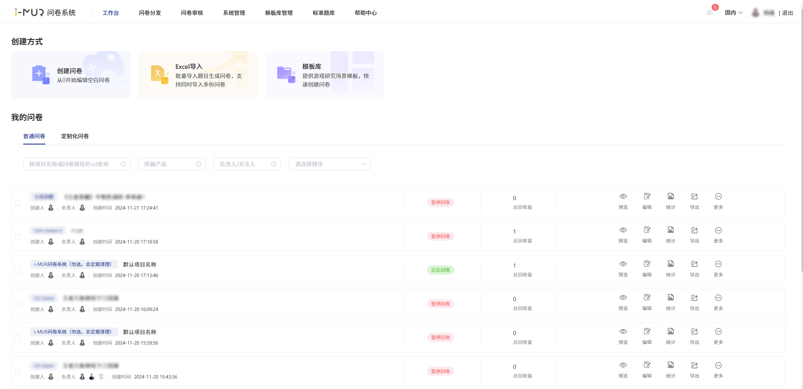

# 🖥️ 系统介绍

iMUR问卷系统提供专业的在线调研及统计工具，服务于国内&海外的调研项目，专注游戏内嵌投放。不仅提供单选、多选、开放题、矩阵题等题型，还提供选项关联（漏斗）、复杂组合逻辑设置、实时统计等功能。


国内版本：[https://surveyimur.woa.com](https://surveyimur.woa.com/)

海外(新加坡)版本：[https://www.outweisurvey.com](https://www.outweisurvey.com/#/)



海外合规说明：[https://docs.qq.com/doc/DS2RYa0lxV0tURkx2](https://docs.qq.com/doc/DS2RYa0lxV0tURkx2)

产品更新日志：[https://iwiki.woa.com/pages/viewpage.action?pageId=4007751213](https://iwiki.woa.com/pages/viewpage.action?pageId=4007751213)



吐槽反馈/功能投票：[https://txc.qq.com/products/593117](https://txc.qq.com/products/593117)

企业微信客服：IMUR问卷系统助手


.png>)

## <mark style="color:blue;">主要特色功能</mark>

**问卷编辑/投放**

* **创建：**&#x591A;种问卷创建方式，支持线下文本导入，线上灵活编辑
* **题型：**&#x63D0;供多种题型选择，适用不同调研背景
* **逻辑：**&#x652F;持复杂的组合逻辑设置，支持漏斗式选项设置
* **投放：**&#x591A;个投放域名自由选择，提高投放保密性，支持设置渠道号

**游戏内嵌/开放接口**

* **内嵌：**&#x63D0;供游戏内嵌投放，收集玩家openid，自适应不同终端答题(移动端横屏/竖屏，PC端）
* **接口：**&#x63D0;供答题数据回调API，与外部系统打通后续发奖链路

**数据分析**

* **分析：**&#x6570;据实时在线统计/交叉分析，图表展示直观简洁
* **分享：**&#x652F;持链接分享结果，多用户协同查看

**海外系统**

* **合规：**&#x63D0;供海外投放答题者信息验证，降低隐私问题风险
* **语言：**&#x81EA;定义答题提示语言，满足海外投放需求

##

## <mark style="color:blue;">重点使用体验</mark>

### 界面主打轻量简洁，功能入口清晰

<figure><figcaption>
工作台
</figcaption></figure>

### 沿用拖拽点选添加，简化编辑操作

<figure><figcaption></figcaption></figure>

### 实时自动保存更新，避免内容丢失错乱

<figure><figcaption></figcaption></figure>

### 支持游戏内嵌投放，自由配置跳转回调

<figure><figcaption></figcaption></figure>

### 答题数据实时统计，直观图表展示

<figure><figcaption></figcaption></figure>

### 各种终端自动兼容，链接可多渠道投放

.png>)

.png>)

