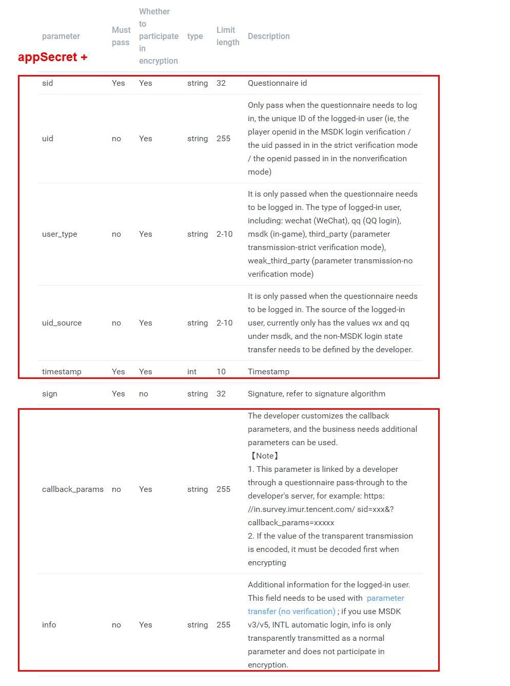

# Callback Interface

### Interface Description

#### Interface Description

After the user submits the questionnaire, the questionnaire system will call back parameters such as the login status to the developer, which is suitable for scenarios such as reward distribution and status modification.

#### scenes to be used

After the user submits the questionnaire, the questionnaire system will call back parameters such as the login status to the developer, which is suitable for scenarios such as reward distribution and status modification.Note that this return action is completed asynchronously by the questionnaire server, and there will be a certain delay \( Second level\).

The configuration of the login state callback interface is turned on under \[Settings\] -&gt; \[Login state callback interface\] under questionnaire editing, and the user needs to configure the \[key\] and \[callback address\], and perform signature verification on the request parameters in the \[callback address\]. Prevent malicious interface brushing.


Support public network callback and intranet L5 callback

1. The callback address starts with http:// or https://
2. Support L5 address, such as: [http://12345601:987654/surveytest1](http://12345601:987654/surveytest1)



### Sign Signature Algorithm

#### Algorithm flow

1. Provide necessary parameters \(see API interface for details\), use kv data structure;
2. Add appSecret as the signature key field to the kv data structure;
3. Sort the keys in ascii ascending order;
4. Traverse the sorted kv data structure, and concatenate all elements into a string according to the

   pattern of "key1value1key2value2";

5. Carry out md5 summary on the spliced database to get the sign signature;
6. Compare the received sign with the sign signature calculated in 5;
7. The status code status is returned.


1. appSecret is the signature key, which is the same as the callback address and is configured on the "Settings" page of the questionnaire. 
2. The spliced encrypted string example _appSecretuIVtlG06callback\_paramscallbackparamsinfotestinfosid5fe4428376051f85cc5f 3973timestamp1609408137uidtestuseruid\_sourcetestsourceuser\_typeweak\_third\_party_

\[Note\] 

Only the default parameters and appSecret participate in the calculation of signatures. The default parameters with empty values and other unspecified parameters do not participate in the encryption calculation.


_Code example_

PHP code

```text
<?php
$query = $_GET;

$appSecret = 'iamsecret';

$sign = $query['sign'];
unset($query['sign']);

// add signature key
$params = array_merge($query, [
    'appSecret' => $appSecret,
]);

ksort($params);

$str = '';
foreach ($params as $key => $value) {
    $str .= $key.$value;
}

$mySign = strtolower(md5($str));

echo json_encode([
    'status' => ($mySign === $sign) ? 'ok' : 'failed',
]);
```

_Callback URL example_

```text
Developer callback interface url?sid=5da414769e8aa80019305e32&timestamp=1573556685&uid=test_user&user_type=third_party&uid_source=qq&info=afdadsfasdfasdf&callback_params=callbackparams&sign=38408d6222e1a4c6fa598e4820443ca8
```

 

## Callback parameter description

### Parameter Description

The interface for the callback to call the developer is to use a GET request.

<table>
  <thead>
    <tr>
      <th style="text-align:left">parameter</th>
      <th style="text-align:left">Must pass</th>
      <th style="text-align:left">Whether to participate in encryption</th>
      <th style="text-align:left">type</th>
      <th style="text-align:left">Limit length</th>
      <th style="text-align:left">Description</th>
    </tr>
  </thead>
  <tbody>
    <tr>
      <td style="text-align:left">sid</td>
      <td style="text-align:left">Yes</td>
      <td style="text-align:left">Yes</td>
      <td style="text-align:left">string</td>
      <td style="text-align:left">32</td>
      <td style="text-align:left">Questionnaire id</td>
    </tr>
    <tr>
      <td style="text-align:left">uid</td>
      <td style="text-align:left">no</td>
      <td style="text-align:left">Yes</td>
      <td style="text-align:left">string</td>
      <td style="text-align:left">255</td>
      <td style="text-align:left">Only pass when the questionnaire needs to log in, the unique ID of the
        logged-in user (ie, the player openid in the MSDK login verification /
        the uid passed in in the strict verification mode / the openid passed in
        in the nonverification mode)</td>
    </tr>
    <tr>
      <td style="text-align:left">user_type</td>
      <td style="text-align:left">no</td>
      <td style="text-align:left">Yes</td>
      <td style="text-align:left">string</td>
      <td style="text-align:left">2-10</td>
      <td style="text-align:left">It is only passed when the questionnaire needs to be logged in. The type
        of logged-in user, including: wechat (WeChat), qq (QQ login), msdk (in-game),
        third_party (parameter transmission-strict verification mode), weak_third_party
        (parameter transmission-no verification mode)</td>
    </tr>
    <tr>
      <td style="text-align:left">uid_source</td>
      <td style="text-align:left">no</td>
      <td style="text-align:left">Yes</td>
      <td style="text-align:left">string</td>
      <td style="text-align:left">2-10</td>
      <td style="text-align:left">It is only passed when the questionnaire needs to be logged in. The source
        of the logged-in user, currently only has the values wx and qq under msdk,
        and the non-MSDK login state transfer needs to be defined by the developer.</td>
    </tr>
    <tr>
      <td style="text-align:left">timestamp</td>
      <td style="text-align:left">Yes</td>
      <td style="text-align:left">Yes</td>
      <td style="text-align:left">int</td>
      <td style="text-align:left">10</td>
      <td style="text-align:left">Timestamp</td>
    </tr>
    <tr>
      <td style="text-align:left">sign</td>
      <td style="text-align:left">Yes</td>
      <td style="text-align:left">no</td>
      <td style="text-align:left">string</td>
      <td style="text-align:left">32</td>
      <td style="text-align:left">Signature, refer to signature algorithm</td>
    </tr>
    <tr>
      <td style="text-align:left">callback_params</td>
      <td style="text-align:left">no</td>
      <td style="text-align:left">Yes</td>
      <td style="text-align:left">string</td>
      <td style="text-align:left">255</td>
      <td style="text-align:left">
        <p>The developer customizes the callback parameters, and the business needs
          additional parameters can be used.</p>
        <p>&#x3010;Note&#x3011;</p>
        <p>1. This parameter is linked by a developer through a questionnaire pass-through
          to the developer&apos;s server, for example: https: //in.survey.imur.tencent.com/
          sid=xxx&amp;?callback_params=xxxxx</p>
        <p>2. If the value of the transparent transmission is encoded, it must be
          decoded first when encrypting</p>
      </td>
    </tr>
    <tr>
      <td style="text-align:left">info</td>
      <td style="text-align:left">no</td>
      <td style="text-align:left">Yes</td>
      <td style="text-align:left">string</td>
      <td style="text-align:left">255</td>
      <td style="text-align:left">Additional information for the logged-in user. This field needs to be
        used with <a href="parameter-transfer-interface-no-verification-mode.md">parameter transfer (no verification)</a> ;
        if you use MSDK v3/v5, INTL automatic login, info is only transparently
        transmitted as a normal parameter and does not participate in encryption.</td>
    </tr>
  </tbody>
</table>

1. Participate in encryption when the optional parameter has a value, and not participate in

   encryption if it is not passed

2. This document unspecified parameters is not involved in encryption, refer to: Why is not

   described in the document received callback argument

3. If you use MSDK v3/v5, INTL to log in automatically, info is only transparently transmitted

   as a common parameter, and does not participate in encryption, nor is it collected in the

   answer.


### Callback success agreement return format

After the developer receives the callback and processes the business process normally, it must return the

following specified json format to the questionnaire server:

```text
{
"status" : "ok"
}
```

### Callback business code

If the business side needs to make some specific identification in the callback, you can pass the business\_code field, and the questionnaire system will store the value of this field in es, which can be used to filter data based on the identification in the open interface. The business\_code value range must be -32768 ~ 32767, if it exceeds this range, it will not be stored. Example:

```text
{
"status" : "ok",
"business_code" : 1000
}
```


1. business\_code must be of type int16, ie -32768 ~ 32767
2. The callback business code will only be written when the status is ok


### The same questionnaire supports multiple callback addresses

The **client** injects the callback parameter into the questionnaire link during launch to distinguish which callback address is called back after the submission. Up to 10 callback addresses can be configured, and the specific callback address is actually specified by the client.

**Note:** Each time you submit a questionnaire, you can only call back to one address. If the questionnaire link does not inject the callback parameter, it will call back to address 1 by default.


If the value of callback injected into the delivery link is 2, the system will callback the login status information to the callback address 2 after submission

[https://in.weisurvey.com/?sid=5f87b81376051f331039dfe5&openid={openid}](https://in.weisurvey.com/?sid=5f87b81376051f331039dfe5&openid={openid}) &callback=2



## Callback interface debugging tool 

You can use the callback interface debugging tool \(it is recommended to use chrome to open\) to confirm the callback and signature verification.


## Common problem

### Why can not receive callback messages?

Under the condition that the provided callback address is correct, please check the following items:

1. **Whether the callback address supports public network access**: If not, please use the internal network L5 callback address or handle it by yourself to open public network access
2. **Whitelist restriction on the server**: If so, please contact the "IMUR Questionnaire System Assistant" on WeChat to obtain the questionnaire system export IP, and add it to the access whitelist \(domestic/overseas environment is completely isolated, export IP is different, please distinguish according to needs Obtain\)


### Why do I receive callback parameters that are not specified in the document?

The parameters injected after the questionnaire link will be synchronously called back to the developer server during the callback, causing the developer server to receive callback parameters that are not described in the document. 

Common scenarios include:

* When logging in to MSDK, the browser will automatically inject the player's login status information after the questionnaire link 
* The client injects custom parameters after the questionnaire link 
* In parameter transfer \(strict verification mode\)/\(non-verification mode\), login parameters such as player id are required to be injected


**Special Note:**

1. Participate in encryption when the optional parameter has a value, and not participate in

   encryption if it is not passed

2. [Callback Interface](callback-interface.md) documentation unspecified parameters is not involved in

   encryption

3. If you use MSDK v3/v5, INTL to log in automatically, info is only transparently transmitted

   as a common parameter, and does not participate in encryption, nor is it collected in the

   answer.




\*\*\*\*

