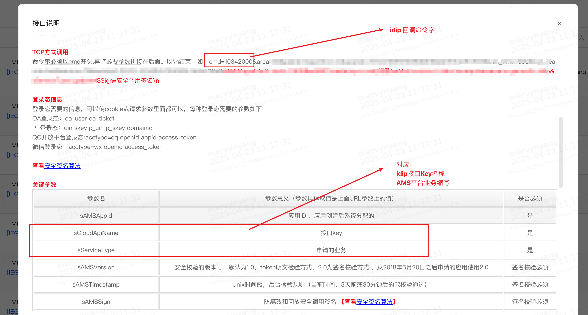

# 登录态回调接口(IDIP)

## 1. 接口说明

### 1.1 接口定义

用户提交问卷后，问卷系统将登录态等参数回调给开发者，适用于奖励发放、业务状态修改等场景。

### 1.2 使用场景

适用于开发者接入问卷系统后，无法接入 [登录态回调接口(HTTP)](deng-lu-tai-hui-tiao-jie-kou.md)， 但是又需要用户在答题之后将用户等相关信息**回传给开发者服务端**的情况。

请注意，如果配置了 IDIP回调，HTTP 回调的配置会默认失效，问卷服务优先处理 IDIP。

### 1.3 前置条件

接入 idip 回调的问卷必须开启登录(推荐使用 MSDK 登录)，因为 openid 的值在 idip 的参数中是必须的，并且只能在登录之后获取到。

## 2. 回调说明

### 2.1 接口自定义参数配置

#### 2.1.1 基础配置

<figure><figcaption></figcaption></figure>

<figure><figcaption></figcaption></figure>

以上配置可以在 AMS 平台的 "接口说明" 中找到:&#x20;

<figure><figcaption><p>ams 接口说明</p></figcaption></figure>

#### 2.1.2 接口自定义参数

请注意，由于 ams 签名算法的原因，只有 `openid` 会是固定硬编码的参数，其他的所有参数需要自定义按需接收。

在 `接口自定义参数` 中支持两种参数占位符：

1.  前端参数占位符(需客户端打开问卷链接时注入)：`{key}` ，使用花括号包裹参数

    * 格式：`{参数名}`&#x20;
    * 说明：从问卷前端传入的 query 参数中获取值
    * 示例：`a={a}&b={b}`


2. 答题信息占位符(问卷系统内置字段)：`[key]` ，使用中括号包裹参数
   * 格式：`[参数名]`&#x20;
   * 说明：从问卷系统内部获取，是固定值
   * 支持的参数：
     * `[effective]`: 问卷有效性（0: 有效，非0: 无效）
     * `[answer_consumed]`: 答题耗时（秒）
     * `[uid_info]`: 用户信息
     * `[sid]:` 问卷 id
     * `[answer_id]`: 答卷 id
   * 示例：`a=1&effective=[effective]&uid_info=[uid_info]`

#### 2.1.3 完整参数配置示例

```
openid=xxxx&type=1&userSource={userSource}&effective=[effective]&uid_info=[uid_info]
```

配置说明：

1. _`type=1`: 固定值，用于标识请求类型_
2. _`userSource={userSource}`: 从问卷前端传入的参数，问卷打开的时候客户端注入，例如：`userSource=test_value`_
3. _`effective=[effective]`: 问卷有效性标记 ，来源于问卷系统的字段定义_
   * _0: 有效问卷_
   * _非0: 无效问卷_
4. _`uid_info=[uid_info]`: 用户信息，来源于问卷系统的字段定义_
5. _`answer_consumed=[answer_consumed]`: 答题耗时（秒），来源于问卷系统的字段定义_

#### 2.1.4 实际场景解析

假设有以下的场景需求：

“我按照不同渠道投放了2份问卷，我需要在玩家答题之后，关闭问卷入口的红点信息，并需要根据IMUR问卷系统对玩家答案是否有效的判断， 然后给该玩家发奖”

那么，idip 接口中，你可能需要接收的参数是：

`openid=123&area=1&platid=1&partition=1&charac_no=12345&effective=0&channel=1`&#x20;

对应的问卷系统的 **接口自定义参数** 配置

`area={sArea}&platid={sPlatId}&partition={sPartition}&charac_no={sRoleId}&effective=[effective]&channel=1`&#x20;

客户端打开问卷时候注入的参数示例：

[https://in.weisurvey.com/v2/?sid=67fc85695ded6e2d9a0bxxxx\&algorithm=itop\&channelid=2\&encode=2\&gameid=28105\&itopencodeparam=xxx\&nickname=x\&os=1\&seq=28105-98a1e12d-f7b9-45f2-a910-844ebddd6ba6-xxxx-10002\&sig=3588eb328de9125743931c13fa8fxxx\&ts=1745465972\&version=5.38.101.6317\&sArea=90\&sPartition=9002\&sRoleId=729002\&sPartition=1](https://in.weisurvey.com/v2/?sid=67fc85695ded6e2d9a0bxxxx\&algorithm=itop\&channelid=2\&encode=2\&gameid=28105\&itopencodeparam=xxx\&nickname=x\&os=1\&seq=28105-98a1e12d-f7b9-45f2-a910-844ebddd6ba6-xxxx-10002\&sig=3588eb328de9125743931c13fa8fxxx\&ts=1745465972\&version=5.38.101.6317\&sArea=90\&sPartition=9002\&sRoleId=729002\&sPartition=1)

**说明：**

openid 是问卷每次接口请求中固定传入的，所以无需配置。

`area/platid/partition/charac_no` 这几个参数则是需要和客户端开发同学沟通，在打开问卷时候注入。

`effective` 是问卷系统内置的字段，使用了 `[]` 标识。

`channel=1` 则可以在不同的问卷硬编码配置，比如 a 问卷使用 `channel=1` ，b 问卷使用 `channel=2` 。


_💡Tips_

_聪明的你可能注意到了，客户端打开的参数是  `sArea/sPartition` ，但是 idip 的接口定义的是 `area/partition` ，这里是在问卷系统中通过 `area={sArea}` 的配置做的参数映射处理_

### 2.2 回调成功约定返回格式

#### 2.2.1 响应格式

```
result=0&error_info=success
```

#### 2.2.2 响应参数说明

* `result`: 回调结果
  * `0`: 回调成功
  * 其他值: 回调失败
* `error_info`: 错误信息
  * 成功时返回 "success"
  * 失败时返回具体错误信息

#### 2.2.3 示例

```
# 成功响应
result=0&error_info=success

# 失败响应
result=1&error_info=invalid_parameter
```

## 3. 回调接口调试工具

可使用回调接口调试工具（建议使用chrome打开）确认调通回调与签名验证。

【国内】[https://test.a.imur.tencent.com/static/tools/index.html#/callback](https://test.a.imur.tencent.com/static/tools/index.html#/callback/log)

【海外】[https://test.a.imur.tencent.com/static/tools-out/#/callback](https://test.a.imur.tencent.com/static/tools-out/#/callback/log)

## 4. 回调记录查询

系统提供工具用于查询问卷服务端发起回调的记录和回调参数，请根据所属环境使用

【国内】[https://test.a.imur.tencent.com/static/tools/index.html#/callback/log](https://test.a.imur.tencent.com/static/tools/index.html#/callback/log)

【海外】[https://test.a.imur.tencent.com/static/tools-out/#/callback/log](https://test.a.imur.tencent.com/static/tools-out/#/callback/log)
