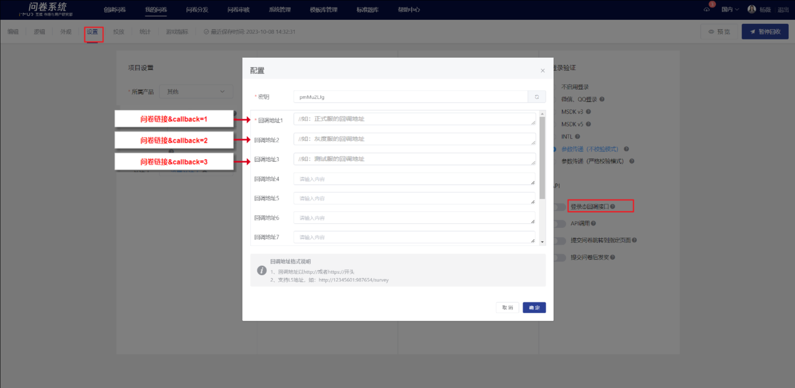

# 登录态回调接口

## 1. 接口说明

### 1.1 接口定义

用户提交问卷后，问卷系统将登录态等参数回调给开发者，适用于奖励发放、业务状态修改等场景。


### 1.2 使用场景

适用于开发者接入问卷系统后，需要用户在答题之后将用户等相关信息**回传给开发者服务端**的情况，注意这个回传动作是问卷服务端异步完成的，会有一定的时延（秒级）。

登录态回调接口的配置在问卷编辑下的【设置】->【登录态回调接口】开启，需要用户配置【密钥】与【回调地址】，并在【回调地址】对请求参数进行签名验证，防止恶意刷接口。


支持公网回调和内网L5回调

1、回调地址以http://或者https://开头

2、支持L5地址，如：http://12345601:987654/surveytest1



### 1.3 sign签名算法

#### **1.3.1 算法流程**

1. 提供必要参数（详情看API接口），使用kv数据结构；
2. 添加appSecret作为签名密钥字段到kv数据结构；
3. 对key进行按ascii升序排序；
4. 遍历排序后的kv数据结构，把所有元素，按照“key1value1key2value2”的模式拼接成字符串；
5. 对拼接的数据库进行md5摘要，即可得sign签名；
6. 对比接收到的sign和5中计算得到的sign签名；
7. 返回状态码status。


1) appSecret即回调密钥，和回调地址一样，在问卷的“设置”页配置。配置方法详见[登录态回调配置](../cao-zuo-zhi-yin/wen-juan-she-zhi/chuan-can-tiao-zhuan-hui-tiao.md#deng-lu-tai-hui-tiao-jie-kou)
2) 拼接后的加密字符串示例 appSecretuIVtlG06callback\_paramscallbackparamsinfotestinfosid5fe4428376051f85cc5f3973timestamp1609408137uidtestuseruid\_sourcetestsourceuser\_typeweak\_third\_party 【注】只有默认参数和appSecret参与计算签名，值为空的默认参数和其他未说明的参数不参与加密计算。


可使用调试工具验证签名:

&#x20;【国内】[https://test.a.imur.tencent.com/static/tools/index.html#/callback](https://test.a.imur.tencent.com/static/tools/index.html#/callback/log)

【海外】[https://test.a.imur.tencent.com/static/tools-out/#/callback](https://test.a.imur.tencent.com/static/tools-out/#/callback/log)

#### **1.3.2 代码示例**

_PHP代码_&#x20;

```php
<?php
$query = $_GET;

$appSecret = 'iamsecret';

$sign = $query['sign'];
unset($query['sign']);

// 添加密钥
$params = array_merge($query, [
    'appSecret' => $appSecret,
]);

ksort($params);

$str = '';
foreach ($params as $key => $value) {
    $str .= $key.$value;
}

$mySign = strtolower(md5($str));

echo json_encode([
    'status' => ($mySign === $sign) ? 'ok' : 'failed',
]);
```


_Go代码_

```go

import (
	"sort"
)
​
func VerifySign(sign string, params map[string]string, secret string) bool {
	return sign == MakeSign(params, secret)
}
​
func MakeSign(data map[string]string, secret string) string {
	str := MakeSignParamStr(data, secret)
​
	sign := MD5(str)
​
	return sign
}
​
func MakeSignParamStr(data map[string]string, secret string) string {
	data["appSecret"] = secret
​
	var keys = make([]string, 0)
	for key := range data {
		keys = append(keys, key)
	}
	sort.Strings(keys)
​
	str := ""
	for _, sortKey := range keys {
		if data[sortKey] != "" {
			str = str + sortKey + data[sortKey]
		}
	}
	delete(data, "appSecret")
​
	return str
}
```

_C# 完整示例_

```csharp
using System;
using System.Collections;
using System.Collections.Generic;
using System.Linq;
using System.Security.Cryptography;
using System.Text;
using System.Web;

namespace TxProxy.Services;

public static class Program
{
	public static void Main()
	{
		var queryString = ""; // important! Your queryString

		var request = HttpUtility.ParseQueryString(queryString);
		var requestDict = request.AllKeys.ToDictionary(k => k!, k => request[k]);
		var sign = requestDict["sign"]!;
		var verifier = new PollCallbackAppSecretVerifier(""); // important! Your survey appSecret
		var isVerified = verifier.Verify(sign, requestDict);

		Console.WriteLine("Verification result: " + (isVerified ? "Valid" : "Invalid"));
	}
}

public sealed class PollCallbackAppSecretVerifier
{
    private static readonly string[] EncryptList =
    {
        "sid",
        "uid",
        "user_type",
        "uid_source",
        "timestamp",
        "callback_params",
	"info",
    };

    private readonly string appSecret;

    public PollCallbackAppSecretVerifier(string appSecret)
    {
        this.appSecret = appSecret;
    }

    // Sign signature algorithm flow
    public bool Verify(string sign, Dictionary<string, string> queryParams)
	{
		var verifyParams = EncryptList.ToHashSet();

		var pairs = queryParams
			.Where(data => verifyParams.Contains(data.Key))
			.Append(new KeyValuePair<string, string>("appSecret", this.appSecret))
			.ToList();

		var sortedPairs = pairs.OrderBy(pair => pair.Key);

		var signBytes = Convert.FromHexString(sign);

		var sb = new StringBuilder();
		foreach (var (k, v) in sortedPairs)
		{
			sb.Append(k);
			sb.Append(v);
		}

		var serialized = sb.ToString();

	#pragma warning disable CA5351
		var result = MD5.HashData(Encoding.ASCII.GetBytes(serialized));
	#pragma warning restore CA5351

		return StructuralComparisons.StructuralEqualityComparer.Equals(result, signBytes);
	}
}

```


_回调URL示例_

```aspnet
开发者回调接口url?sid=5da414769e8aa80019305e32&timestamp=1573556685&uid=test_user&user_type=third_party&uid_source=qq&info=afdadsfasdfasdf&callback_params=callbackparams&sign=38408d6222e1a4c6fa598e4820443ca8
```

####

## **2. 回调参数说明**

### **2.1 参数说明**

回调接口使用GET请求。

<table data-header-hidden><thead><tr><th>参数</th><th>是否必传</th><th>是否参与加密</th><th width="188">数据类型</th><th>限制长度</th><th>说明</th></tr></thead><tbody><tr><td>参数</td><td>是否必传</td><td>是否参与加密</td><td>数据类型</td><td>限制长度</td><td>说明</td></tr><tr><td>sid</td><td>是</td><td>是</td><td>string</td><td>32</td><td>问卷id</td></tr><tr><td>uid</td><td>否</td><td>是</td><td>string</td><td>255</td><td>仅在问卷需要登录时传递，登录用户的唯一ID（即，MSDK登录验证中的玩家openid/严格校验模式下传入的uid/不校验模式下传入的openid）</td></tr><tr><td>user_type</td><td>否</td><td>是</td><td>string</td><td>2-10</td><td>仅在问卷需要登录时传递，登录用户类型，包含：wechat(微信)、qq(QQ登录)、msdk(游戏内)、third_party(参数传递-严格校验模式)、weak_third_party（参数传递-不校验模式）</td></tr><tr><td>uid_source</td><td>否</td><td>是</td><td>string</td><td>2-10</td><td>仅在问卷需要登录时传递，登录用户来源，当前只在msdk下有值wx与qq，非MSDK登录态传递则需要开发者自己定义</td></tr><tr><td>timestamp</td><td>是</td><td>是</td><td>int</td><td>10位</td><td>时间戳</td></tr><tr><td>sign</td><td>是</td><td>否</td><td>string</td><td>32</td><td>签名，参考签名算法</td></tr><tr><td>callback_params</td><td>否</td><td>是</td><td>string</td><td>255</td><td><p>开发者自定义回调参数，业务需要额外的参数则可以使用。【注】</p><p>1.该参数是由开发者通过问卷链接<strong>透传</strong>到开发者服务端的，例如：https://in.survey.imur.tencent.com/?sid=xxx&#x26;</p><p>lang=zh-CHS&#x26;callback_params=xxxxx</p><p>2.如透传时值被encode，则加密时需先decode</p></td></tr><tr><td>info</td><td>否</td><td>是</td><td>string</td><td>255</td><td>登录用户额外的信息。</td></tr><tr><td>effective</td><td>是</td><td>否</td><td>bool</td><td></td><td>设置了自动过滤的条件，在答完题之后，计算用户的答案是否有效。如果有效则返回 "true"，否则返回 "false"</td></tr><tr><td>aid</td><td>是</td><td>否</td><td>string</td><td>32</td><td>答卷编号；不参与生成sign，<a href="kai-fang-jie-kou/">开放接口</a>中用于查询答卷详情。</td></tr></tbody></table>



1. 非必传参数有值时参与加密，未传则不参与加密
2. 本文档未说明的参数不参与加密，可参考：[为什么会接收到文档中未说明的回调参数](../chang-jian-wen-ti/you-xi-nei-qian/wei-shen-me-hui-jie-shou-dao-wen-dang-zhong-wei-shuo-ming-de-hui-tiao-can-shu.md)


.png>)

### **2.2 回调成功约定返回格式**

开发者接收到回调并正常处理业务流程后，必需返回以下指定的json格式到问卷服务端：

```javascript
{
    "status": "ok"
}
```


若接收方未正确返回状态码，问卷服务端会自动发起重试，最多重试4次。


### 2.3 回调业务码

如果业务方需要在回调中做一些特定标识，可以传递business\_code字段，问卷系统会存储该字段的值到es中，可以用来在开放接口中根据该标识筛选数据，business\_code值范围必须在 -32768 \~ 32767，如果超过该范围，则不会存储。示例：

```javascript
{
    "status": "ok",
    "business_code": 1000
}
```


business\_code必须是int16类型，即 -32768 \~ 32767

回调业务码只会在status为ok的情况下写入


### 2.4 同一问卷支持设置多个回调地址

投放时**客户端**在问卷链接中注入callback参数，用以区分该次提交后回调到哪个回调地址中。最多可配置10个回调地址，具体回调到哪个实际由客户端指定。

**注：**&#x6BCF;次提交问卷仅能回调到一个地址中，若问卷链接未注入callback参数，默认回调到地址1。


如投放链接中注入callback的值为2，则提交后系统自动把登录态信息回调到回调地址2中

https://in.weisurvey.com/?sid=5f87b81376051f331039dfe5\&openid={openid}**\&callback=2**




## 3. 回调接口调试工具

可使用回调接口调试工具（建议使用chrome打开）确认调通回调与签名验证。

【国内】[https://test.a.imur.tencent.com/static/tools/index.html#/callback](https://test.a.imur.tencent.com/static/tools/index.html#/callback/log)

【海外】[https://test.a.imur.tencent.com/static/tools-out/#/callback](https://test.a.imur.tencent.com/static/tools-out/#/callback/log)

.png>)


## 4. 回调记录查询

系统提供工具用于查询问卷服务端发起回调的记录和回调参数，请根据所属环境使用

【国内】[https://test.a.imur.tencent.com/static/tools/index.html#/callback/log](https://test.a.imur.tencent.com/static/tools/index.html#/callback/log)

【海外】[https://test.a.imur.tencent.com/static/tools-out/#/callback/log](https://test.a.imur.tencent.com/static/tools-out/#/callback/log)

<figure><figcaption></figcaption></figure>

## 5. 常见问题

### 5.1 [为什么收不到回调消息？](../chang-jian-wen-ti/you-xi-nei-qian/wei-shen-me-shou-bu-dao-hui-tiao-xiao-xi.md)

### 5.2 [为什么会接收到文档中未说明的回调参数？](../chang-jian-wen-ti/you-xi-nei-qian/wei-shen-me-hui-jie-shou-dao-wen-dang-zhong-wei-shuo-ming-de-hui-tiao-can-shu.md)
