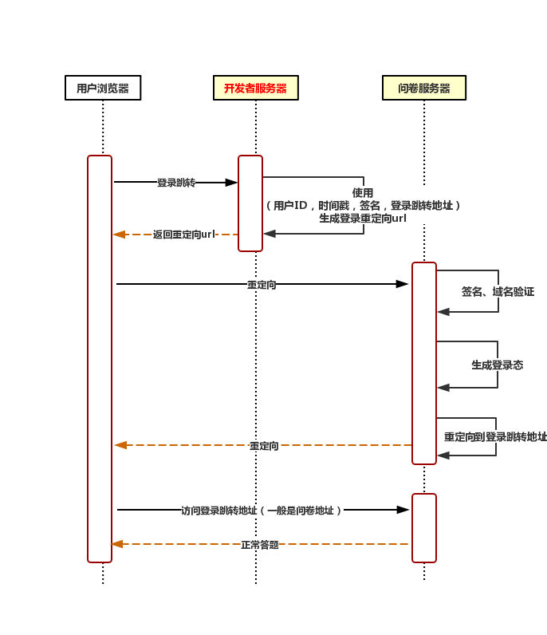
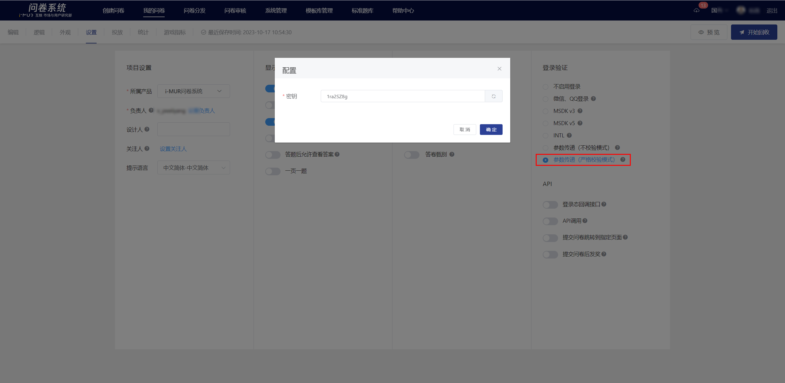

# 参数传递接口（严格校验模式）

## 1. 接口说明

### 1.1 接口定义

参数传递接口（严格校验模式）接口用于解决第三方开发者拥有自己系统的登录态（如小程序登录态、facebook登录等），但又希望能够同步该登录态到问卷系统的情况。

### 1.2 使用场景

以下几种情况可以**不需要**接入非MSDK登录态传递接口：

* 问卷内嵌到游戏中，问卷系统默认支持MSDK登录态处理，可在问卷编辑页选择【设置】-> 【MSDK登录验证】打开该功能，当前仅支持v3和v5版本MSDK登录；
* 仅需要做每个用户答题限制，不关注采集的用户uid，可以选择使用微信或者手Q登录，可在问卷编辑页选择【设置】-> 【微信、QQ登录验证】打开该功能；

### 1.3 交互流程



开发者仅需关注开发者服务器流程，重点关注签名以及登录重定向url的生成。

### 1.4 sign签名算法

#### **1.4.1 算法流程**

1. 提供必要参数（详情看API接口，空值不需要参与签名），使用kv数据结构；
2. 添加appSecret作为签名密钥字段到kv数据结构；
3. 对key进行按ascii升序排序；
4. 遍历排序后的kv数据结构，把所有元素，按照“key1value1key2value2”的模式拼接成字符串；
5. 对拼接的数据库进行md5摘要，即可得sign签名；
6. 添加sign作为签名字段到kv数据结构；
7. 将kv数据结构转换成http的query请求参数；
8. 带上query请求参数调用登录态传递接口。

#### **1.4.2 代码示例**

_PHP代码_

```php
<?php
$appSecret = 'iamsecret';

$sid = '60cfe98c76051f40495d32c2';

$query = [
    'sid' => $sid,
    'uid' => 'test_uid',
    'timestamp' => time(),
    'source' => 'testsource',
    'info' => 'extra_info',
    // 登录完成后系统会跳转到redirect的地址，一般使用的是问卷投放链接，会包括sid内容
    // 如果有登录态回调参数，请参考【API文档】-> 【登录态回调接口】添加需要的参数，如callback、callback_params
    // 注意：这里的域名要根据投放的域名做修改，详情看文档下方【API接口】
    'redirect' => 'https://in.weisurvey.com/?sid='.$sid,
];

// 添加密钥
$params = array_merge($query, [
    'appSecret' => $appSecret,
]);

ksort($params);

$str = '';
foreach ($params as $key => $value) {
    // 值为空的参数不参与加密
    if ($value !== '') {
        $str .= $key.$value;
    }
}

$query['sign'] = strtolower(md5($str));

// 注意：这里的域名要根据投放的域名做修改，详情看文档下方【API接口】
$redirectUrl = 'https://in.weisurvey.com/v2/api/autologin?'.http_build_query($query);

// 重定向
header('Location: '.$redirectUrl);
```

_请求url示例_

```
 https://in.weisurvey.com/v2/api/autologin?sid=60cfe98c76051f40495d32c2&uid=test_uid&timestamp=1624262138&source=testsource&info=extra_info&redirect=https%3A%2F%2Fin.weisurvey.com%2F%3Fsid%3D60cfe98c76051f40495d32c2%26callback%3D3%26callback_params%3Dtestparams&sign=44b2e38119366c059946698f2828752c
```


**普通投放链接与内嵌投放链接示例对比**

【普通投放链接】

https://in.weisurvey.com/v2/?sid=60cfe98c76051f40495d32c2

【内嵌投放链接】

https://in.weisurvey.com/v2/api/autologin?sid=60cfe98c76051f40495d32c2\&uid=test\_uid\&timestamp=1624262138\&source=testsource\&info=extra\_info\&redirect=https%3A%2F%2Fin.weisurvey.com%2Fv2%2F%3Fsid%3D60cfe98c76051f40495d32c2%26callback%3D3%26callback\_params%3Dtestparams\&sign=44b2e38119366c059946698f2828752c

_\*以上参数对应的值仅作展示使用_


## **2. 接口参数说明**

### **2.1 登录接口地址**

请根据业务投放域名与国内、海外选择接入接口。

#### **2.1.1 国内投放**

```
国内投放拥有两套域名，开发时需要注意
1.问卷投放域名为https://in.survey.imur.qq.com/v2/?sid=xxx则为qq域，对应登录接口为：
https://in.survey.imur.qq.com/v2/api/autologin?

2.问卷投放域名为https://in.weisurvey.com/v2/?sid=xxx则为非qq域，对应登录接口为：
https://in.weisurvey.com/v2/api/autologin?
```

#### **2.1.2 海外投放**

```
海外投放对应登录接口为：
https://user.outweisurvey.com/v2/api/autologin?
```


由于接口升级，【国内】采用inapi前缀登录接口的游戏，请提前更改为新版登录接口，以免影响正常使用，调整如下：


| 问卷投放域名 | 旧版登录接口（已废弃）                                      | 新版登录接口                                          |
| ------ | ------------------------------------------------ | ----------------------------------------------- |
| 非qq域   | https://inapi.weisurvey.com/autologin?           | https://in.weisurvey.com/v2/api/autologin?      |
| qq域    | https://inapi.survey.imur.tencent.com/autologin? | https://in.survey.imur.qq.com/v2/api/autologin? |

### **2.2 参数说明**

使用GET请求方式传参。

| 参数        | 是否必须 | 是否参与加密 | 数据类型   | 限制长度    | 说明                                                                                                                                                                                                                                    |
| --------- | ---- | ------ | ------ | ------- | ------------------------------------------------------------------------------------------------------------------------------------------------------------------------------------------------------------------------------------- |
| sid       | 是    | 是      | string | 32      | 问卷id，从问卷链接可解析                                                                                                                                                                                                                         |
| uid       | 是    | 是      | string | 255     | 登录用户的唯一ID                                                                                                                                                                                                                             |
| timestamp | 是    | 是      | int    | 10位     | 时间戳                                                                                                                                                                                                                                   |
| redirect  | 是    | 是      | string | url地址   | <p>登录成功之后跳转的页面url，一般使用的是问卷的链接</p><p>【注】</p><ol><li><strong>加密sign</strong>时使用原始URL；<strong>拼接为内嵌投放链接</strong>时，需先把URL进行encode后赋值到redirect，再拼到内嵌投放链接中</li><li>回调中的callback、callback_params需先注入到问卷原始url，再把此url按步骤1赋值到redirect</li></ol> |
| source    | 是    | 是      | string | 2-10位英文 | 用户自定义渠道标识                                                                                                                                                                                                                             |
| sign      | 是    | 否      | string | 32      | 签名，参考签名算法                                                                                                                                                                                                                             |
| info      | 否    | 是      | string | 255     | 额外的登录用户信息，可自定义；为空时不参与加密                                                                                                                                                                                                               |


各参数的赋值请勿带分号;，否则值会被截断


### 2.3 客户端生成链接示例

#### 原始链接

https://in.weisurvey.com/v2/?sid=60cfe98c76051f40495d32c2

#### STEP 1 原始链接注入回调参数（非必要）

https://in.weisurvey.com/v2/?sid=60cfe98c76051f40495d32c&#x32;**\&callback=3\&callback\_params=testparams**

#### STEP 2 拼接kv数据结构的字符串

appSecretiamsecretinfoextra\_inforedirecthttps://in.weisurvey.com/v2/?sid=60cfe98c76051f40495d32c2\&callback=3\&callback\_params=testparamssid60cfe98c76051f40495d32c2sourcetestsourcetimestamp1624262138uidtest\_uid

#### STEP 3 对字符串加密生成sign

sign=**ade962f5273a404f72aaabf544b14281**

#### STEP 4 拼接链接，完成

https://in.weisurvey.com/v2/api/autologin?sid=60cfe98c76051f40495d32c2\&uid=test\_uid\&timestamp=1624262138\&source=testsource\&info=extra\_info\&redirect=https%3A%2F%2Fin.weisurvey.com%2Fv2%2F%3Fsid%3D60cfe98c76051f40495d32c2%26callback%3D3%26callback\_params%3Dtestparams\&sign=ade962f5273a404f72aaabf544b14281


**参数赋值情况**

sid=60cfe98c76051f40495d32c2

uid=test\_uid&#x20;

timestamp=1624245611&#x20;

source=testsource&#x20;

info=extra\_info

redirect=https%3A%2F%2Fin.weisurvey.com%2Fv2%2F%3Fsid%3D60cfe98c76051f40495d32c2%26callback%3D3%26callback\_params%3Dtestparams&#x20;

sign=ade962f5273a404f72aaabf544b14281


.png>)

## 3. 问卷设置

需在问卷设置页面设置密钥，密钥支持自定义。



## 4. 常见问题
