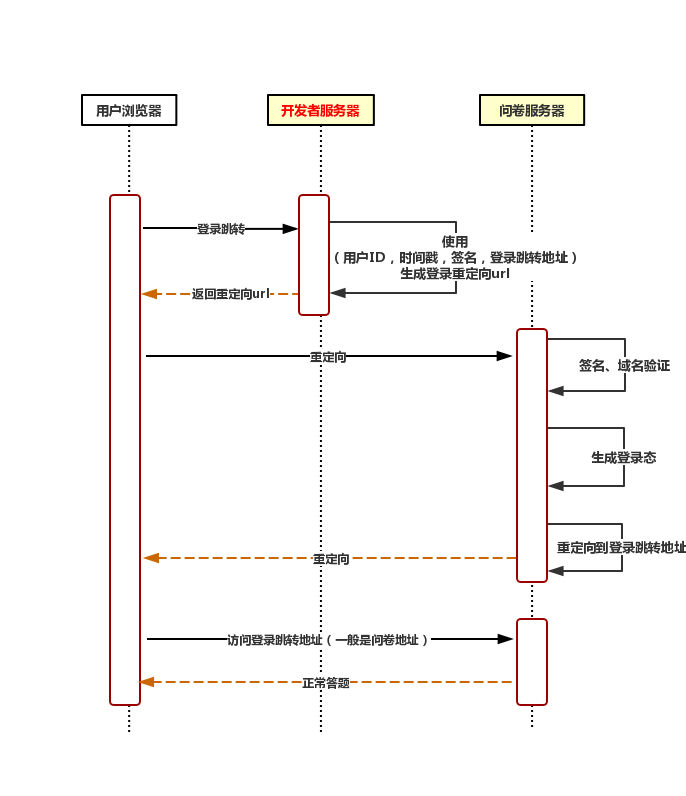

# 参数传递接口（严格校验模式）

## 接口说明

### 接口定义

参数传递接口（严格校验模式）接口用于解决第三方开发者拥有自己系统的登录态（如小程序登录态、facebook登录等），但又希望能够同步该登录态到问卷系统的情况。

### 使用场景

以下几种情况可以**不需要**接入非MSDK登录态传递接口：

* 问卷内嵌到游戏中，问卷系统默认支持MSDK登录态处理，可在问卷编辑页选择【设置】-&gt; 【MSDK登录验证】打开该功能，当前仅支持v3和v5版本MSDK登录；
* 仅需要做每个用户答题限制，不关注采集的用户uid，可以选择使用微信或者手Q登录，可在问卷编辑页选择【设置】-&gt; 【微信、QQ登录验证】打开该功能；

### 交互流程



开发者仅需关注开发者服务器流程，重点关注签名以及登录重定向url的生成。

### sign签名算法

#### **算法流程**

1. 提供必要参数（详情看API接口，空值不需要参与签名），使用kv数据结构；
2. 添加appSecret作为签名密钥字段到kv数据结构；
3. 对key进行按ascii升序排序；
4. 遍历排序后的kv数据结构，把所有元素，按照“key1value1key2value2”的模式拼接成字符串；
5. 对拼接的数据库进行md5摘要，即可得sign签名；
6. 添加sign作为签名字段到kv数据结构；
7. 将kv数据结构转换成http的query请求参数；
8. 带上query请求参数调用登录态传递接口。

#### **代码示例**

_PHP代码_

```php
<?php
$appSecret = 'iamsecret';

$sid = '5dc5727a76051f14b96d5172';

$query = [
    'sid' => $sid,
    'uid' => 'user_id',
    'timestamp' => time(),
    'source' => 'dwk',
    'info' => 'extra_info',
    // 登录完成后系统会跳转到redirect的地址，一般使用的是问卷投放链接，会包括sid、lang内容
    // 如果有登录态回调参数，请参考【API文档】-> 【登录态回调接口】添加需要的参数
    // 注意：这里的域名要根据投放的域名做修改，详情看文档下方【API接口】
    'redirect' => 'https://in.survey.imur.tencent.com/index.html?sid='.$sid,
];

// 添加密钥
$params = array_merge($query, [
    'appSecret' => $appSecret,
]);

ksort($params);

$str = '';
foreach ($params as $key => $value) {
    // 值为空的参数不参与加密
    if ($value !== '') {
        $str .= $key.$value;
    }
}

$query['sign'] = strtolower(md5($str));

// 注意：这里的域名要根据投放的域名做修改，详情看文档下方【API接口】
$redirectUrl = 'https://in.weisurvey.com/v2/api/autologin?'.http_build_query($query);

// 重定向
header('Location: '.$redirectUrl);
```

_请求url示例_

```text
 https://in.weisurvey.com/autologin?sid=5dc5727a76051f14b96d5172&uid=user_id&timestamp=1573455797&source=dwk&info=extra_info&redirect=https%3A%2F%2Fin.survey.imur.tencent.com%2Findex.html%3Fsid%3D5dc5727a76051f14b96d5172&sign=2ac5ab8ce6a9b306e07dc2664fe7d175
```


**普通投放链接与内嵌投放链接示例对比**

【普通投放链接】

https://in.survey.imur.tencent.com/?sid=5e8d767b76051f46707cf692&lang=zh-CHS&ADTAG=sid.5e8d767b76051f46707cf692

【内嵌投放链接】

 https://inapi.survey.imur.tencent.com/autologin?sid=5e8d767b76051f46707cf692&uid=user\_id&timestamp=1573455797&source=dwk&info=extra\_info&redirect=https%3A%2F%2Fin.survey.imur.tencent.com%2F%3Fsid%3D5e8d767b76051f46707cf692%26lang%3Dzh-CHS%26ADTAG%3Dsid.5e8d767b76051f46707cf692&sign=2ac5ab8ce6a9b306e07dc2664fe7d175

_\*以上参数对应的值仅作展示使用_


## **接口参数说明**

### **登录接口地址**

请根据业务投放域名与国内、海外选择接入接口。

#### **国内投放**

```text
国内投放拥有两套域名，分为tencent域与非tencent域，开发时需要注意

tencent域：
问卷投放域名为https://in.survey.imur.tencent.com/?sid=xxx则为tencent域，对应登录接口为：
https://in.survey.imur.tencent.com/v2/api/autologin?

非tencent域：
问卷投放域名为https://in.weisurvey.com/?sid=xxx则为非tencent域，对应登录接口为：
https://in.weisurvey.com/v2/api/autologin?
```

#### **海外投放**

```text
海外投放拥有三套域名，分为tencent域与非tencent域，开发时需要注意

tencent域：
问卷投放域名为https://out.survey.imur.tencent.com/?sid=xxx则为tencent域，对应登录接口为：
https://out.survey.imur.tencent.com/v2/api/autologin?

非tencent域：
问卷投放域名为https://out.weisurvey.com/?sid=xxx则为非tencent域，对应登录接口为：
https://out.weisurvey.com/v2/api/autologin?

新海外环境：
问卷投放域名为https://user.outweisurvey.com/?sid=xxxxx则为新海外环境，对应登录接口为：
https://user.outweisurvey.com/v2/api/autologin?
```

### **参数说明**

使用GET请求方式传参。

| 参数 | 是否必须 | 是否参与加密 | 数据类型 | 限制长度 | 说明 |
| :--- | :--- | :--- | :--- | :--- | :--- |
| sid | 是 | 是 | string | 32 | 问卷id，从问卷链接可解析 |
| uid | 是 | 是 | string | 255 | 登录用户的唯一ID |
| timestamp | 是 | 是 | int | 10位 | 时间戳 |
| redirect | 是 | 是 | string | url地址 | 登录成功之后跳转的页面url，一般使用的是问卷的链接（**加密**时使用原始URL；**拼接为内嵌投放链接**时，需先把URL进行encode后再赋值到redirect，再拼到内嵌投放链接中） |
| source | 是 | 是 | string | 2-10位英文 | 用户自定义渠道标识 |
| sign | 是 | 否 | string | 32 | 签名，参考签名算法 |
| info | 否 | 是 | string | 255 | 额外的登录用户信息，可自定义；为空时不参与加密 |

### 问卷设置

支持在问卷设置页面自定义密钥


## 常见问题

