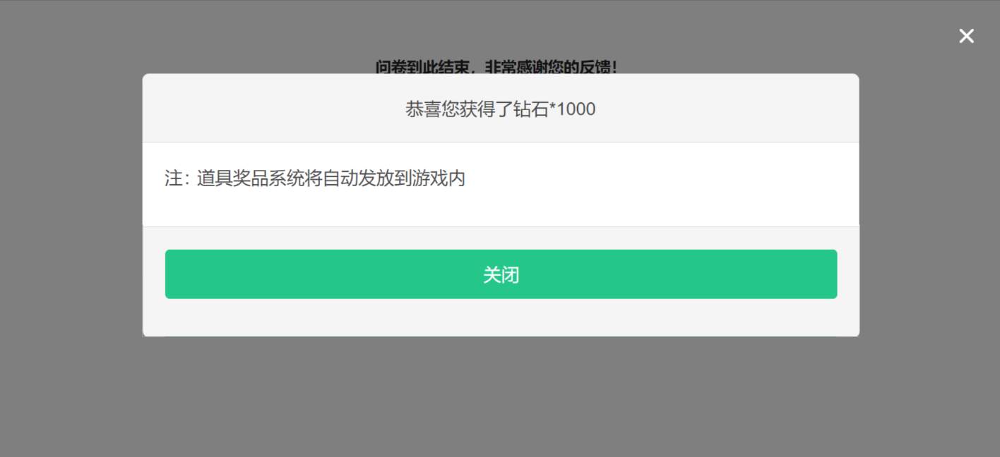

# AMS发奖

## 提交问卷后发奖

支持AMS礼包发奖功能；对于已对接AMS邮件发货功能的游戏，开启此功能时，用户提交问卷后，问卷系统可自动触发奖励发放。


1. 仅支持已对接邮件发货功能的游戏使用
2. 问卷务必开启[MSDK登录验证](../cao-zuo-zhi-yin/wen-juan-she-zhi/da-ti-xian-zhi-she-zhi/#msdk-deng-lu-yan-zheng)/[INTL登录验证](intl-deng-lu-tai-cai-ji.md)/[参数传递（严格校验模式）](../cao-zuo-zhi-yin/wen-juan-she-zhi/chuan-can-tiao-zhuan-hui-tiao.md#can-shu-chuan-di-jie-kou-yan-ge-xiao-yan-mo-shi)/[参数传递（不校验模式）](../cao-zuo-zhi-yin/wen-juan-she-zhi/chuan-can-tiao-zhuan-hui-tiao.md#can-shu-chuan-di-jie-kou-bu-xiao-yan-mo-shi)以上任一功能
3. 对每个答题者仅发奖一次；已成功发奖的答题者再次回答问卷后不可二次触发发奖


### 【STEP 1】AMS礼包单配置

请在AMS接口平台—礼包仓库(mrms)，即道具仓库中配置AMS礼包单，以获取AMS礼包单号、礼包组编号。


注：**国内**使用渠道务必配置为 **MUR问卷发奖应用 \[IEG-AMS-11836]**

&#x20;      **海外**使用渠道务必配置为 **MUR问卷发奖应用 \[IEG-AMS-4000046]**


### 【STEP 2】发奖配置

在需要发奖的问卷中开启“发奖 ”AMS发奖功能，并配置AMS礼包单号、礼包组编号、业务缩写、AMS环境参数


注：国内游戏内是使用的是gopenid发奖，则开启gopenid即可


<figure><figcaption></figcaption></figure>

<figure><figcaption></figcaption></figure>


注：海外配置礼包单时，ams环境是通过配置不同环境域名区分，具体域名可咨询ams助手获取


<figure><figcaption></figcaption></figure>

### 【STEP 3】传递发奖参数

问卷务必开启MSDK登录验证/INTL登录验证/参数传递（严格校验模式）/参数传递（不校验模式）以上任一功能，游戏客户端把以下4个发奖参数用拼接的方式注入问卷链接，用以发奖，若不需要其中部分参数，不传即可，参数说明如下：

| 参数名                   | 说明                   |
| --------------------- | -------------------- |
| 

sPlatId
 | 平台类型，如IOS:0、安卓:1     |
| sArea                 | 对应到渠道，如手Q、微信，请传对应的数字 |
| sPartition            | 手机端使用，小区             |
| sRoleId               |  角色ID，发货到游戏内时提供      |

#### 问卷链接注入发奖参数示例

<table data-header-hidden><thead><tr><th width="180.61832587663224">情况</th><th width="150">注入说明</th><th>示例链接</th></tr></thead><tbody><tr><td>情况</td><td>注入说明</td><td>示例链接</td></tr><tr><td>原始问卷链接</td><td>--</td><td><a href="https://in.weisurvey.com">https://in.weisurvey.com</a>/？sid=5e8d767b76051f46707cf692</td></tr><tr><td>MSDK登录验证</td><td>
4个发奖参数

直接拼接在

问卷链接后
</td><td><a href="https://in.weisurvey.com">https://in.weisurvey.com</a>/?sid=5e8d767b76051f46707cf692<strong>&#x26;sPlatId={sPlatId}&#x26;sArea={sArea}&#x26;sPartition={sPartition}&#x26;sRoleId={sRoleId}</strong></td></tr><tr><td>参数传递接口 （不校验模式）</td><td>
4个发奖参数

直接拼接在

问卷链接后
</td><td><a href="https://in.weisurvey.com">https://in.weisurvey.com</a>/?sid=5e8d767b76051f46707cf692&#x26;openid={答题者openid}<strong>&#x26;sPlatId={sPlatId}&#x26;sArea={sArea}&#x26;sPartition={sPartition}&#x26;sRoleId={sRoleId}</strong></td></tr><tr><td>参数传递接口 （严格校验模式）</td><td>
4个发奖参数

拼接在redirect所赋值的链接后再对redirect的值encode
</td><td>
https:// inap.in.weisurvey.com/autologin?sid

=5e8d767b76051f46707cf692&#x26;uid=user_id&#x26;timestamp=1573455797

&#x26;source=dwk&#x26;info=extra_info&#x26;redirect=https%3A%2F%2F

in.survey.imur.tencent.com%2F%3Fsid%3D5e8d767b76051f46707cf692

%26lang%3Dzh-CHS%26ADTAG%3Dsid.5e8d767b76051f46707cf692

<strong>%26sPlatId%3D{sPlatId}%26sArea%3D{sArea}%26sPartition</strong>

<strong>%3D{sPartition}%26sRoleId%3D{sRoleId}</strong>

&#x26;sign=2ac5ab8ce6a9b306e07dc2664fe7d175
</td></tr></tbody></table>

### 【STEP 4】接口申请

由问卷触发ams发奖需提前申请游戏内抽奖接口，请企业微信联系：IMUR问卷系统助手

### 【STEP 5】完成

在游戏中投放问卷，答题者提交问卷后，问卷系统会自动触发调用AMS礼包单发奖（奖品名称显示为step1中所配置的礼包组名称）。

### 发奖记录查询

点击“发奖记录”即可查看所有答题账号的触发发奖情况。

<figure><figcaption></figcaption></figure>

<figure><figcaption>
发奖记录详情
</figcaption></figure>

#### ams响应码说明

<table><thead><tr><th width="136">ams响应码</th><th width="198.33333333333331">情况说明</th><th>建议操作</th></tr></thead><tbody><tr><td>0</td><td>发奖成功</td><td>/</td></tr><tr><td>空或-100</td><td>不是测试号</td><td>测试环境调用发礼包接口需要使用测试号，请先前往<strong>测试号系统</strong>登记绑定并关联openid</td></tr><tr><td>100002</td><td>礼包扣光需要回滚资格</td><td>前往礼包仓库调整礼包单的配置，调整为每个账号可领取多次或增加礼包总数量</td></tr><tr><td>-9012</td><td>区服等参数异常</td><td>需要确认sPlatId、sArea、sPartition、sRoleId等四个参数值是否正确</td></tr><tr><td>-9081</td><td>调用gopenid接口未得到有效gopenid</td><td>1、游戏内使用openid体系：关闭设置弹窗中的“使用gopenid发奖设置” 2、游戏内使用gopenid体系：用户未注册游戏角色或者gopenid服务异常，检查账号状态是否正常</td></tr></tbody></table>

## 常见问题

[如何实现用户填完问卷后自动发奖？](../chang-jian-wen-ti/you-xi-nei-qian/ams-fa-jiang-she-zhi.md)

[在问卷设置中配置了AMS礼包单，为什么提交问卷后还是领不到奖励？](../chang-jian-wen-ti/zai-wen-juan-she-zhi-zhong-pei-zhi-le-ams-li-bao-dan-wei-shi-mo-ti-jiao-wen-juan-hou-huan-shi-ling-b.md)

[海外 AMS 发奖礼包多语言如何配置？](../chang-jian-wen-ti/you-xi-nei-qian/hai-wai-ams-fa-jiang-li-bao-duo-yu-yan-pei-zhi.md)
