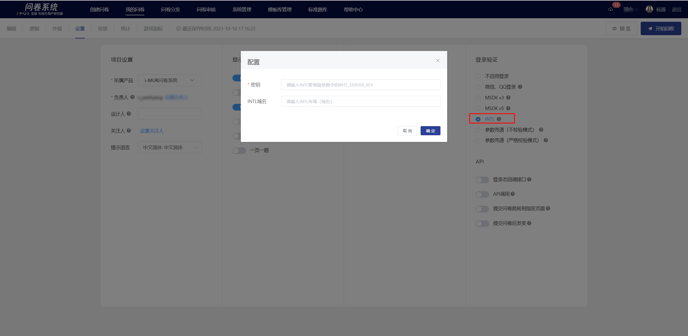

# INTL登录态采集

对接了INTL的APP，可在问卷设置的登录验证中选择【INTL】登录；用户提交问卷时，问卷系统会自动获取该玩家登录态（如openid）并存储在答题数据中。



### 参数配置说明


1. **密钥**：请填写INTL管理端参数中的INTL\_SERVER\_KEY

&#x20; 2\. **域名**：区分正式环境和测试环境，请自行联系游戏后端开发获取。

&#x20;      测试环境域名参考：https://test.intlgame.com

&#x20;      正式环境域名参考：https://sg.intlgame.com



### INTL登录态加解密说明

问卷系统后台用于解密获取玩家登录态流程的说明，游戏侧仅需关注是否有在问卷链接后**注入正确的登录态参数**。

#### 游戏客户端获取登录态加密票据

游戏客户端需通过INTL webview自带的“获取加密票据”接口在把问卷链接加密并注入登录态信息；参数包括：encodeparam、os、gameid、channelid、sdk\_version、user\_name、ts、seq。

```
//原始问卷链接
https://user.outweisurvey.com/v2/?sid=60d57b6eacb1fb323d61f772

//添加加密票据后的问卷链接
https://user.outweisurvey.com/v2/?sid=60d57b6eacb1fb323d61f772&gameid=11&os=1&ts=1597840414&version=0.1.000.0001&seq=11-42e0e9d2-2f0e-4b01-a1ab-6831cf9b6165-1597840414-11&encodeparam=4060E2A762B31B8B57A8D5A9BBAF10E8657A5A3A285B0DA7159417C2D6F0D801
```

#### 方式一：调用OpenUrl接口打开链接时，参数encryptEnable赋值为true

INTL文档参考：

【打开网页OpenUrl】 [https://docs.playernetwork.intlgame.com/docs/zh/API/UE-sdk/WebView/OpenUrl](https://docs.playernetwork.intlgame.com/docs/zh/API/UE-sdk/WebView/OpenUrl)

<figure><figcaption><p>参数赋值说明</p></figcaption></figure>

#### 方式二：调用（获取加密票据）接口在链接后注入登录态参数

MSDK文档参考：

【获取加密票据GetEncryptUrl】

[https://docs.playernetwork.intlgame.com/docs/zh/API/UE-sdk/WebView/GetEncryptUrl](https://docs.playernetwork.intlgame.com/docs/zh/API/UE-sdk/WebView/GetEncryptUrl)


**特别注意**

以上两种注入登录态方式任选其一，不可同时使用，否则会重复注入多次登录态参数导致问卷侧解密失败，无法访问问卷。（报错提示：登录失败请刷新）



**问卷分发情况说明**

使用“问卷分发页”投放的多语言问卷，注入登录态方式与上述描述一致，在分发页的汇总链接后注入登录态参数。



#### 问卷系统解密获取登录态信息

系统通过“解密校验”获取encodeparam解密后的明文，<mark style="color:red;">游戏侧无须关注</mark>。

INTL文档参考：【解密校验】

[https://docs.playernetwork.intlgame.com/docs/zh/API/Backend/Auth/decrypt\_aes](https://docs.playernetwork.intlgame.com/docs/zh/API/Backend/Auth/decrypt_aes#interface)


### 登录失败提示

当系统无法获取正确的登录态时，问卷页面会显示警告弹窗，主要导致失败的原因如下：

（1）encodeparam解密登录态时，由于缺失os、gameid、channelid、sdk\_version、user\_name、ts、seq等参数导致解密失败。

（2）注入登录态参数后的问卷链接过长，部分参数被截断导致参数缺失（需客户端另行处理）。

.png>)


若INTL登录态采集接口联调失败，可改用参数传递（[严格校验模式](https://imur.gitbook.io/help_center/api-wen-dang/fei-msdk-deng-lu-tai-chuan-di-jie-kou)、[不校验模式](https://imur.gitbook.io/help_center/api-wen-dang/can-shu-chuan-di-jie-kou-bu-xiao-yan-mo-shi)）接口，实现登录态传递。

