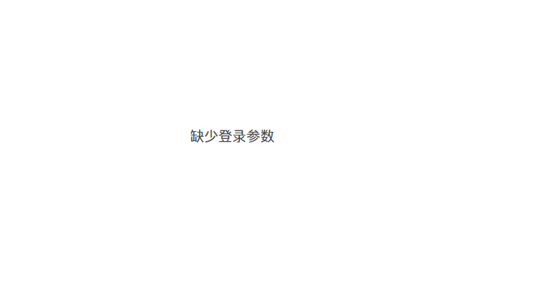

# MSDK-V3登录态采集

对接了MSDK V3版本的APP，可在问卷设置的登录验证中选择【MSDK v3】，用户提交问卷时，问卷系统会自动获取MSDK的登录态并存储在答题数据中。

<figure><figcaption></figcaption></figure>

## MSDK-V3登录态加解密说明

问卷系统后台用于解密获取玩家登录态流程的说明，游戏侧仅需关注是否有在问卷链接后**注入正确的登录态参数**。

### 游戏客户端获取登录态加密票据

游戏客户端需通过MSDK webview自带的“获取加密票据”接口在把问卷链接加密并注入登录态信息；参数包括：msdkEncodeParam、timestamp、appid、algorithm、version、sig、encode等。

MSDK文档参考：【获取加密票据】

[https://wiki.ssl.msdk.qq.com/Android/webview.html#Android\_UrlAddEncodeParam](https://wiki.ssl.msdk.qq.com/Android/webview.html#Android_UrlAddEncodeParam)


### **问卷系统解密获取登录态信息**

系统通过“解密校验”接口获取msdkEncodeParam解密后的明文openid，游戏侧无须关注。

MSDK文档参考：【解密校验】[https://wiki.ssl.msdk.qq.com/Android/webview.html#Android\_DecodeLoginInfo](https://wiki.ssl.msdk.qq.com/Android/webview.html#Android_DecodeLoginInfo)

（1）系统优先使用msdkEncodeParam参数进行登录态解密，此时要求必须带上timestamp、appid、algorithm、version、sig、encode这6个参数参与，示例如下：

```
http://www.qq.com?algorithm=v2&version=2.0.6a&timestamp=1423538227203&appid=100703379&sig=427291da31b56b597
39be6da61d433ec&encode=2&msdkEncodeParam=BAD8B1625CB04523B06AAF6739ACB3CEA96F54393831AF5C6890E92EE61CF1A29F
493710592DD84B47D4217BA9FA9DAFB8025CEB27E45EC958689A794E8BD33CF2544CC5D00FCE03AEF7B23EE2BFCA4332F5D69547477
A3E93E44F3270F19664D5499CA2990BE5BA9E232036197B184F1411B76CF95537AC07E3D6A27F054AD3F26648B18554F9C1
```

.png>)

（2）当msdkEncodeParam参数无法正常解密登录态时，系统会直接获取openid参数值作为登录态。

（3）如需获取自定义参数，可在链接后拼接“info”为自定义内容存储到答题数据中（非必选）

<figure><figcaption></figcaption></figure>


原始问卷链接 https://in.weisurvey.com/?sid=60ebdefe76051f6b8a37f782


添加加密票据和info后的问卷链接 https://in.weisurvey.com/?sid=60ebdefe76051f6b8a37f782\&algorithm=itop\&encode=2\&gameid=12\&os=1\&ts=1542889299\&version=2.2.000.2607.2607\&seq=11-5d0f17db-ef1e-44cd-88d7-57b556cc63ce-53\&sig=eb6ee5ab9418d1c8e6400608815e76f2\&itopencodeparam=F5382C12988BADA6F659B443ACE9978C14DE1B62EB1274AEFDECC219DE635C2B\&info=xxx



## 登录失败提示

当系统无法获取正确的登录态时，会显示警告弹窗，主要导致失败的原因如下：

（1）msdkEncodeParam解密登录态时，由于缺失timestamp、appid、algorithm、version、sig、encode等参数导致解密失败。

（2）链接中无openid参数，导致无法获取登录态。

（3）注入登录态参数后的问卷链接过长，部分参数被截断导致参数缺失（需客户端另行处理）。




如MSDK-V3登录态采集接口联调失败，可改用参数传递（[严格校验模式](https://imur.gitbook.io/help_center/api-wen-dang/fei-msdk-deng-lu-tai-chuan-di-jie-kou)、[不校验模式](https://imur.gitbook.io/help_center/api-wen-dang/can-shu-chuan-di-jie-kou-bu-xiao-yan-mo-shi)）接口，实现登录态传递。


