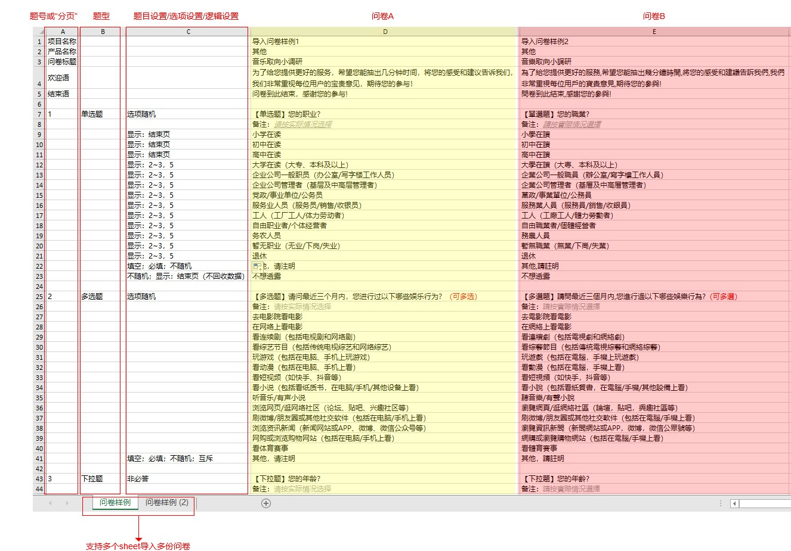

# 问卷自动导入

如果您已经有设计好的EXCEL问卷，可以直接使用”问卷自动导入“功能导入问卷文本并创建在线问卷，支持一次导入多份问卷。

## 【STEP 1】在EXCEL编辑问卷内容

可提前在EXCEL中编辑问卷，包括：问卷基本信息（项目名称、产品名称、问卷标题、欢迎语、结束语）、题目与选项内容（含字体样式）、题目设置、分页设置、简单逻辑设置等。


## 格式规范 

1、 前5行是问卷基本信息

 A列：固定为“项目名称”、“产品名称”、“问卷标题”、“欢迎语”、“结束语” 

B、C列：固定为空 

D列：“项目名称”、“产品名称”、“问卷标题”、“欢迎语”、“结束语”等对应的具体内容，可为空；空值上传时系统会自动填入基本信息默认值 （问卷标题最多可输入50字）

2、 第6行为间隔的空行

3、 第7行开始为问卷题目内容，识别前4列的内容，题目之间间隔一行空行 

A列：题号或“**分页**”；“**分页**”和题目之间不需要间隔空行；所有信息栏的A列固填入：**0** 

B列：题型；需要与系统的题型名称一致，目前支持：单选题、多选题、下拉题、主观题、矩阵单选题、矩阵多选题、矩阵量表题、信息栏、量表题、下拉题、联动题 

C列：题目设置、选项设置； 

D列：题干、备注、选项内容；备注在题干的下一行，以“**备注：**”开头，冒号：仅支持中文 （D列开始每列为一份问卷）

4、导入支持文本样式识别，包括加粗、斜体、下划线、删除线、字体颜色

5、分割符号： D列矩阵单选题的问题和选项、矩阵多选题的问题和选项使用尖号^分割

6、特殊符号说明：不支持导入尖括号&lt;&gt;，导入文本中若包括&lt;&gt;，导入后尖括号&lt;&gt;及尖括号中的文本内容会自动置空，请用户在线上直接编辑。

7、题目设置： 

（1）非必答设置；C列不进行任何题目设置时，默认题目必答；若该题为非必答，在题目所在行的C列填入：**非必答** 

（2）选项随机排序设置：默认不启用选项随机排序； 若启用，在题目所在行的C列填入：选项随机，指定选项所在行的C列中填入：**不随机** 

（3）最多选择、最少选择设置：若启用，在题目所在行的C列填入：**最少**：m 、 **最多**：n，其中m和n为数值，且m必须小于等于n，可以仅设置最多或最少其中一项 

（4）问题随机排序设置：支持矩阵单选题、矩阵多选题、矩阵量表题，默认不启用问题随机排序； 若启用，在题目所在行的C列填入：**问题随机**，指定问题所在行的C列中填入：**不随机** 

（5）量表题最低分、最高分设置：

① 在D列中备注后三行依次填入最低分、^、最高分 

② 第一行为最低分，第二行为连接符^，第三行为最高分 

③ 最低分、最高分均为整数，可为负数 

（6）量表题量表提示语设置： 

在最低分所在行设置左边提示语 

在连接符所在行设置中间提示语 

在最高分所在行设置右边提示语 

（7）联动题仅支持题干和备注的导入，暂不支持选项的导入

8、选项设置： 

（1）填空设置：不注明时，默认不添加填空框；若该选项需要添加填空框，在选项所在行的C列填入：**填空** 

（2）必填设置：已设置填空的选项，不注明时，默认为非必填；若该选项的填空框为必填，在选项所在行的C列填入：**必填** 

（3）互斥设置：仅多选题支持此设置，不注明时，默认均不为互斥项 若该选项为互斥项，在选项所在行的C列填入：**互斥**

9、引用设置：不支持内容引用设置的导入，请用户在线上直接编辑

10、关联设置：不支持关联的导入，请用户在线上直接编辑

11、逻辑设置：需要设置简单逻辑的选项，在该选项的所在行的C列标注 

（1）支持题型：单选题、下拉题、多选题 

（2） 格式说明：题号之间用中文逗号，隔开，连续题号用~连接 

显示：题号，题号~题号，题号 

显示：结束页 

显示：结束页（不回收数据）


## 【STEP 2】导入问卷

在问卷创建页中，点击“导入”按钮后进入导入页面，上传已编辑好的EXCEL文件。

## 【STEP 3】确认基本信息

上传EXCEL文件后，系统会自动识别问卷内容并生成问卷列表，已上传的问卷支持重新上传或删除（删除后不会生成问卷），可调整项目名称、产品名称、问卷标题。

## 【STEP 4】生成在线问卷

确认问卷信息后，点击“创建问卷”即可生成在线问卷，显示在“我的问卷”列表。

