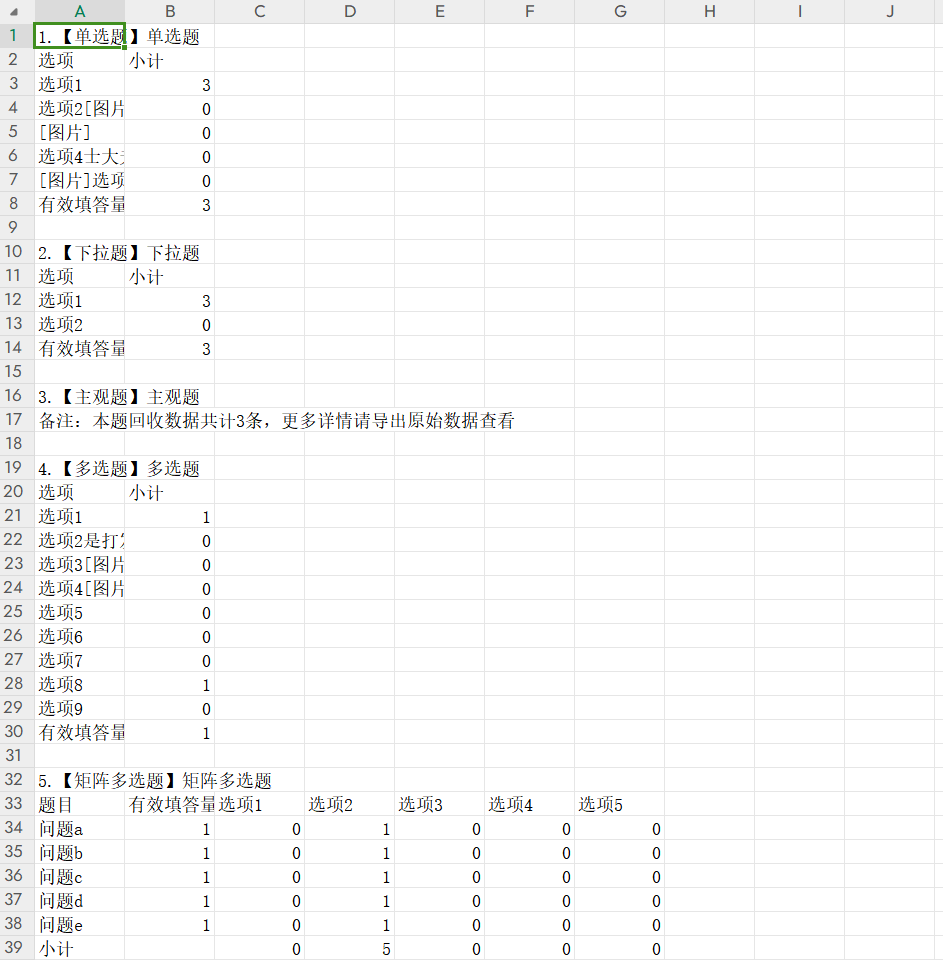

# 统计图表

在统计图表页支持在线查看各题答案的统计结果、统计结果导出（含小计和百分比）。


左侧导航大纲支持点击定位到指定题目。


<figure><figcaption></figcaption></figure>

下载结果格式为CSV格式，可在excel中直接打开，包含：总表（总计+小计+百分比）+频率表（含百分比）+频数表（含小计），满足不同看数场景

<figure><figcaption>
频率表
</figcaption></figure>

<figure><figcaption>
频数表
</figcaption></figure>

## 数据筛选

统计图表提供数据筛选功能，开启后可设定指定条件对当前已回收的答卷数据进行筛选，筛选结果以统计图表形式展现。


* 支持您将当前筛选器配置保存为筛选条件，并为其命名；
* 在筛选器上方展示已保存的条件标签，支持快速切换；
* 支持您随时修改当前筛选条件并查看数据，但只有点击“保存”后才更新已保存的内容；
* 提供“另存为”功能，允许您基于当前条件创建新的筛选条件


添加条件

点击添加条件可设置多个条件进行筛选，支持一次勾选多个选项设定。筛选条件默认包含（来源平台、提交时间、答题时长、问卷状态、答题语言）

<figure><figcaption></figcaption></figure>

添加条件组

点击“添加条件组“可自定义满足"And”或”or”条件下的数据筛选，支持一次勾选多个选项设定。

<figure><figcaption></figcaption></figure>

添加条件后点击开始筛选，统计图表将会根据筛选条件刷新&#x20;

<figure><figcaption></figcaption></figure>

支持添加多个筛选条件进行命名、复用，系统将根据该标签对应的筛选条件逻辑，实时查询当前问卷的最新回收数据，并重新计算统计结果

<figure><figcaption></figcaption></figure>
