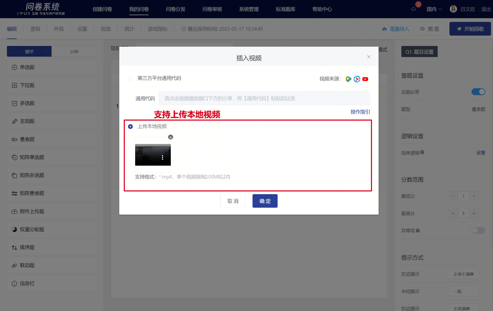

# 插入视频

支持两种方式：上传本地视频、插入第三方平台代码

## 编辑状态下插入视频

### **【STEP 1】指定插入视频位置**

问卷编辑状态中，点击问卷题目、备注或选项文本编辑框后，左上方会展开富文本编辑工具，在富文本编辑工具中点击“视频”图标。

### &#x20;**【STEP 2】选择视频插入方式**

### 方式一：本地视频上传

支持本地视频上传，视频直接上传到问卷系统后台，敏感调研项目中更有效地避免素材泄露。

<figure><figcaption></figcaption></figure>

### 方式二：第三方平台视频代码

<figure><figcaption></figcaption></figure>


注意：上传视频时，要先将视频上传到第三方的视频网站平台，建议使用：腾讯视频


在第三方视频网站（建议使用腾讯视频），在被插入视频的播放页面下方的“分享”的按钮中找到“通用代码”并复制。


**支持平台**

* 腾讯视频
* 优酷视频
* bilibili
* YouTube


#### 平台一：腾讯视频

.png>)

#### 平台二：优酷视频

.png>)

#### 平台三：YouTube

.png>)

.png>)

#### 调整视频播放器尺寸大小

如需调整PC答题端视频尺寸，可在通用代码中加入宽高标记以设置视频播放器的宽度和高度，如：width="700" height="480"


仅支持调整PC答题端中的视频播放器尺寸


.png>)

### **【STEP 3】**确认插入视频

点击确定即插入视频成功，文本编辑栏中显示已插入视频的缩略图。

.png>)

## 答题端显示视频

.png>)
