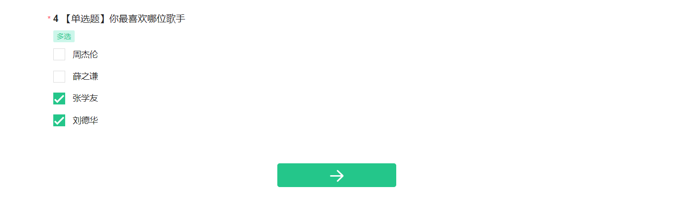
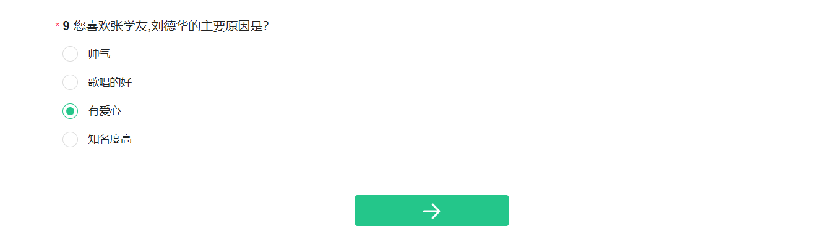

# 内容引用

在编辑问卷题目、备注或选项时，均支持引用前序题目的选中项、未选中项、填空内容。

<figure><figcaption>
内容引用效果
</figcaption></figure>

## 设置引用内容

### **【STEP 1】指定插入内容引用的位置**

问卷编辑状态中，点击问卷题目、备注或选项文本编辑框后，左上方会展开富文本编辑工具，在富文本编辑工具中点击“引用”图标。

<figure><figcaption></figcaption></figure>

### **【STEP 2】**&#x6307;定引用内容

在下拉框中指定需要引用的前序题目后，选择引用该题的选中项、未选中项或填空项，选择后点击右&#x4FA7;**“插入到下文”**&#x81EA;动生成标识。


1. 仅支持引用前序的单选题/多选题/下拉题，其他题型不支持作为被引用题目。

&#x20;   2\. 为避免显示错乱，请尽量避免编辑自动生成的标识内容。


<figure><figcaption></figcaption></figure>


### 引用标识语法说明

格式：\[Q数字题号:选项标识] &#x20;

如：\[Q4:blank-content]

### 选项标识

**选中项** selected

&#x20;**未选中项**   unselected

**填空内容**  blank-content


## 答题端显示

已插入引用内容的题目、备注或选项，在答题端中会根据所引用的前序题目选项/填空内变化自动同步文本，多项时会自动用逗号，隔开。

<figure><figcaption></figcaption></figure>

