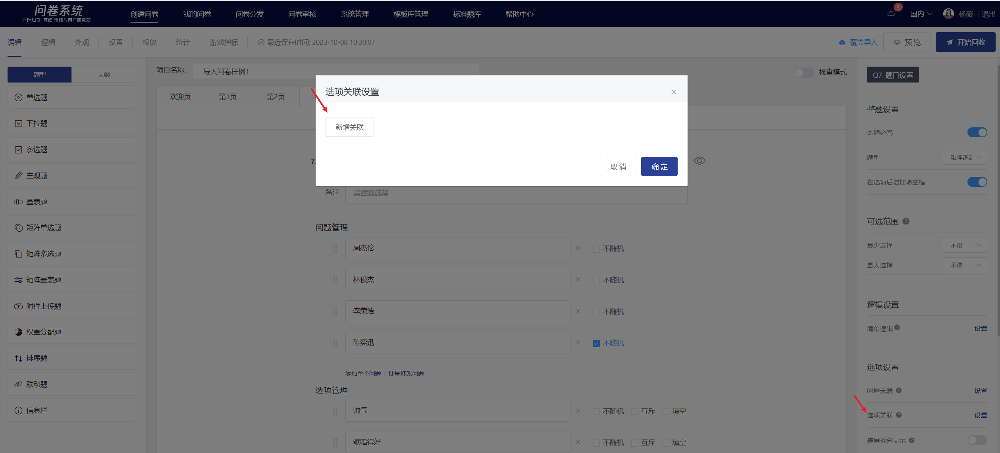
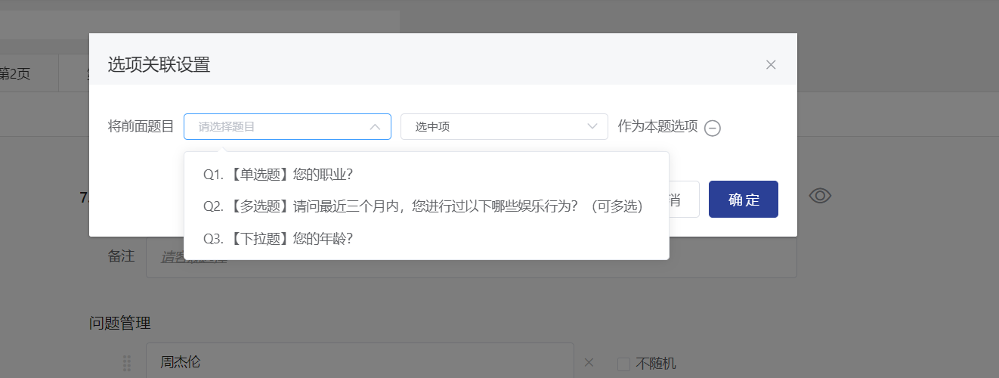
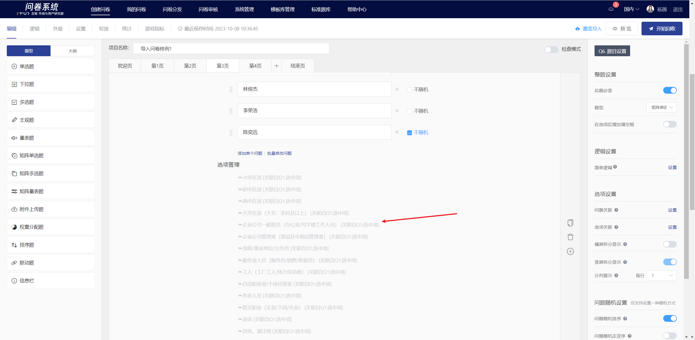
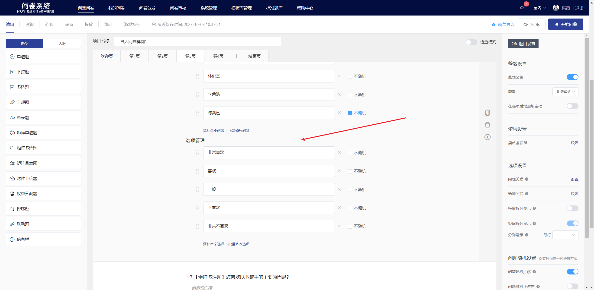

# 选项关联

选项关联即让答题者选中（或未选中）的选项显示在下一题的可选项中，一般用于题目相关性极高的两题中或追问的情况。


从前序题目关联下来的选项不支持设置填空、互斥或随机。


## 【STEP 1】显示设置弹窗

在题目编辑状态下，点击右侧题目设置面板中“选项关联”右侧“设置”按钮，即显示选项关联设置弹窗。

## 【STEP 2】新增关联/移除关联

### 新增关联

在选项关联设置弹窗中，点击“新增关联”按钮后，显示题目与选项设置下拉框。

.png>)

.png>)

点击展开题目下拉框，选择题目。


仅支持选择单选题/多选题/下拉题/矩阵单选/矩阵多选/矩阵量表题


点击展开选项设置下拉框，选择“选中项”/“未选中项”。

.png>)

点击确定设置完成。

### 移除关联

在选项关联设置弹窗中点击 - 即可移除选项关联设置。

.png>)

## 答题端显示

设置选项关联后，答题时题目的选项会根据已设置所关联题目的选项情况改变。

.png>)
