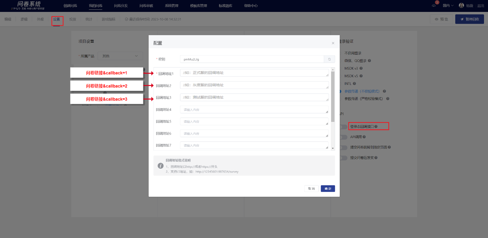

# API(跳转/回调/发奖）

问卷系统支持内嵌投放及答题后跳转、参数回调等功能，用户可根据实际需要按以下各项设置。

<figure><figcaption></figcaption></figure>

## 提交问卷跳转到指定页面

功能开启后，在设置弹窗中填写跳转的链接（链接需为包含http://或http://前缀的地址），设置完成后当答题者提交问卷后浏览器将跳转到您设置的链接上。

.png>)

<figure><figcaption></figcaption></figure>

## 登录态回调接口

提供登录态回调的功能，开发者可自行配置回调地址和密钥，问卷系统将登录态等参数回调给开发者，开发者获取参数后可用于奖励发放。

.png>)

<figure><figcaption></figcaption></figure>

### 同一问卷支持设置多个回调地址

投放时**客户端**在问卷链接中注入callback参数，用以区分该次提交后回调到哪个回调地址中。最多可配置10个回调地址，具体回调到哪个实际由客户端指定。

**注：**&#x6BCF;次提交问卷仅能回调到一个地址中，若问卷链接未注入callback参数，默认回调到地址1。


如投放链接中注入callback的值为2，则提交后系统自动把登录态信息回调到回调地址2中

https://in.weisurvey.com/?sid=5f87b81376051f331039dfe5\&openid={openid}**\&callback=2**


### 回调示例

开发者回调接口url?sid=5da414769e8aa80019305e32\&timestamp=1573556685\&uid=test\_user\&user\_type=third\_party\&uid\_source=qq\&info=afdadsfasdfasdf\&callback\_params=callbackparams\&sign=38408d6222e1a4c6fa598e4820443ca8

[点击了解详细API文档](../../api-wen-dang/deng-lu-tai-hui-tiao-jie-kou.md)。

## API调用

系统提供开放接口用以查询指定问卷的答卷信息、答题统计数据、题型统计等，开启功能后系统将自动生成密钥（密钥支持自定义修改），凭密钥调用接口查询问卷信息；关闭后不可调用查询。

.png>)

[点击了解详细API文档。](../../api-wen-dang/kai-fang-jie-kou/)

<figure><figcaption></figcaption></figure>

## AMS发奖

系统支持AMS礼包发奖，可通过问卷设置—提交问卷后发奖功能实现；对于已对接AMS邮件发货功能的游戏，开启此功能时，用户提交问卷后，问卷系统可自动触发奖励发放。

<figure><figcaption></figcaption></figure>


1. 仅支持已对接**邮件发货**功能的游戏使用
2. 问卷务必开启[MSDK登录验证](da-ti-xian-zhi-she-zhi/#msdk-deng-lu-yan-zheng)/[参数传递（严格校验模式）](chuan-can-tiao-zhuan-hui-tiao.md#can-shu-chuan-di-jie-kou-yan-ge-xiao-yan-mo-shi)/[参数传递（不校验模式）](chuan-can-tiao-zhuan-hui-tiao.md#can-shu-chuan-di-jie-kou-bu-xiao-yan-mo-shi)以上任一功能
3. 对每个答题者仅发奖一次；已成功发奖的答题者再次回答问卷后不可二次触发发奖


### 【STEP 1】AMS礼包单配置

请在AMS接口平台—礼包仓库(mrms)，即道具仓库中配置AMS礼包单，以获取AMS礼包单号、礼包组编号。


注：**国内**使用渠道务必配置为 **MUR问卷发奖应用 \[IEG-AMS-11836]**

&#x20;        **海外**使用渠道务必配置为 **MUR问卷发奖应用 \[IEG-AMS-4000046]**


### 【STEP 2】发奖配置

在需要发奖的问卷中开启“提交问卷后发奖”功能，并配置AMS礼包单号、礼包组编号、业务缩写、AMS环境参数

若游戏内是使用的是gopenid发奖，则开启gopenid即可

<figure><figcaption></figcaption></figure>

### 【STEP 3】传递发奖参数

问卷务必开启MSDK登录验证/参数传递（严格校验模式）/参数传递（不校验模式）以上任一功能，游戏客户端把以下4个发奖参数用拼接的方式注入问卷链接，用以发奖，参数说明如下：

| 参数名                   | 说明                   |
| --------------------- | -------------------- |
| 

sPlatId
 | 平台类型，如IOS:0、安卓:1     |
| sArea                 | 对应到渠道，如手Q、微信，请传对应的数字 |
| sPartition            | 手机端使用，小区             |
| sRoleId               |  角色ID，发货到游戏内时提供      |

#### 问卷链接注入发奖参数示例

| 情况             | 注入说明                                                     | 示例链接                                                                                                                                                                                                                                                                                                                                                                                                                                                                                                                                           |
| -------------- | -------------------------------------------------------- | ---------------------------------------------------------------------------------------------------------------------------------------------------------------------------------------------------------------------------------------------------------------------------------------------------------------------------------------------------------------------------------------------------------------------------------------------------------------------------------------------------------------------------------------------- |
| 原始问卷链接         | --                                                       | https://in.survey.imur.tencent.com/?sid=5e8d767b76051f46707cf692                                                                                                                                                                                                                                                                                                                                                                                                                                                                               |
| MSDK登录验证       | 
4个发奖参数

直接拼接在

问卷链接后
                    | https://in.survey.imur.tencent.com/?sid=5e8d767b76051f46707cf69&#x32;**\&sPlatId={sPlatId}\&sArea={sArea}\&sPartition={sPartition}\&sRoleId={sRoleId}**                                                                                                                                                                                                                                                                                                                                                                                        |
| 参数传递接口（不校验模式）  | 
4个发奖参数

直接拼接在

问卷链接后
                    | https://in.survey.imur.tencent.com/?sid=5e8d767b76051f46707cf692\&openid={答题者openid}**\&sPlatId={sPlatId}\&sArea={sArea}\&sPartition={sPartition}\&sRoleId={sRoleId}**                                                                                                                                                                                                                                                                                                                                                                         |
| 参数传递接口（严格校验模式） | 
4个发奖参数

拼接在redirect所赋值的链接后再对redirect的值encode
 | 
https:// inapi.survey.imur.tencent.com/autologin?sid

=5e8d767b76051f46707cf692&#x26;uid=user_id&#x26;timestamp=1573455797

&#x26;source=dwk&#x26;info=extra_info&#x26;redirect=https%3A%2F%2F

in.survey.imur.tencent.com%2F%3Fsid%3D5e8d767b76051f46707cf692

%26lang%3Dzh-CHS%26ADTAG%3Dsid.5e8d767b76051f46707cf692

<strong>%26sPlatId%3D{sPlatId}%26sArea%3D{sArea}%26sPartition</strong>

<strong>%3D{sPartition}%26sRoleId%3D{sRoleId}</strong>

&#x26;sign=2ac5ab8ce6a9b306e07dc2664fe7d175
 |

### 【STEP 4】接口申请

由问卷触发ams发奖需提前申请游戏内抽奖接口，请企业微信联系：IMUR问卷系统助手

### 【STEP 5】完成

在游戏中投放问卷，答题者提交问卷后，问卷系统会自动触发调用AMS礼包单发奖（奖品名称显示为step1中所配置的礼包组名称）。

<figure><figcaption>
游戏内填答后发奖成功提示
</figcaption></figure>

### 发奖记录查询

点击“发奖记录”即可查看所有答题账号的触发发奖情况。

<figure><figcaption></figcaption></figure>

<figure><figcaption>
发奖记录详情
</figcaption></figure>

#### ams响应码说明

<table><thead><tr><th width="136">ams响应码</th><th width="198.33333333333331">情况说明</th><th>建议操作</th></tr></thead><tbody><tr><td>0</td><td>发奖成功</td><td>/</td></tr><tr><td>空或-100</td><td>不是测试号</td><td>测试环境调用发礼包接口需要使用测试号，请先前往<strong>测试号系统</strong>登记绑定并关联openid</td></tr><tr><td>100002</td><td>礼包扣光需要回滚资格</td><td>前往礼包仓库调整礼包单的配置，调整为每个账号可领取多次或增加礼包总数量</td></tr><tr><td>-9012</td><td>区服等参数异常</td><td>需要确认sPlatId、sArea、sPartition、sRoleId等四个参数值是否正确</td></tr><tr><td>-9081</td><td>调用gopenid接口未得到有效gopenid</td><td>1、游戏内使用openid体系：关闭设置弹窗中的“使用gopenid发奖设置” 2、游戏内使用gopenid体系：用户未注册游戏角色或者gopenid服务异常，检查账号状态是否正常</td></tr></tbody></table>

