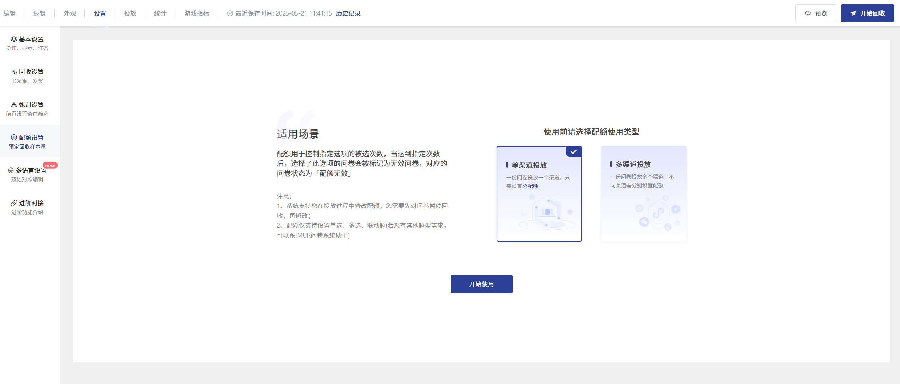

# 配额设置

配额设置仅支持单选题、多选题、联动题(需导入地址）

### 【STEP 1】选择单渠道或者多渠道投放

常规投放只需选择单渠道投放即可（需要对多个分链接分别进行配额时，可选择多渠道投放）

<figure><figcaption></figcaption></figure>

### 【STEP 2】设置配额题目

将左侧题目列表中的题目拖拽到右侧配额题目即可生成配额条件

<figure><figcaption></figcaption></figure>

### 【STEP 3】设置配额数量

设置每个选项的配额数量，默认0为不限制配额

<figure><figcaption></figcaption></figure>

### 【STEP 4】开启配额开关

投放问卷前，请开启配额开关，否则配额条件不生效

<figure><figcaption></figcaption></figure>

### 【STEP5】查看配额进度

投放过程中可随时进入配额设置页面查看配额进度

<figure><figcaption></figcaption></figure>

### 设置交叉配额

通过设置交叉配额，可以根据2个题目来限定选项可选择的次数。例如：需收集10个喜欢电脑游戏的男性玩家答卷，可以使用交叉配额来完成，设置如下图所示，拖拽列表中的题目到需参与交叉配额的题目下方

<figure><figcaption>
交叉配额
</figcaption></figure>

### 有效问卷回收量上限

可单独对问卷设置有效问卷回收上限，达到上限后，问卷自动暂停回收

<figure><figcaption></figcaption></figure>

<figure><figcaption>
两处功能一致
</figcaption></figure>


1.以上两个入口功能一致，上方常用于仅设置单个问卷回收上限，不设置任何配额题目；下方适用于对题目设置配额的同时又设置问卷回收上限

2.可对每个投放渠道分别设置有效问卷回收量上限，达到上限后该渠道自动暂停回收，其他渠道正常回收问卷。



### 进阶功能

#### <mark style="background-color:blue;">区间配额</mark>

对一些样本进行定量回收时，部分用户是允许收取的样本在一定范围比例内波动，例如收集男女的题目，可以允许男比例在80%-90%，女比例在10%--20%，此时可使用区间配额控制

<figure><figcaption></figcaption></figure>


1.使用区间配额，需设置单题上限，达到单题上限后，选中该题的任何选项都会被标记为配额无效

2.未达到单题上限，当某个选项达到区间最大值，那么选中该选项会被标记为配额无效

3.区间配额只适用于单渠道投放中的单选题


#### <mark style="background-color:blue;">设置满额后跳转结束页</mark>

答题者点击下一页即判断是否已选中满额选项，若已满额则自动跳转到结束页，无需答完全部题目

<figure><figcaption></figcaption></figure>

#### <mark style="background-color:blue;">添加变量</mark>

支持自定义变量，即重新组合题目字段生成新变量，新生成的变量可参与配额或与其他题目生成交叉配额

<figure><figcaption>
添加变量
</figcaption></figure>

添加成功后，会在题目列表下方生成新的变量题目，拖拽即可参与配额

<figure><figcaption></figcaption></figure>

