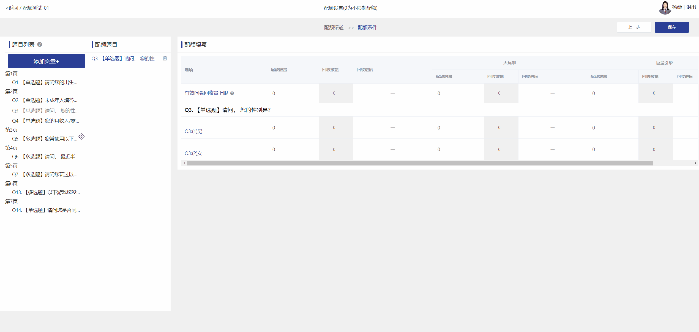

# 配额设置

配额设置仅支持单选题、多选题、联动题(需导入地址）

### 【STEP 1】添加渠道

进入配额设置后可以先增加投放渠道，对每个渠道回收数据进行配额（如不分渠道投放点击下一步即可）

<figure><figcaption>
添加渠道
</figcaption></figure>

### 【STEP 2】设置配额题目

将左侧题目列表中的题目拖拽到右侧配额题目即可生成配额

<figure><figcaption>
添加配额题目
</figcaption></figure>

### 【STEP 3】设置配额数量

设置每个选项的配额数量，默认0为不限制配额

<figure><figcaption>
设置配额数量
</figcaption></figure>

### 【STEP 4】查看配额进度

回收问卷后可直接在当前页查看配额完成情况

<figure><figcaption></figcaption></figure>

### 设置交叉配额

通过设置交叉配额，可以根据2个题目来限定选项可选择的次数。例如：需收集10个喜欢电脑游戏的男性玩家答卷，可以使用交叉配额来完成，设置如下图所示，拖拽列表中的题目到需参与交叉配额的题目下方

<figure><figcaption>
交叉配额
</figcaption></figure>

### 有效问卷回收量上限


有效问卷达到预设值后，将自动暂停回收；

可对每个投放渠道分别设置有效问卷回收量，有效问卷量上限后该渠道链接自动暂停回收，其他渠道正常回收问卷。


<figure><figcaption></figcaption></figure>

### 添加变量

支持自定义变量，即重新组合题目字段生成新变量，新生成的变量可参与配额或与其他题目生成交叉配额

<figure><figcaption>
添加变量
</figcaption></figure>

添加成功后，会在题目列表下方生成新的变量题目，拖拽即可参与配额

<figure><figcaption></figcaption></figure>
