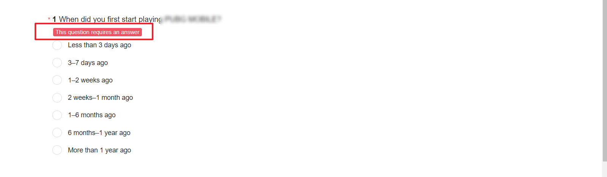
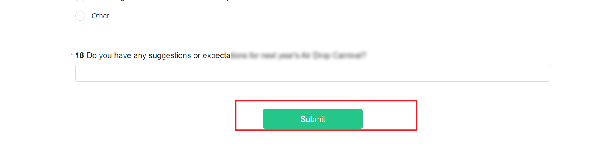

# 基础设置

在“基本设置”的“基础设置”项中可补充完整项目信息，包括所属产品、问卷负责人、问卷关注人、提示语言。

<figure><figcaption></figcaption></figure>


1. 问卷首次开始回收/提交审核前，需补充完整所属产品和负责人信息
2. 负责人请填写项目对接的**用研经理**
3. 用研经理创建问卷后，默认成为问卷负责人


## 设置负责人

负责人即本问卷的其他管理员，负责人拥有该问卷最高的权限，且该问卷出现在他的“我的问卷”列表中，从而实现该问卷的协同编辑及管理。

在“设置”页可设置指定问卷的负责人，在输入框中输入用户的RTX账号或姓名后自动搜索匹配的用户，选择后即设置负责人成功。


1.负责人输入框支持模糊搜索。

2\. 仅**用研经理**可被设置为问卷负责人。

3.每份问卷支持设置多名负责人，至少保留一名负责人。

4.若多名用户同时编辑/设置同一份问卷，以最后保存的一份问卷内容为准。


<figure><figcaption></figcaption></figure>

## 设置关注人

关注人即本问卷的普通用户，支持为关注人分配指定权限，且该问卷出现在他的“我的问卷”列表中，从而实现该问卷的协同编辑及管理。

<figure><figcaption></figcaption></figure>

<figure><figcaption></figcaption></figure>

<figure><figcaption></figcaption></figure>


1. 仅问卷负责人可添加关注人并为其分配权限
2. 为避免敏感数据泄露，请谨慎分配“**答题数据**”和“**导出数据**”权限
3. 预览权限默认勾选，若不勾选，则此关注人在预览页面无权分享预览链接给他人查看


## 提示语言

提示语言指的是，在答题端中显示的提示语语种，默认为中文简体，可根据实际需要设置其他语种。

<figure><figcaption></figcaption></figure>


提示语支持语种：

* 中文简体-中文简体&#x20;
* 中文繁体-中文繁體&#x20;
* 英语-English&#x20;
* 阿拉伯语-العربية&#x20;
* 德语-Deutsch&#x20;
* 俄语-Pусский&#x20;
* 法语-Français&#x20;
* 菲律宾语-Filipino&#x20;
* 韩语-한국어&#x20;
* 高棉语-ខ្មែរ។&#x20;
* 马来语-Bahasa Melayu
* 孟加拉语-বাংলা
* 葡萄牙语-Português&#x20;
* 日语-日本語&#x20;
* 泰语-ภาษาไทย&#x20;
* 土耳其语-Türkçe&#x20;
* 乌尔都语-اردو‎
* 西班牙语-Español&#x20;
* 意大利语-Italiano&#x20;
* 印地语-हिन्दी&#x20;
* 印尼语-Bahasa Indonesia&#x20;
* 越南语-Tiếng Việt


<figure><figcaption></figcaption></figure>

<figure><figcaption></figcaption></figure>
