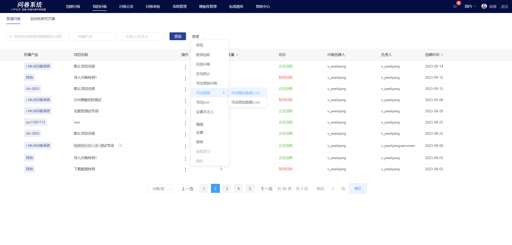
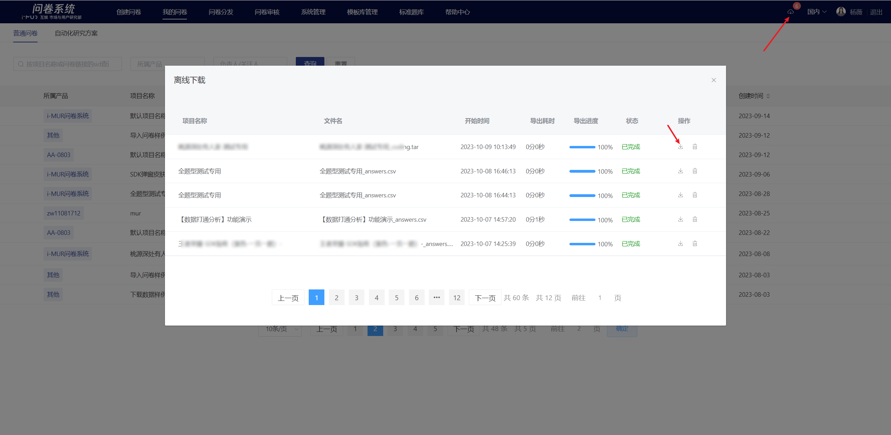

# 导出答题编码

在“我的问卷”列表选择一份问卷，点击操作栏中的“导出”-导出答题编码，即可导出该问卷的全部答题数据。

&#x20;文件采用异步下载方式，任务导出状态显示在“离线下载”弹窗中，导出完成后下载。

导出的答题编码数据为.zip格式的压缩包，内含答题编码数据（.csv）、SPSS编码（.txt）、交叉表代码（.txt）。


**特殊说明**

由于合规限制，base国内用户不可获取玩家id等个人隐私信息，问卷系统对导出数据中的ip地址、用户id列做脱敏处理。如需获取明文数据，请自行联系base海外的同事并找问卷系统助手开通权限后下载。下载的数据必须**脱敏后才能传回国内**。数据示例如下：



## 在EXCEL中打开答题编码数据

答题编码数据（.csv）一般需要使用SPSS软件进行数据分析，详情请查看[SPSS数据分析](spss-shu-ju-fen-xi.md)，也可导入到EXCEL中直接查看。


1. 直接使用EXCEL打开答题编码数据（.csv）文件可能会导致所收集的手机号码、uid等长数字显示错乱。请避免直接用EXCEL打开答题编码数据（.csv）文件，请按以下步骤导入。  （excel2016的导入设置请[点击此处](https://imur.gitbook.io/help_center/cao-zuo-zhi-yin/xia-zai-shu-ju/dao-chu-da-ti-bian-ma#excel-2016)查看，excel2019的导入设置请[点击此处](https://imur.gitbook.io/help_center/cao-zuo-zhi-yin/xia-zai-shu-ju/dao-chu-da-ti-bian-ma#excel-2019)查看）
2. 当答卷数量过多时，在EXCEL中查看答题编码数据（.csv）文件可能会出现卡顿，请改用SPSS软件查看。


### 【STEP 1】创建EXCEL文档

创建一个Excel文档（格式可以为 xls 或 xlsx 都可以），用于存放导入的目标数据。

.png>)

### 【STEP 2】选择自文本导入

鼠标选择第一个单元格（第一行A列的单元格），选择EXCEL文档中的“数据”-“自文本”，在弹窗中选择需要查看的csv文件（csv文件需提前解压到文件夹），开始导入。

.png>)

### 【STEP 3】导入设置

在文本导入向导中，在最时候的文件类型中选择“分隔分隔符号”，勾选“数据包含标题”，点击“下一步”。

.png>)

分隔符勾选“逗号”，点击“下一步”。

.png>)

在下方“数据预览”中鼠标点选第一列id后，按住键盘的shift不放，鼠标横拽至最后一列，点选最后一列，放开shift键，此时已全选所有列；全选后，在列数据格式中选择“文本”，点击完成。

.png>)


#### EXCEL 2016

1. 新建excel文件后，点击“数据”-“从文本/CSV”
2. 选中需要导入的文件后，系统弹窗中显示数据类型校验为“基于前200行”；
3. 可以使用默认情况直接进行导入
4. 如果导入后，仍发现uid列尾数存在显示为0000的情况，可重新导入，此时弹窗中数据类型校验选择“不检查数据类型”


.png>)


#### EXCEL 2019

1. 新建excel文件后，点击“数据”-“从文本/CSV”
2. 选中需要导入的文件后，在预览界面点击下方的“编辑”按钮；
3. 在弹出的**Power Query编辑器**中选中所有列，点击“开始”-数据类型选择“文本”后，点击上方工具栏中的“关闭并上载”即导入完成


.png>)

### 【STEP 4】导入完成

.png>)

## 常见问题

### 导出的数据打开出现乱码怎么办？

导出的答题数据或答题编码出现乱码是由于编码配置不兼容导致的问题，可通过“记事本”打开文件，“另存为”选择编码为“UTF-8”即可。

 (1).png>)

###

### 导出的数据在excel中手机号码、openid打开显示成科学计数法怎么办？

直接使用excel打开csv文件可能会导致所收集的手机号码、uid等长数字显示错乱。请避免直接用EXCEL打开答题编码数据（.csv）文件，请按“[在EXCEL中打开答题编码数据](dao-chu-da-ti-bian-ma.md#zai-excel-zhong-da-kai-da-ti-bian-ma-shu-ju)”的步骤导入。

.png>)

