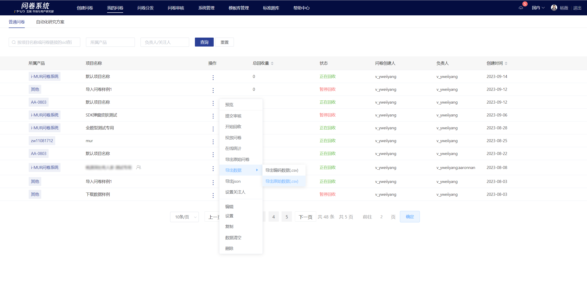
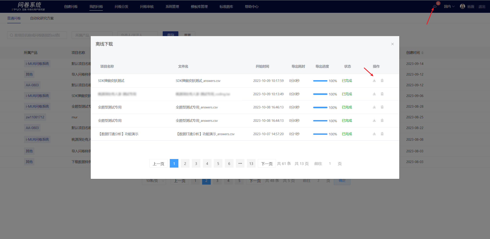

# 导出原始数据

在“我的问卷”列表选择一份问卷，点击操作栏中的“导出”-导出原始，即可导出该问卷的全部原始答题数据（文本形式）。

&#x20;文件采用异步下载方式，任务导出状态显示在“离线下载”弹窗中，导出完成后下载。

.png>)


**特殊说明**

由于合规限制，base国内用户不可获取玩家id等个人隐私信息，问卷系统对导出数据中的ip地址、用户id列做脱敏处理。如需获取明文数据，请自行联系base海外的同事并找问卷系统助手开通权限后下载。下载的数据必须**脱敏后才能传回国内**。数据示例如下：



