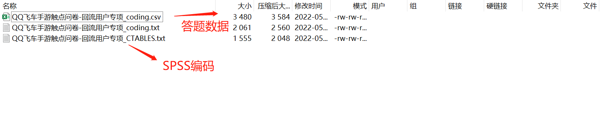
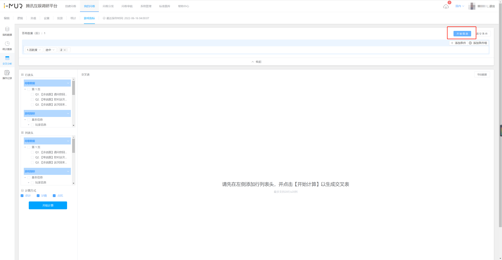
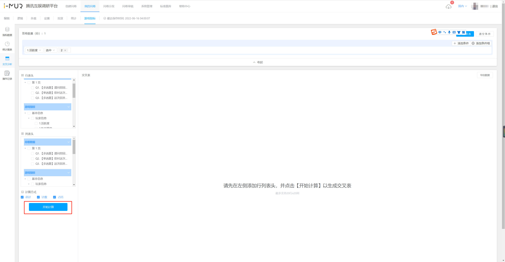
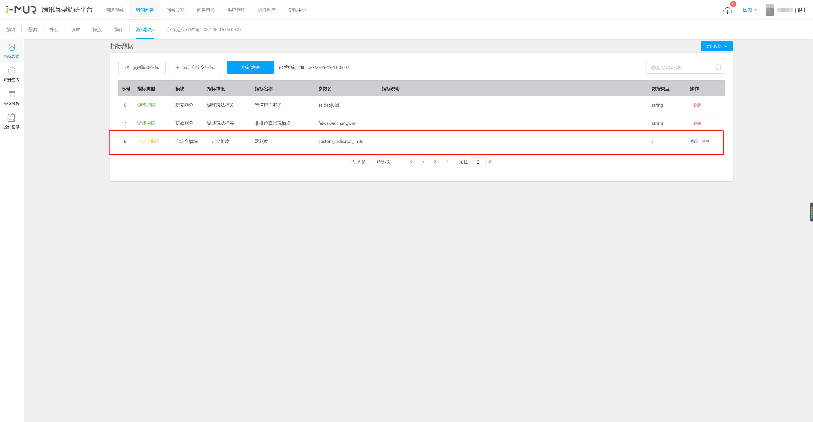

# 🆕 游戏指标打通

问卷系统支持调研数据与游戏指标数据打通，结合答题者的主观态度与客观行为进行分析。

在游戏完成接入后，用户可在问卷系统平台上选取本次调研所需打通的游戏指标并自助**提取数据**，系统**在线计算**结果数据，同时支持用户**下载**打通后数据表。

.png>)

.png>)

## 【前置工作】游戏接入及权限申请


【指引】游戏指标数据接入及功能使用 [https://iwiki.woa.com/p/1674316383](https://iwiki.woa.com/p/1674316383)


.png>)

## &#x20;1. 选取游戏指标

问卷开始投放后，前往“游戏指标”模块可提取**已答题玩家**的游戏指标数据。

### 1.1 设置游戏指标

先选定本次调研所需使用的游戏指标，保存后系统将自动执行提取，支持二次编辑（新增/删除指标）。

每份问卷仅能生成一份提取任务，该问卷的所有负责人和关注人共同管理，新增/删除指标前请内部沟通确认。


数据提取规则说明：

1. 问卷系统按玩家提交答卷的时间，提取该**玩家答题当天**的游戏指标数据
2. 由于经分侧生成游戏指标数据为次日，请在玩家填答后的次日前往本系统提取数据

【例】

玩家A在游戏&#x5185;**{5月6日}**&#x7B54;题，经分侧&#x5728;**{5月7日}**&#x624D;生成玩家A在5月6日的游戏指标记录，需要&#x5728;**{5月7日}**&#x624D;能到问卷系统提取该玩家的调研数据+游戏指标，在此前仅能获取该玩家的调研数据。


.png>)

.png>)

.png>)

### 1.2 更新指标数据

支持实时更新数据，更新方式为全量刷新；更新过程中统计图表功能可正常使用

## 2. 导出数据表

### 2.1 导出原始数据

1. 点击显示下拉框，选择导出原始数据，即可导出该问卷的全部原始答题数据+游戏指标数据+自定义指标数据
2. 导出的文件名称为：项目名称\_answers.csv
3. 文件采用异步下载方式，任务导出状态显示在离线下载弹窗中，导出后完成下载

### 2.2 导出编码数据

1. 点击显示下拉框，选择导出原始数据，即可导出该问卷的全部原始答题数据+游戏指标数据+自定义指标数据
2. 导出的答题编码数据为.tar格式的压缩包，内含答题编码数据（.csv）和SPSS编码（.txt）
3. 文件采用异步下载方式，任务导出状态显示在离线下载弹窗中，导出后完成下载

## 3. 统计图表

支持在线查看统计结果

### 3.1 统计图表

统计图表页支持在线查看答题数据和指标数据的统计结果

1. 左侧大纲展示问卷题目和游戏指标，自由勾选显示的问卷题目和游戏指标，取消勾选后右侧不显示对应题目或指标
2. 游戏指标支持分三个层级展示：模块——指标维度——指标名称
3. 支持对问卷题目和指标进行关键词搜索过滤


统计说明：百分比=该项小计/该指标的总计\*100%，保留两位小数


.png>)

### 3.2 数据筛选

统计图表提供数据筛选功能，开启后可设定指定条件对当前已回收的答卷数据和指标数据进行筛选


关闭或刷新页面，将清空筛选条件并展示全部答题数据和指标数据

筛选条件仅当次有效，不保存记录

支持一键清空条件，操作不可撤回


#### **设置筛选条件**

支持添加条件和多个条件组成条件组进行筛选，条件和条件组均支持and（符合全部条件）或者or（符合任一条件）的连接关系

### 3.3 导出统计结果

支持在线导出统计结果


1. 未设置筛选条件时，点击导出统计结果即可下载全部数据，包含问卷数据+指标数据
2. 设置筛选条件后，须点击开始筛选，筛选成功即可导出基于筛选条件下展示的所有数据
3. 统计说明：百分比=该项小计/该指标的总计\*100%，保留两位小数


## 4. 交叉分析

游戏指标模块支持问卷数据和游戏数据的交叉分析，可自定义行、列用于生成在线交叉表

### 【STEP 1】数据筛选

提供数据筛选功能，点击开始筛选后可基于指定条件对当前的问卷数据和指标数据进行筛选，在筛选结果中生成交叉表格

点击【清空条件】会同时清空筛选条件和交叉计算

### 【STEP 2】设置行、列表头

左侧设置栏分别勾选作为行表头、列表头的题目和指标数据，点击“开始计算”按钮即实时计算生成交叉表格


行表头、列表头最多支持20行x20列，超过20\*20时，仅支持离线下载


### 【STEP 3】生成交叉分析表

.png>)

## 5. 自定义组合指标

支持自定义指标，用于组合游戏指标和题目字段，新生成指标可用于后续的统计和交叉计算

### 【STEP 1】设置自定义指标

带\*为必填项，同一指标支持添加多个有效值

.png>)

### 【STEP 2】保存生成自定义指标

