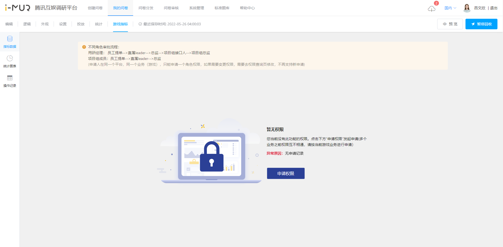

# 游戏指标权限申请

游戏指标打通分析功能仅开放给**已对接打通功能的游戏**项目组成员及支持该项目组的用研经理。如游戏完成已对接，项目组成员可企微联系"IMUR问卷系统助手"获取功能入口。

## 权限申请

根据合规要求，获取、使用游戏指标数据需先经过数据生产方（项目组）允许，并注明申请目的及数据用途。

游戏指标权限的申请按业务提出，申请入口见下图：

<table><thead><tr><th>信息</th><th width="308.3333333333333">填写说明</th></tr></thead><tbody><tr><td>平台选择</td><td>[181]i-MUR问卷系统</td></tr><tr><td>业务选择</td><td>当前问卷所属业务，与问卷设置中的“所属产品”一致</td></tr><tr><td>角色选择</td><td>按需选择</td></tr><tr><td>申请理由</td><td>请详细填写使用场景、目的</td></tr></tbody></table>

.png>)

#### 各角色默认由项目组对接人审批


以上为默认审批流程，实际审批流以各个游戏对接协商达成的流程为准。


## 角色修改

申请人在同一个业务（游戏），只能申请一个角色权限，如果需要变更权限，需要去权限查询页修改，不再支持新申请。权限系统将按照新选择的角色重新生成审批流程。


提交修改后，权限自动终止，在审批流程完成前将无法正常使用游戏指标所有功能。


.png>)

.png>)
