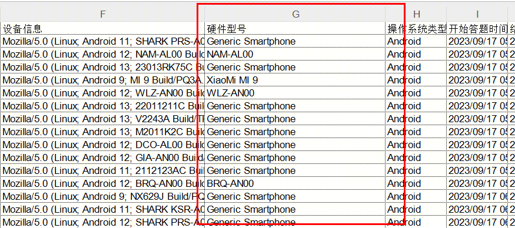

# 能采集到答题者的手机型号吗？

部分情况下可以。在导出数据中“设备信息”一列，可查看答题设备的具体信息，包括浏览器信息、手机型号、操作系统信息和app信息。


iPhone/iPad的机型并非所有情况下都能采集到，能否采集到取决于答题者打开问卷使用的app。如需使用iPhone/iPad机型用于分析，请投放前测试确认。



市场上主流机型列表：[https://doc.weixin.qq.com/sheet/e3\_AHkAfgaDACc01AUkoCvSKyuu7thOP?scode=AJEAIQdfAAo20WkfJ5AHkAfgaDACc\&is\_precreate=1\&dver=2.9.0\&tab=BB08J2](https://doc.weixin.qq.com/sheet/e3\_AHkAfgaDACc01AUkoCvSKyuu7thOP?scode=AJEAIQdfAAo20WkfJ5AHkAfgaDACc\&is\_precreate=1\&dver=2.9.0\&tab=BB08J2)


.png>)

导出原始数据中硬件型号一列可以统计到答题者的设备硬件型号

<figure><figcaption></figcaption></figure>
