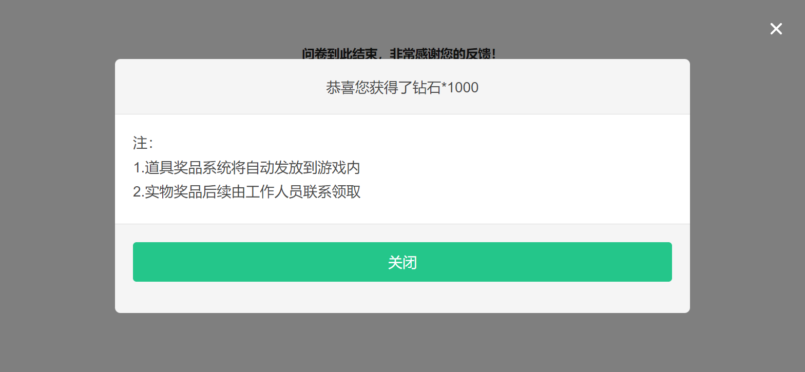

# 如何实现用户填完问卷后自动发奖？

## 问卷可以实现用户填完问卷后发奖的功能吗？

系统支持AMS礼包发奖，可通过问卷设置—提交问卷后发奖功能实现；对于已对接AMS邮件发货功能的游戏，开启此功能时，用户提交问卷后，问卷系统可自动触发奖励发放。

.png>)

<figure><figcaption>
提示发奖成功效果
</figcaption></figure>

## 配置步骤

请点击查看：[提交问卷后发奖](../../cao-zuo-zhi-yin/wen-juan-she-zhi/chuan-can-tiao-zhuan-hui-tiao/#ti-jiao-wen-juan-hou-fa-jiang)

## 特殊说明


1. 仅支持已对接**邮件发货**功能的游戏（国内版）使用
2. 问卷务必开启[MSDK登录验证](../../cao-zuo-zhi-yin/wen-juan-she-zhi/da-ti-xian-zhi-she-zhi/#msdk-deng-lu-yan-zheng)/[参数传递（严格校验模式）](../../cao-zuo-zhi-yin/wen-juan-she-zhi/chuan-can-tiao-zhuan-hui-tiao/#can-shu-chuan-di-jie-kou-yan-ge-xiao-yan-mo-shi)/[参数传递（不校验模式）](../../cao-zuo-zhi-yin/wen-juan-she-zhi/chuan-can-tiao-zhuan-hui-tiao/#can-shu-chuan-di-jie-kou-bu-xiao-yan-mo-shi)以上任一功能
3. 对每个答题者仅发奖一次；已成功发奖的答题者再次回答问卷后不可二次触发发奖

