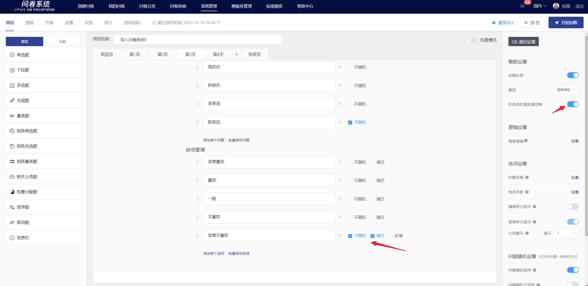

# 矩阵单选题

矩阵单选题是将同类的多个问题和选项排列成一个矩阵，方便答题者对比后进行单项选择。

## 【STEP 1】 新建矩阵单选题

在问卷编辑页中，选择左侧题型控件中的“矩阵单选题”或在指定题目点击右侧快捷工具栏中的+按钮选择“矩阵单选题”即可新建矩阵单选题。

## 【STEP 2】编辑题目、问题、备注、选项内容

矩阵单选题的题目、问题、选项及备注均支持富文本编辑，包括：字体样式、[插入超链接](../cao-zuo-zhi-yin/wen-juan-bian-ji/cha-ru-chao-lian-jie.md)、[插入图片](../cao-zuo-zhi-yin/wen-juan-bian-ji/cha-ru-tu-pian.md)、[插入视频](../cao-zuo-zhi-yin/wen-juan-bian-ji/cha-ru-shi-pin.md)、[引用选项内容](../cao-zuo-zhi-yin/wen-juan-bian-ji/nei-rong-yin-yong.md)。

编辑完成后可预览该矩阵，矩阵中显示的每行是一个问题，每列是一个选项。

## 【STEP 3】题目、问题及选项设置

### 必答设置

在右侧面板中关闭“此题必答”功能后，答题时此题可以为空。


所有题目默认开启“此题必答”功能。


### 在选项后增加填空框

开启后，在选项后方增加填空框，勾选必填，用户须填写内容后才可提交，适用于用户选择其他项后，收集其他相关信息的场景

<figure><figcaption></figcaption></figure>

### 选项关联

选项关联即让答题者选中（或未选中）的选项显示在本矩阵单选题的可选项中，一般用于题目相关性极高的两题中或追问的情况。


[xuan-xiang-guan-lian.md](../cao-zuo-zhi-yin/wen-juan-bian-ji/xuan-xiang-she-zhi/xuan-xiang-guan-lian.md)


### 选项随机

在题目编辑状态下，可设置选项随机，设置成功后，在答题端会根据所选择的随机方式显示选项。矩阵单选题的选项随机方式包括：随机排序、随机正逆序。

#### 选项随机排序

选项随机排序是指答题时题目中的选项以随机顺序出现。开启“选项随机排序”功能后，题目的选项右侧会出现不随机的勾选框，若希望某个选项固定在当前位置，可在其后勾选“不随机”，则该选项不参与随机排序。

.png>)

#### 选项随机正逆序

选项随机正逆序是指答题时题目中的选项随机以正序/逆序出现。开启“选项随机正逆序”功能后，“选项随机正逆序”功能下方会出现“固定最后一个选项”功能开关，若希望最后一个选项固定在当前位置，可开启“固定最后一个选项”功能，则在答题端显示时最后一个选项不参与随机正逆序。


[xuan-xiang-sui-ji.md](../cao-zuo-zhi-yin/wen-juan-bian-ji/xuan-xiang-she-zhi/xuan-xiang-sui-ji.md)


### 问题关联

问题关联即让答题者选中（或未选中）的选项显示在本矩阵单选题的问题中，一般用于题目相关性极高的两题中或追问的情况。

问题关联的设置方法与[选项关联](../cao-zuo-zhi-yin/wen-juan-bian-ji/xuan-xiang-she-zhi/xuan-xiang-guan-lian.md)的设置方法相同。

### 问题随机

在题目编辑状态下，可设置矩阵单选题中的问题随机显示，设置成功后，在答题端会根据所选择的随机方式显示问题。矩阵单选题中问题随机方式包括：随机排序、随机正逆序。

#### 问题随机排序

问题随机排序是指答题时该矩阵单选题中的问题以随机顺序出现。开启“问题随机排序”功能后，每个问题右侧会出现不随机的勾选框，若希望某个问题固定在当前位置，可在其后勾选“不随机”，则该问题不参与随机排序。

#### 问题随机正逆序

问题随机正逆序是指答题时该矩阵单选题中的问题随机以正序/逆序出现。开启“问题随机正逆序”功能后，“问题随机正逆序”功能下方会出现“固定最后一个问题”功能开关，若希望最后一个问题固定在当前位置，可开启“固定最后一个问题”功能，则在答题端显示时最后一个问题不参与随机正逆序。

问题随机的设置方法与[选项随机](../cao-zuo-zhi-yin/wen-juan-bian-ji/xuan-xiang-she-zhi/xuan-xiang-sui-ji.md)的设置方法相同。

## 编辑页及答题端显示

编辑完成后，在编辑页内可查看矩阵单选题的具体内容及选项的关联、内容引用、填空设置。

矩阵单选题会根据答题终端自适应展示为矩阵或问题拆分形式。

## 统计结果展示

在统计分析页中，以条形图+表格小计的形式展示矩阵单选题的填答结果。

