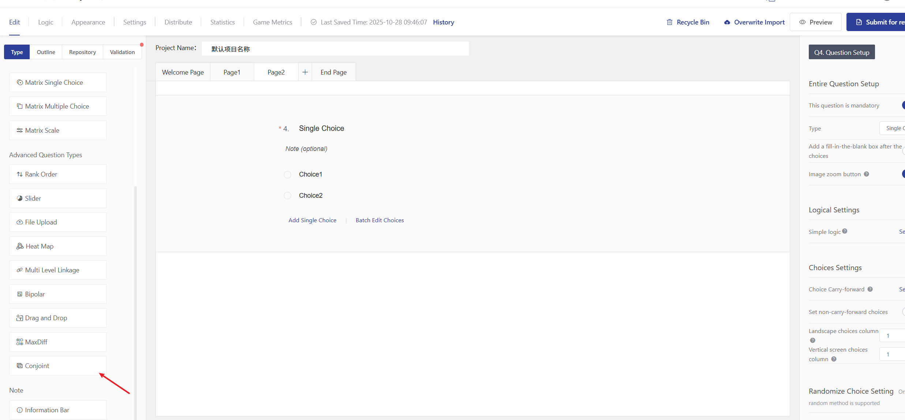

# MaxDiff

MaxDiff（最大差异度量）是一种高效的偏好测量方法，用于测量人们对一系列属性的偏好或重要性认知。与传统的评分量表不同，MaxDiff通过强制受访者在每组选项中选择"最喜欢"和"最不喜欢"的项目，从而获得更准确、更可靠的数据。

<figure><figcaption></figcaption></figure>

### 一、MaxDiff的核心优势

* **消除评分偏差**：避免传统评分中的"分数膨胀"或"中庸倾向"
* **提高区分度**：能更好地区分各项属性的相对重要性
* **结果直观**：生成的重要性分数易于理解和解释
* **跨文化适用**：不受不同文化评分习惯的影响

### **二、 关键词说明**

**【属性】** 在MaxDiff中的调研比较对象，如品牌、材质、款式、价格等统称为“属性”；

**【任务】** 同时出示几个属性进行“最好/最差”的选择。在这里每一组这样的题，我们称为一个任务。任务的数量我们会根据您输入的“属性”数进行推荐，您可手动输入，但必须在推荐范围内

**【每个任务属性数】**&#x6BCF;个任务上出现的“属性”数量。

**【两级文案】**“属性”对应选择的描述。如“最重要的”/“最可能的”来描述最“好”，最“不重要的”/“最可能的”来描述最“差”；

**【在全部属性中随机呈现】**&#x6307;每个作答者不需要在全部属性中选择，开启后，每个任务中的属性随意呈现，但系统会尽量保证每个属性出现的次数均等，适用于属性较多的调研

### 三、问卷系统中设置 MaxDiff 题

#### 第一步：创建 MaxDiff 题型

进入问卷编辑页面，在题型列表中选择 “MaxDiff

<figure><figcaption></figcaption></figure>

#### 第二步：编辑题干、选择两级文案

提供默认提供六种推荐文案，并支持自定义

<figure><figcaption></figcaption></figure>

#### 第三步：录入全部属性（待评属性）

录入所有需要进行评估的属性，通常建议至少 5 个以上

<figure><figcaption></figcaption></figure>

#### 第三步：配置任务（设计方案）

1.  选择每个任务属性数

    * 指受访者在每一次选择中会看到多少个属性。建议3\~5个，数量过多会增加选择难度，过少缺少对比性

    <figure><figcaption></figcaption></figure>
2.  输入任务数

    * 指一位受访者总共需要完成多少次选择任务。系统会根总属性数和每个任务属性数自动推荐一个合理任务数范围，需手动输入任务数后才可投放

    <figure><figcaption></figcaption></figure>

3. 在全部属性中随机呈现（非必须）

* &#x20;   开启后，会随机抽取N个属性给答题者作答，每个任务中的属性随意呈现，但系统会尽量保证每个属性出现  的次数均等，适用于属性较多的调研

<figure><figcaption></figcaption></figure>

#### 第四步：预览与发布

1. 点击 “预览” 按钮，以作答者者视角检查题目展示效果，确保逻辑无误。
2. 确认无误后，“发布” 问卷。

#### 第五步：数据统计

我们提供基础报告与精准报告两种辅助您分析

1.基础报告

<figure><figcaption></figcaption></figure>

系统会自动记录作答者的每一次“最佳”和“最差”选择。核心统计指标包括：

**偏好份额：**&#x504F;好份额直观展现了各个属性的偏好程度或重要性，值越大说明该属性偏好程度越高。

最重要分数：

最不重要

出现次数
