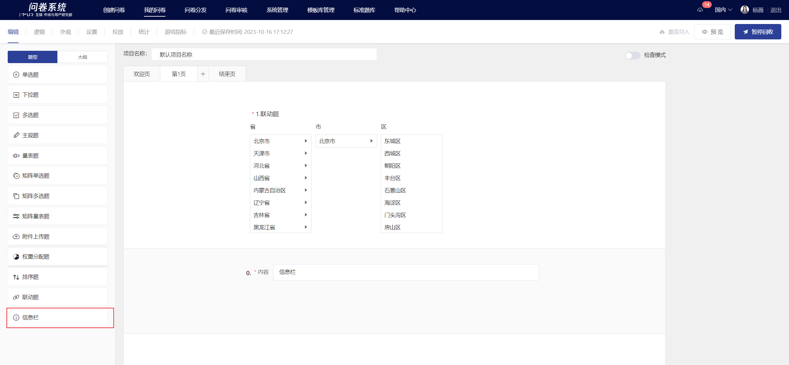
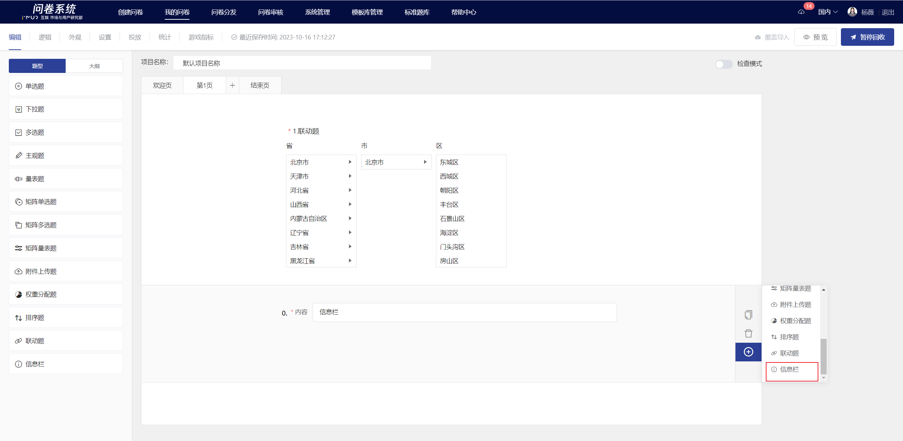

# 信息栏

在问卷调研中，经常需要对问卷题目进行分类标记或进一步阐述。信息栏可在题目与题目之间增加文字描述，让答题者能更清晰直观地了解问卷内容。

.png>)

## 【STEP 1】 新建信息栏

在问卷编辑页中，选择左侧题型控件中的“信息栏”或在指定题目点击右侧快捷工具栏中的+按钮选择“信息栏”即可新建信息栏。

## 【STEP 2】编辑信息栏内容

信息栏内容支持富文本编辑，包括：字体样式、[插入超链接](../cao-zuo-zhi-yin/wen-juan-bian-ji/cha-ru-chao-lian-jie.md)、[插入图片](../cao-zuo-zhi-yin/wen-juan-bian-ji/cha-ru-tu-pian.md)、[插入视频](../cao-zuo-zhi-yin/wen-juan-bian-ji/cha-ru-shi-pin.md)、[引用选项内容](../cao-zuo-zhi-yin/wen-juan-bian-ji/nei-rong-yin-yong.md)。

## 编辑页及答题端显示

编辑完成后，在编辑页内可查看信息栏的具体内容。

.png>)

 (1) (1) (1) (1) (1) (1) (1).png>)


1. 信息栏不设题号，不参与题号排序
2. 信息栏仅作为信息展示，不参与统计分析


