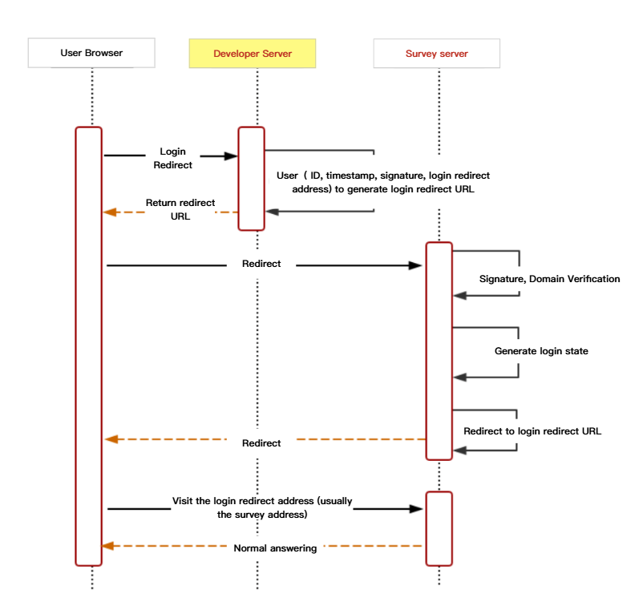
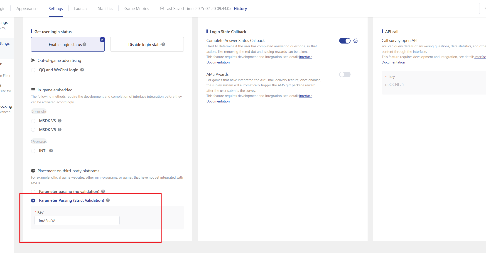

# Parameter Passing Interface (Strict Validation Mode)

## 1. Interface Description

### 1.1 Interface Definition

The parameter passing interface (strict validation mode) is used to address the situation where third-party developers have their own system login states (such as mini-program login states, Facebook login, etc.), but wish to synchronize these login states to the survey system.

### 1.2 Usage scenario

The following situations do not require the integration of non-MSDK login state transmission interfaces:

* The survey is embedded into the game, and the survey system by default supports MSDK login state handling. You can enable this feature by selecting \[Settings] -> \[MSDK Login Verification] on the survey editing page. Currently, only v3 and v5 versions of MSDK login are supported.
* It is only necessary to set a limit on the number of questions each user can answer, without collecting the user's UID. Users can choose to log in using WeChat or QQ. This feature can be enabled in the survey editing page by selecting \[Settings] -> \[WeChat, QQ login verification].

### 1.3 Interactive Process



Developers only need to focus on the developer server process, with an emphasis on the generation of signature and login redirect URLs.

### 1.4 Signature Algorithm

#### **1.4.1** Algorithm Process

1. Provide the necessary parameters (see API interface for details, empty values do not need to participate in the signature), using the kv data structure;
2. Add appSecret as a signature key field to the kv data structure;
3. Sort the keys in ascending ASCII order;
4. Traverse the sorted kv data structure and concatenate all elements into a string in the pattern of "key1value1key2value2";
5. Perform an MD5 digest on the concatenated database to obtain the sign signature;
6. Add sign as a signature field to the kv data structure;
7. Convert kv data structure into HTTP query request parameters;
8. Use the query request parameter to call the login status transfer interface.

#### **1.4.2** Code Example

PHP code

```php
<?php
$appSecret = 'iamsecret';

$sid = '60cfe98c76051f40495d32c2';

$query = [
    'sid' => $sid,
    'uid' => 'test_uid',
    'timestamp' => time(),
    'source' => 'testsource',
    'info' => 'extra_info',
    // After logging in, the system will redirect to the address specified in the redirect, which is usually a survey distribution link and will include the sid content.
    // If there are login state callback parameters, please refer to [API Documentation] -> [Login State Callback Interface] to add the required parameters, such as callback、callback_params
    // Note: The domain name here should be modified according to the domain name used for delivery. For details, see the [API Interface] section at the bottom of the document.
    'redirect' => 'https://in.weisurvey.com/?sid='.$sid,
];

// Add key
$params = array_merge($query, [
    'appSecret' => $appSecret,
]);

ksort($params);

$str = '';
foreach ($params as $key => $value) {
    // Parameters with null values are not included in the addition.
    if ($value !== '') {
        $str .= $key.$value;
    }
}

$query['sign'] = strtolower(md5($str));

// Note: The domain name here needs to be modified according to the domain name being used. For details, see the [API Interface] section at the bottom of the document.
$redirectUrl = 'https://in.weisurvey.com/v2/api/autologin?'.http_build_query($query);

// Redirect
header('Location: '.$redirectUrl);
```

Request URL Example

```
 https://in.weisurvey.com/v2/api/autologin?sid=60cfe98c76051f40495d32c2&uid=test_uid&timestamp=1624262138&source=testsource&info=extra_info&redirect=https%3A%2F%2Fin.weisurvey.com%2F%3Fsid%3D60cfe98c76051f40495d32c2%26callback%3D3%26callback_params%3Dtestparams&sign=44b2e38119366c059946698f2828752c
```


Comparison of Normal Embedding Link and Embedded Embedding Link Examples

【Regular distribution link】

https://in.weisurvey.com/v2/?sid=60cfe98c76051f40495d32c2

【Embedded delivery link】

https://in.weisurvey.com/v2/api/autologin?sid=60cfe98c76051f40495d32c2\&uid=test\_uid\&timestamp=1624262138\&source=testsource\&info=extra\_info\&redirect=https%3A%2F%2Fin.weisurvey.com%2Fv2%2F%3Fsid%3D60cfe98c76051f40495d32c2%26callback%3D3%26callback\_params%3Dtestparams\&sign=44b2e38119366c059946698f2828752c

_\*_&#x54;he values corresponding to the above parameters are for display purposes only.


## **2.** Interface Parameters Description

### **2.1** Login interface address

Please choose the access interface based on the business deployment domain and whether it is domestic or overseas.

#### **2.1.1** Domestic Placement

```
The domestic deployment has two sets of domain names, which need to be noted during development.

1.https://in.survey.imur.qq.com/v2/?sid=xxx is the QQ domain, and the corresponding login interface is:
https://in.survey.imur.qq.com/v2/api/autologin?
2.https://in.weisurvey.com/v2/?sid=xxx is a non-QQ domain, and the corresponding login interface is:
https://in.weisurvey.com/v2/api/autologin?
```

#### **2.1.2** Overseas Advertising

```
The login interface for overseas advertising is:
https://user.outweisurvey.com/v2/api/autologin?
```


Due to the interface upgrade, games using the inapi prefix login interface in \[China] should switch to the new login interface in advance to avoid any disruption. The adjustments are as follows:


| Domain name deployment | Login Interface                                                                                         |
| ---------------------- | ------------------------------------------------------------------------------------------------------- |
| Non-QQ domain          | [https://in.weisurvey.com/v2/api/autologin?](https://in.weisurvey.com/v2/api/autologin?)                |
| QQ domain              | [https://in.survey.imur.tencent.com/v2/api/autologin?](https://in.survey.imur.qq.com/v2/api/autologin?) |

### **2.2** Parameter Description

Pass parameters using GET request method

| Parameter | Is it necessary | Whether to participate in encryption | Data Type | Limit length               | Explanation                                                                                                                                                                                                                                                                                                                                                                                                                                                                                |
| --------- | --------------- | ------------------------------------ | --------- | -------------------------- | ------------------------------------------------------------------------------------------------------------------------------------------------------------------------------------------------------------------------------------------------------------------------------------------------------------------------------------------------------------------------------------------------------------------------------------------------------------------------------------------ |
| sid       | yes             | yes                                  | string    | 32                         | Survey ID, can be parsed from survey link                                                                                                                                                                                                                                                                                                                                                                                                                                                  |
| uid       | yes             | yes                                  | string    | 255                        | Unique ID of the logged-in user                                                                                                                                                                                                                                                                                                                                                                                                                                                            |
| timestamp | yes             | yes                                  | int       | 10位                        | Timestamp                                                                                                                                                                                                                                                                                                                                                                                                                                                                                  |
| redirect  | yes             | yes                                  | string    | URL address                | The URL of the page redirected to after a successful login is usually the survey link. \[Note] When encrypting the sign, use the original URL; when concatenating it into the embedded delivery link, first encode the URL and assign it to redirect, then concatenate it into the embedded delivery link. The callback and callback\_params in the callback need to be injected into the original survey URL first, and then this URL should be assigned to redirect according to step 1. |
| source    | yes             | yes                                  | string    | 2-10 characters in English | User Custom Channel Identifier                                                                                                                                                                                                                                                                                                                                                                                                                                                             |
| sign      | yes             | no                                   | string    | 32                         | Signature, refer to the signature algorithm法                                                                                                                                                                                                                                                                                                                                                                                                                                               |
| info      | no              | yes                                  | string    | 255                        | Additional login user information, customizable; will not be encrypted if empty                                                                                                                                                                                                                                                                                                                                                                                                            |


Please do not include semicolons when assigning values to parameters, otherwise the values will be truncated.


### 2.3 Client-generated link example

**Original link**

https://in.weisurvey.com/v2/?sid=60cfe98c76051f40495d32c2

#### STEP 1 Original link injection callback parameters (optional)

https://in.weisurvey.com/v2/?sid=60cfe98c76051f40495d32c&#x32;**\&callback=3\&callback\_params=testparams**

**STEP 2 Concatenate kv data structure string**

appSecretiamsecretinfoextra\_inforedirecthttps://in.weisurvey.com/v2/?sid=60cfe98c76051f40495d32c2\&callback=3\&callback\_params=testparamssid60cfe98c76051f40495d32c2sourcetestsourcetimestamp1624262138uidtest\_uid

#### STEP 3 Generate sign by encrypting the string

sign=**ade962f5273a404f72aaabf544b14281**

#### STEP 4 Splicing link, completed

https://in.weisurvey.com/v2/api/autologin?sid=60cfe98c76051f40495d32c2\&uid=test\_uid\&timestamp=1624262138\&source=testsource\&info=extra\_info\&redirect=https%3A%2F%2Fin.weisurvey.com%2Fv2%2F%3Fsid%3D60cfe98c76051f40495d32c2%26callback%3D3%26callback\_params%3Dtestparams\&sign=ade962f5273a404f72aaabf544b14281


Parameter Assignment Situation

sid=60cfe98c76051f40495d32c2

uid=test\_uid&#x20;

timestamp=1624245611&#x20;

source=testsource&#x20;

info=extra\_info

redirect=https%3A%2F%2Fin.weisurvey.com%2Fv2%2F%3Fsid%3D60cfe98c76051f40495d32c2%26callback%3D3%26callback\_params%3Dtestparams&#x20;

sign=ade962f5273a404f72aaabf544b14281


## 3. Survey settings

A key needs to be set on the survey settings page, and the key supports customization.



## 4. 常见问题
