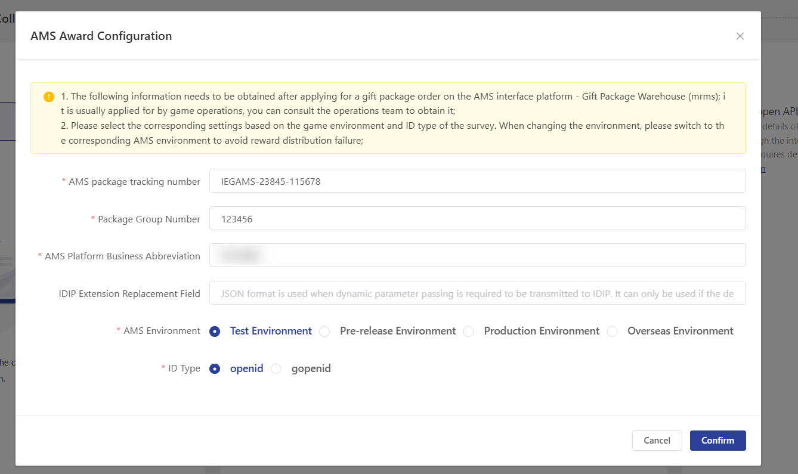
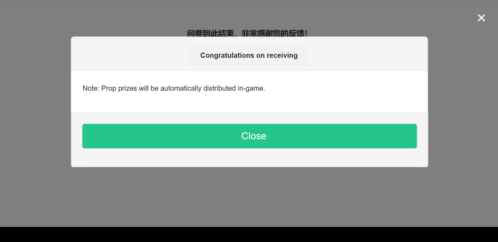
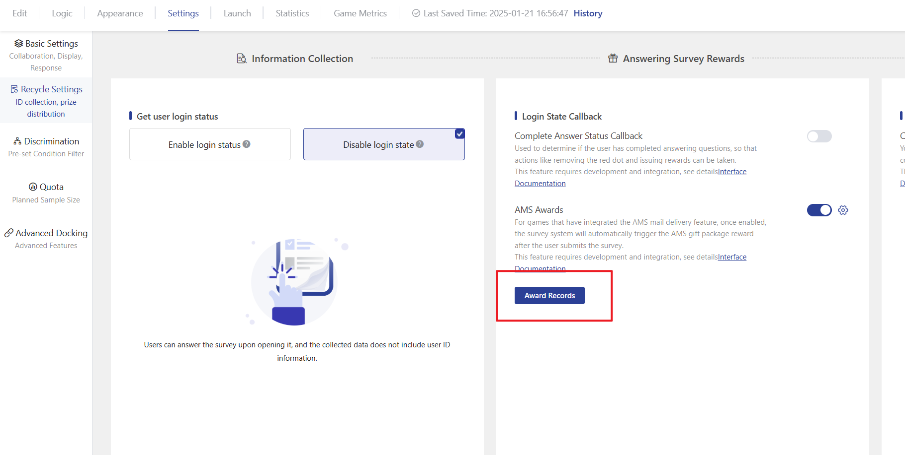

# AMS Awards

**Reward after submitting the survey**

Support AMS package reward distribution function; for games that have already integrated AMS email delivery function, when this function is enabled, the survey system can automatically trigger the reward distribution after the user submits the survey.


1. Only supports games with integrated email delivery functionality.
2. The survey must enable one of the following features: MSDK login verification/INTL login verification/parameter passing (strict verification mode)/parameter passing (non-verification mode). Each respondent can only receive a reward once;
3. Each respondent can only be awarded once; respondents who have already successfully received an award cannot trigger the award again by answering the survey again.


### 【STEP 1】AMS Package Configuration

Please configure the AMS gift pack order in the AMS interface platform - Gift Pack Warehouse (mrms), which is the item warehouse, to obtain the AMS gift pack order number and gift pack group number.


Note: For domestic use, the channel must be configured as the MUR survey reward application \[IEG-AMS-11836].

Overseas usage channels must be configured as MUR survey reward application \[IEG-AMS-4000046]


### 【STEP 2】Award Configuration

Enable the "reward after survey submission" feature in the surveys that require rewards, and configure the AMS gift package order number, gift package group number, business abbreviation, and AMS environment parameters.

If the game uses gopenid for awarding prizes, then enable gopenid.

### 【STEP 3】Pass award parameters

The survey must enable one of the following features: MSDK login verification/INTL login verification/parameter passing (strict verification mode)/parameter passing (non-verification mode). The game client should inject the following four reward parameters into the survey link by concatenation for awarding purposes. If some parameters are not needed, they can be omitted. The parameters are described as follows:

| Parameter Name        | Explanation                                                                   |
| --------------------- | ----------------------------------------------------------------------------- |
| 

sPlatId
 | Platform type, such as IOS:0, Android:1                                       |
| sArea                 | For channels such as QQ and WeChat, please provide the corresponding numbers. |
| sPartition            | Mobile use, residential area                                                  |
| sRoleId               | Character ID, provided when shipping into the game                            |

**Survey link injection with reward parameter example**

<table data-header-hidden><thead><tr><th width="180.61832587663224">情况</th><th width="150">注入说明</th><th>示例链接</th></tr></thead><tbody><tr><td>Situation</td><td>Injection Instructions</td><td>Example link</td></tr><tr><td>Original survey link</td><td>--</td><td>https://in.survey.imur.tencent.com/?sid=5e8d767b76051f46707cf692</td></tr><tr><td>MSDK Login Verification</td><td>4 award parameters Directly spliced in After the survey link</td><td>https://in.survey.imur.tencent.com/?sid=5e8d767b76051f46707cf692<strong>&#x26;sPlatId={sPlatId}&#x26;sArea={sArea}&#x26;sPartition={sPartition}&#x26;sRoleId={sRoleId}</strong></td></tr><tr><td>Parameter Passing Interface (No verification mode)</td><td>Four award parameters Directly concatenated with After the survey link</td><td>https://in.survey.imur.tencent.com/?sid=5e8d767b76051f46707cf692&#x26;openid={答题者openid}<strong>&#x26;sPlatId={sPlatId}&#x26;sArea={sArea}&#x26;sPartition={sPartition}&#x26;sRoleId={sRoleId}</strong></td></tr><tr><td>Parameter Passing Interface (Strict Validation Mode)</td><td>Four award parameters Concatenate the value assigned to redirect with the link, and then encode the value of redirect.</td><td>
https:// inapi.survey.imur.tencent.com/autologin?sid

=5e8d767b76051f46707cf692&#x26;uid=user_id&#x26;timestamp=1573455797

&#x26;source=dwk&#x26;info=extra_info&#x26;redirect=https%3A%2F%2F

in.survey.imur.tencent.com%2F%3Fsid%3D5e8d767b76051f46707cf692

%26lang%3Dzh-CHS%26ADTAG%3Dsid.5e8d767b76051f46707cf692

<strong>%26sPlatId%3D{sPlatId}%26sArea%3D{sArea}%26sPartition</strong>

<strong>%3D{sPartition}%26sRoleId%3D{sRoleId}</strong>

&#x26;sign=2ac5ab8ce6a9b306e07dc2664fe7d175
</td></tr></tbody></table>

### 【STEP 4】Interface Application

The AMS reward triggered by the survey requires prior application for the in-game lottery interface. Please contact via WeChat for Business:IMUR问卷系统助手

### 【STEP 5】Complete

In the game, when a survey is released and the respondents submit the survey, the survey system will automatically trigger the AMS gift package single award (the prize name will be displayed as the gift package group name configured in step 1).

**Award Records Inquiry**

Click on "Award Records" to view the prize-triggering status of all survey accounts.

<figure><figcaption>
Check reward records
</figcaption></figure>

**AMS response code description**

<table><thead><tr><th width="136">AMS response code</th><th width="198.33333333333331">Situation Description</th><th>Recommended Action</th></tr></thead><tbody><tr><td>0</td><td>Award successfully granted</td><td>/</td></tr><tr><td>空或-100</td><td>Not a test number</td><td>To call the gift package interface in the testing environment, you need to use a test account. Please go to the test account system to register, bind, and associate the openid first.openid</td></tr><tr><td>100002</td><td>The gift pack depletion requires rollback eligibility.</td><td>Go to the gift pack warehouse to adjust the configuration of the gift pack list, allowing each account to claim multiple times or increasing the total number of gift packs.</td></tr><tr><td>-9012</td><td>Server region and other parameters are abnormal</td><td>It is necessary to confirm whether the values of the four parameters sPlatId, sArea, sPartition, and sRoleId are correct.</td></tr><tr><td>-9081</td><td>No valid gopenid was obtained when calling the gopenid interface.</td><td>

<ol><li>Use the openid system in the game: Turn off the "Use gopenid for reward settings" in the settings popup.</li><li>Using the gopenid system in the game: If the user has not registered a game character or if there is an exception with the gopenid service, check if the account status is normal.</li></ol></td></tr></tbody></table>

##
