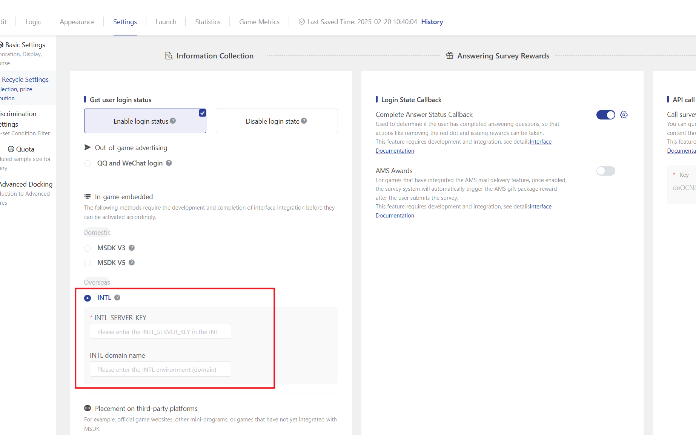

# INTL Login State Collection

After integrating the INTL APP, you can select \[INTL] login in the login verification of the survey settings; when the user submits the survey, the survey system will automatically obtain the player's login status (such as openid) and store it in the answer data.



**Parameter Configuration Instructions**


1. **Key:** Please fill in INTL\_SERVER\_KEY in the INTL management terminal parameters.

&#x20; 2\. **Domain name：**&#x54;o distinguish between the production environment and the testing environment, please contact the game backend developers directly.

**Test Environment Domain Reference：**&#x68;ttps://test.intlgame.com

&#x20;**Official environment domain reference：**&#x68;ttps://sg.intlgame.com



**INTL Login Encryption and Decryption Instructions**

The survey system backend is used to decrypt and obtain the player's login status process. The game side only needs to ensure that the correct login status parameters are injected after the survey link.

**The game client obtains the login state encrypted ticket**

The game client needs to encrypt the survey link and inject login state information through the "Get Encrypted Ticket" interface provided by the INTL webview; the parameters include: encodeparam, os, gameid, channelid, sdk\_version, user\_name, ts, seq.

```
//Original survey link
https://user.outweisurvey.com/v2/?sid=60d57b6eacb1fb323d61f772

//Survey link with added encrypted token
https://user.outweisurvey.com/v2/?sid=60d57b6eacb1fb323d61f772&gameid=11&os=1&ts=1597840414&version=0.1.000.0001&seq=11-42e0e9d2-2f0e-4b01-a1ab-6831cf9b6165-1597840414-11&encodeparam=4060E2A762B31B8B57A8D5A9BBAF10E8657A5A3A285B0DA7159417C2D6F0D801
```

**Method 1: When calling the OpenUrl interface to open the link, set the parameter encryptEnable to true.**

INTL document reference:

**\[Open webpage OpenUrl]** [https://docs.playernetwork.intlgame.com/docs/zh/API/UE-sdk/WebView/OpenUrl](https://docs.playernetwork.intlgame.com/docs/zh/API/UE-sdk/WebView/OpenUrl)

<figure><figcaption><p>参数赋值说明</p></figcaption></figure>

#### Method 2: Call the (obtain encrypted ticket) interface to inject login state parameters after the link

MSDK Documentation Reference:&#x20;

GetEncryptUrl

[https://docs.playernetwork.intlgame.com/docs/zh/API/UE-sdk/WebView/GetEncryptUrl](https://docs.playernetwork.intlgame.com/docs/zh/API/UE-sdk/WebView/GetEncryptUrl)


Special Attention&#x20;

You can choose either of the above two methods to inject login status, but they cannot be used simultaneously. Otherwise, multiple login status parameters will be injected repeatedly, causing the survey decryption to fail and making the survey inaccessible. (Error message: Login failed, please refresh)



**Survey Distribution Report**

For multi-language surveys distributed using the "survey distribution page," the method of injecting login status is consistent with the description above. The login status parameters are injected after the summary link on the distribution page.



**Survey system decrypts and retrieves login state information**

The system obtains the plaintext after decrypting encodeparam through "decryption verification", and the game side does not need to pay attention to it.

INTL document reference: \[Decryption Verification]

[https://docs.playernetwork.intlgame.com/docs/zh/API/Backend/Auth/decrypt\_aes](https://docs.playernetwork.intlgame.com/docs/zh/API/Backend/Auth/decrypt_aes#interface)


Login Failure Prompt When the system fails to obtain the correct login status, the survey page will display a warning popup. The main reasons for the failure are as follows:&#x20;

(1) When decrypting the encodeparam login state, the decryption fails due to missing parameters such as os, gameid, channelid, sdk\_version, user\_name, ts, and seq.&#x20;

(2) The survey link with injected login parameters is too long, causing some parameters to be truncated and missing (requires separate handling by the client).

.png>)


If the INTL login state collection interface fails during joint debugging, you can switch to using the parameter passing ([strict validation mode](fei-msdk-deng-lu-tai-chuan-di-jie-kou.md), [non-validation mode](parameter-transfer-interface-no-verification-mode.md)) interface to achieve login state transmission.

