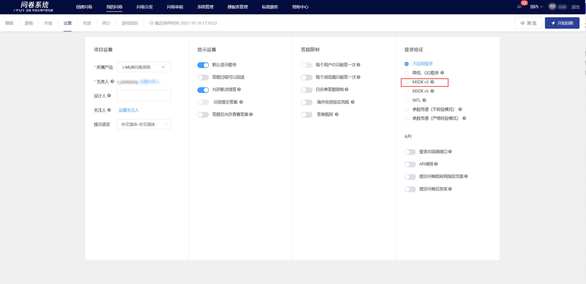

# MSDK-V3登录态采集

The APP integrated with MSDK V3 version can select \[MSDK v3] in the login verification of the survey settings. When users submit the survey, the survey system will automatically obtain the MSDK login status and store it in the response data.



## MSDK-V3 Login State Encryption and Decryption Instructions

The survey system backend is used to decrypt and obtain the player's login status process. The game side only needs to focus on whether the correct login status parameters are injected after the survey link.

## The game client obtains the login state encrypted token

The game client needs to encrypt the survey link and inject login status information through the "Get Encrypted Ticket" interface provided by the MSDK webview; parameters include: msdkEncodeParam, timestamp, appid, algorithm, version, sig, encode, etc.

MSDK Documentation Reference: \[Get Encrypted Ticket]

[https://wiki.ssl.msdk.qq.com/Android/webview.html#Android\_UrlAddEncodeParam](https://wiki.ssl.msdk.qq.com/Android/webview.html#Android_UrlAddEncodeParam)


## Survey system decrypts and retrieves login status information

The system obtains the plaintext openid decrypted from msdkEncodeParam through the "decryption verification" interface, and the game side does not need to pay attention.

**MSDK Document Reference: \[Decryption Verification]**

[https://wiki.ssl.msdk.qq.com/Android/webview.html#Android\_DecodeLoginInfo](https://wiki.ssl.msdk.qq.com/Android/webview.html#Android_DecodeLoginInfo)

(1) The system prioritizes using the msdkEncodeParam parameters for login state decryption. In this case, it is required to include the following six parameters: timestamp, appid, algorithm, version, sig, and encode. An example is as follows:

```
http://www.qq.com?algorithm=v2&version=2.0.6a&timestamp=1423538227203&appid=100703379&sig=427291da31b56b597
39be6da61d433ec&encode=2&msdkEncodeParam=BAD8B1625CB04523B06AAF6739ACB3CEA96F54393831AF5C6890E92EE61CF1A29F
493710592DD84B47D4217BA9FA9DAFB8025CEB27E45EC958689A794E8BD33CF2544CC5D00FCE03AEF7B23EE2BFCA4332F5D69547477
A3E93E44F3270F19664D5499CA2990BE5BA9E232036197B184F1411B76CF95537AC07E3D6A27F054AD3F26648B18554F9C1
```

.png>)

(2) When the msdkEncodeParam parameter cannot decrypt the login state properly, the system will directly use the openid parameter value as the login state.

(3) To obtain custom parameters, you can append "info" to the link to store custom content in the survey data (optional).

<figure><figcaption></figcaption></figure>


**Original survey link**

&#x20;https://in.weisurvey.com/?sid=60ebdefe76051f6b8a37f782

**Survey link after adding encrypted token and info**

https://in.weisurvey.com/?sid=60ebdefe76051f6b8a37f782\&algorithm=itop\&encode=2\&gameid=12\&os=1\&ts=1542889299\&version=2.2.000.2607.2607\&seq=11-5d0f17db-ef1e-44cd-88d7-57b556cc63ce-53\&sig=eb6ee5ab9418d1c8e6400608815e76f2\&itopencodeparam=F5382C12988BADA6F659B443ACE9978C14DE1B62EB1274AEFDECC219DE635C2B\&info=xxx



### Login Failure Notice

When the system fails to obtain the correct login status, a warning pop-up will be displayed. The main reasons for the failure are as follows:&#x20;

(1) When decrypting the login state with msdkEncodeParam, the decryption failed due to missing parameters such as timestamp, appid, algorithm, version, sig, and encode.&#x20;

(2) The openid parameter is missing in the link, resulting in the inability to obtain the login status.&#x20;

(3) The survey link with the login state parameters injected is too long, causing some parameters to be truncated and missing (requires separate handling by the client).

.png>)


If the MSDK-V3 login state collection interface fails to integrate, you can use the parameter passing (strict verification mode, non-verification mode) interface to achieve login state transmission.


