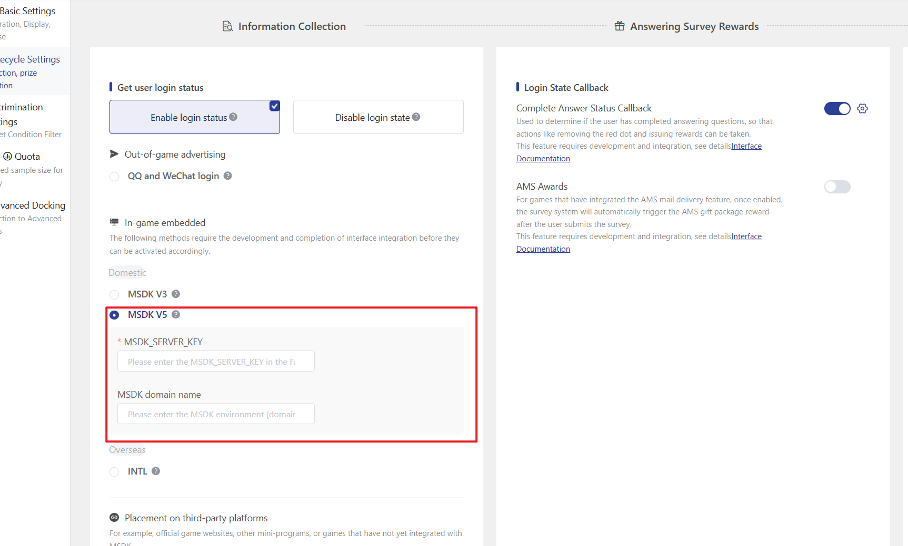
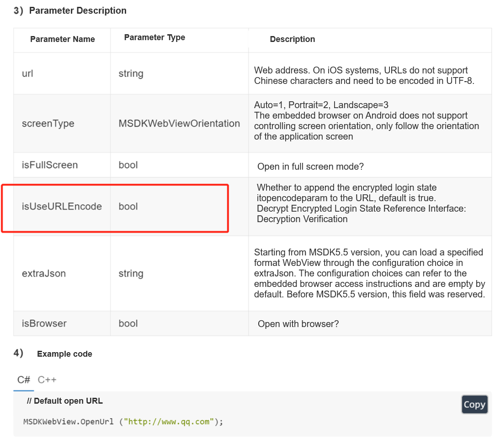

# MSDK-V5 Login State Collection

The APP integrated with MSDK V5 version can select \[MSDK v5] in the login verification of the survey settings. When users submit the survey, the survey system will automatically obtain the MSDK login status and store it in the response data.

**Parameter Configuration Description**


Please fill in the "Key" with the MSDK\_SERVER\_KEY from the Falcon system parameters. The "msdk domain name" distinguishes between the production environment and the testing environment. Please refer to the following for details:


| Environment (Domain)               | HTTP Intranet                        | HTTPS External Network                                                                       |
| ---------------------------------- | ------------------------------------ | -------------------------------------------------------------------------------------------- |
| Test Environment                   | http://hktest.itop.tencent-cloud.net | 
https://hktest.itop.qq.com （Domestic）

https://ipv6-hktest.itop.qq.com（Overseas）
 |
| Formal environment                 | http://itop.tencent-cloud.net        | 
https://itop.qq.com

https://ipv6-sh.itop.qq.com
                                 |
| Singapore's formal environment     | None                                 | https://sg.itopsdk.com                                                                       |
| Silicon Valley formal environment境 | None                                 | https://us.itopsdk.com                                                                       |

## MSDK-V5 Login State Encryption and Decryption Instructions

The survey system backend is used to decrypt and obtain the player's login status process. The game side only needs to focus on whether the correct login status parameters are injected after the survey link.

## The game client obtains the login state encrypted token

The game client needs to encrypt the survey link and inject login status information through the "Get Encrypted Ticket" interface provided by the MSDK webview; parameters include: msdkEncodeParam, timestamp, appid, algorithm, version, sig, encode, etc.

**Original survey link**

[<mark style="color:purple;">https://in.weisurvey.com/?sid=60ebdefe76051f6b8a37f782</mark>](https://in.weisurvey.com/?sid=60ebdefe76051f6b8a37f782)

**Survey link with added encrypted token**

[<mark style="color:purple;">https://in.weisurvey.com/?sid=60ebdefe76051f6b8a37f782\&algorithm=itop\&encode=2\&gameid=12\&os=1\&ts=1542889299\&version=2.2.000.2607.2607\&seq=11-5d0f17db-ef1e-44cd-88d7-57b556cc63ce-53\&sig=eb6ee5ab9418d1c8e6400608815e76f2\&itopencodeparam=F5382C12988BADA6F659B443ACE9978C14DE1B62EB1274AEFDECC219DE635C2B</mark>](https://in.weisurvey.com/?sid=60ebdefe76051f6b8a37f782\&algorithm=itop\&encode=2\&gameid=12\&os=1\&ts=1542889299\&version=2.2.000.2607.2607\&seq=11-5d0f17db-ef1e-44cd-88d7-57b556cc63ce-53\&sig=eb6ee5ab9418d1c8e6400608815e76f2\&itopencodeparam=F5382C12988BADA6F659B443ACE9978C14DE1B62EB1274AEFDECC219DE635C2B)

**Method 1: When calling the OpenUrl interface to open a link, set the parameter isUseURLEncode to true.**

&#x20;**MSDK Documentation Reference:**

【Open Webpage OpenUrl】[http://doc.itop.woa.com/v5/zh-CN/Module/WebView.html#22-%E6%89%93%E5%BC%80%E7%BD%91%E9%A1%B5](http://doc.itop.woa.com/v5/zh-CN/Module/WebView.html#22-%E6%89%93%E5%BC%80%E7%BD%91%E9%A1%B5)

<figure><figcaption>
MSDK Document
</figcaption></figure>

**Method 2: Call the (Get Encrypted Ticket) interface to inject login state parameters after the link.**

&#x20;MSDK Documentation Reference:&#x20;

【Get Encrypted Token GetEncodeUrl】http://doc.itop.woa.com/v5/en-US/Module/WebView.html#23-%E8%8E%B7%E5%8F%96%E5%8A%A0%E5%AF%86%E7%A5%A8%E6%8D%AE


You can choose either of the above two methods to inject the login state, but you cannot use both simultaneously. Doing so will result in multiple injections of login state parameters, causing decryption failure on the survey side and making the survey inaccessible. (Error message: Login failed, please refresh)


## Survey system decrypts to obtain login state information

The survey system obtains the plaintext gopenid decrypted from itopencodeparam through the "decryption verification" interface, which does not require attention from the game side.

MSDK Documentation Reference: \[Decryption Verification]

[http://doc.itop.woa.com//v5/zh-CN/Server/verify.html#%E4%BA%8C%E3%80%81%E8%A7%A3%E5%AF%86%E6%A0%A1%E9%AA%8C](http://doc.itop.woa.com/v5/zh-CN/Server/verify.html#%E4%BA%8C%E3%80%81%E8%A7%A3%E5%AF%86%E6%A0%A1%E9%AA%8C)

**Login Failure Prompt When the system fails to obtain the correct login status, the survey page will display a warning popup. The main reasons for the failure are as follows:**&#x20;

(1) The decryption of the itopencodeparam login state failed due to the lack of parameters such as os, gameid, channelid, ts, sig, and source.&#x20;

(2) The survey link with injected login state parameters is too long, causing some parameters to be truncated and missing. The game client needs to handle this on its own.&#x20;

(3) Repeated injection of login state parameters multiple times leads to decryption failure. The game client needs to check whether isUseURLEncode in OpenUrl() is set to true. If it is, then there is no need to additionally call GetEncodeUrl().

.png>)


If the MSDK-V5 login state collection interface fails during joint debugging, you can switch to using the parameter passing ([strict validation mode](fei-msdk-deng-lu-tai-chuan-di-jie-kou.md), [non-validation mode](parameter-transfer-interface-no-verification-mode.md)) interface to achieve login state transmission.

