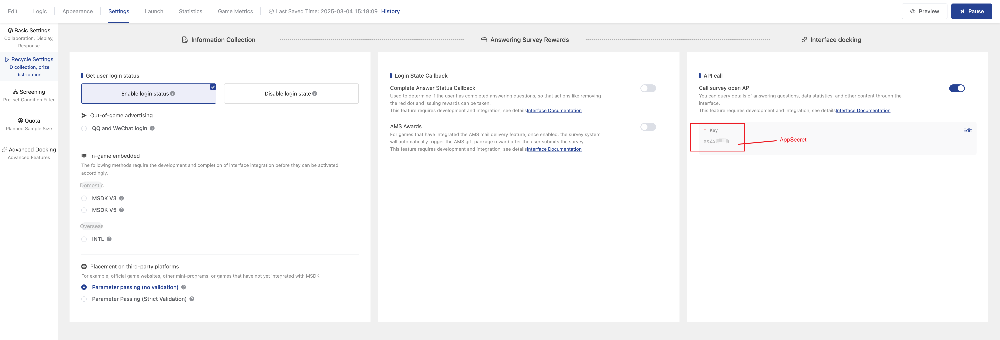

# Signature Algorithm

### 1. **Algorithm Process**

1. Provide the required parameters: `sid` (survey ID), `timestamp` (current timestamp in milliseconds), and `algorithm_version` (signature algorithm version, using `"v2"`), structured in a key-value (KV) format.
2. Sort the keys in ascending order based on ASCII values.
3. Iterate through the sorted key-value structure and concatenate all elements into a string using the format `"key1value1key2value2"`.
4. Apply the MD5 hashing algorithm to the concatenated string to generate the `sign` signature.
5. Append the generated `sign` as a signature field to the key-value structure.
6. Add `appSecret` as the signature key field in the key-value structure.
7. Convert the key-value structure into HTTP query parameters or body parameters.
8. Attach the generated request parameters and invoke the session authentication API.

### **2.Configure Open API Secret**

You can find the secret corresponding to your survey here and modify it if needed.

<figure><figcaption></figcaption></figure>

### **3.Full  Example**

#### Golang

```go
package main

import (
	"crypto/md5"
	"encoding/hex"
	"fmt"
	"sort"
)

// Generate MD5 hash
func MD5(s string) string {
	hash := md5.Sum([]byte(s))
	return hex.EncodeToString(hash[:])
}

// Generate signature
func MakeSign(data map[string]string, secret string) string {
	str := MakeSignParamStr(data, secret)
	return MD5(str)
}

// Generate parameter string
func MakeSignParamStr(data map[string]string, secret string) string {
	data["appSecret"] = secret

	keys := make([]string, 0, len(data))
	for key := range data {
		keys = append(keys, key)
	}
	sort.Strings(keys)

	str := ""
	for _, key := range keys {
		if data[key] != "" {
			str += key + data[key]
		}
	}
	delete(data, "appSecret")

	return str
}

// Verify signature
func VerifySign(sign string, params map[string]string, secret string) bool {
	return sign == MakeSign(params, secret)
}

func main() {
	// Example parameters
	params := map[string]string{
		"sid":               "67c6a30e2797730bf50d0972",
		"uid":	             "xxxxx",
		"timestamp":         "1741071430",
		"algorithm_version": "v2",
	}

	secret := "mySecretKey"

	// Generate sign
	sign := MakeSign(params, secret)
	params["sign"] = sign

	// Print result
	fmt.Println("Generated sign:", sign)
	fmt.Println("Final request parameters:", params)
}

```


