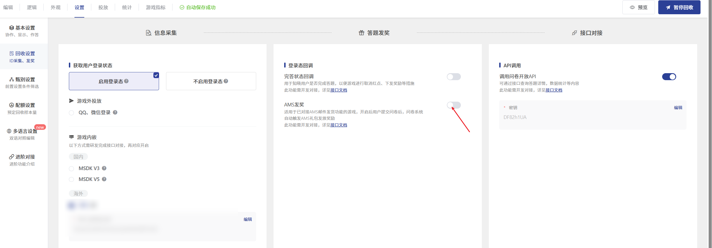

# Variable Setting

Support for custom variables, which allows the recombination of survey question fields to generate new variables. These newly generated variables can be used for subsequent weighting, statistics, and cross-calculation

## 【STEP 1】Set variable

<figure><figcaption></figcaption></figure>

Fields marked with \* are mandatory. Multiple valid values can be added under the same variable. The rules for valid values are defined according to project requirements.

<figure><figcaption></figcaption></figure>

The system will match according to the order of the valid values above. The same survey data will be preferentially matched to the valid values in the earlier order. If none of the above conditions are met, it will be left blank.

### Variable Type Description

Variable types: single-choice, multiple-choice

* Single-choice type: Similar to multiple-choice questions, each player can only correspond to one valid value variable. \[For example] Gender: Male, Female
* Multiple choice type: Similar to multiple-choice questions, each player can correspond to one or more valid values of the variable. \[For example] Frequently played categories: Action Role-Playing/ARPG, Shooting, Real-time MMORPG, Racing, Sports.

### How to determine the type of a variable

If the conditions for valid values include multiple-choice questions/matrix multiple-choice questions, then it is a multiple-choice variable.

### Converting multiple-choice variables to single-choice variables


The current system functionality only supports setting single-choice variables. If there are multiple-choice variables, the variables need to be split into multiple ones according to valid values. Each variable would be: original\_variable\_valid\_value: valid\_value or original\_variable\_valid\_value: yes.


\[Example]

Frequently played genres: Action Role-Playing Games (ARPG), Shooting games, Real-time MMORPG, Racing games, Sports games

**Split into multiple variables as:**

Frequently played category\_Action Role-Playing Game/ARPG: Yes

Frequently Played Category\_Shooter: Yes&#x20;

Frequently Played Category\_Real-time MMORPG: Yes&#x20;

Frequently Played Category\_Racing: Yes&#x20;

Frequently Played Category\_Sports: Yes

## 【STEP 2】Calculate generated variables

fter finishing editing all variables, click "Execute Calculation Variables" above to trigger the calculation. Once the calculation is complete, the variables will be written into the survey data as new columns, which can be used for statistics, cross-analysis, etc.

<figure><figcaption></figcaption></figure>

### Application 1: Participation in Weighted Settings

All newly generated variables can be used as weighting conditions to adjust the sample proportion.

<figure><figcaption>
Variables as weighted conditions
</figcaption></figure>

### Application 2: Online Data Viewing

<figure><figcaption>
The generated variables are updated to the survey data.
</figcaption></figure>

### Application 3: Export Data

In the exported raw data/encoded data, newly generated variables will be updated as new columns in the list.

<figure><figcaption>
Example: Export raw data
</figcaption></figure>

### Application 4: Statistical Charts

The distribution of each valid value of the newly generated variable can be viewed on the statistical chart page.

<figure><figcaption></figcaption></figure>

### Application 5: Cross Analysis

The newly generated variable can be used as a header for cross-analysis.

<figure><figcaption></figcaption></figure>
