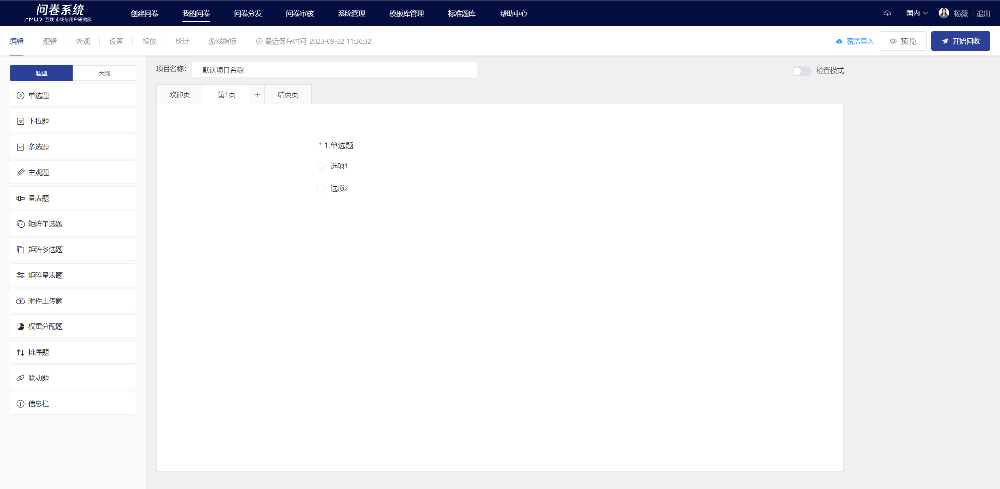

# 创建空白问卷

创建空白问卷，是指直接创建一份没有任何题目信息的空白问卷。点击“创建空白问卷”按钮，就可以创建一份空白问卷，编辑问卷内容与设置可同时进行。

.png>)

项目名称、问卷标题、欢迎语、结束语、问题、选项等问卷内容可根据自己的需求内容录入，支持字体样式调整及富文本编辑等。在左侧面板中的“题型”控件点击所需题型添加题目，包括单选题、下拉题、多选题、主观题、量表题、矩阵单选题、矩阵多选题、矩阵量表题、附件上传题、权重分配题、排序题、联动题、信息栏等。

