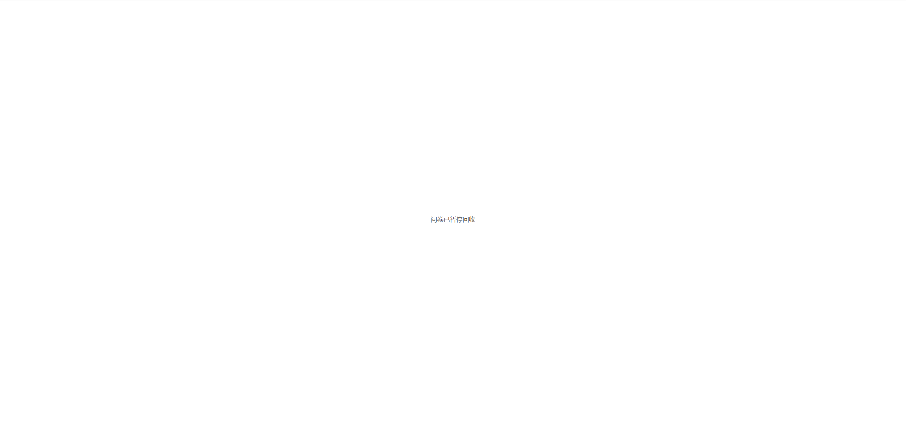

# Distribute survey

After completing the editing and setting of the survey, users with survey review permissions can activate the distribution link through the "publish" function to distribute the survey. If the user does not have survey review permissions, they need to submit the survey for review to the designated reviewer. Once approved, the distribution link will automatically become active. After the sample collection is complete, users can close the distribution link using the "Pause " function to ensure the security of the survey information.

### Start recycling

After completing the editing and settings of the survey, it is recommended to send the preview link to colleagues within the group and members of the project team for assistance in checking. Ensure there are no errors before starting the collection. On the survey editing page, click "publish”in the upper right corner or go to "Home—more—publish" and click confirm.


The two deployed domains are common, and the collected survey data will be aggregated together.


<figure><figcaption></figcaption></figure>


The survey being recycled does not support modification, deletion, or data clearing.


<figure><figcaption></figcaption></figure>

### Submit for review

After completing the editing and settings of the survey, users who do not have survey review permissions need to submit the survey to the designated reviewer for review. Once the reviewer approves the survey, the distribution link will automatically become effective, and response data can be collected normally.

<figure><figcaption></figcaption></figure>

<figure><figcaption></figcaption></figure>


* Project team members do not have survey review permissions by default. If you need to distribute a survey, please contact the corresponding UX manager for survey review.
* The reviewer set during submission must have survey review permissions.
* Multiple reviewers can be assigned, and once any reviewer approves, the survey status changes to "collecting responses" and the distribution link becomes active.
* Once submitted for review, the survey cannot be modified.
* After submitting for review, if you need to modify the survey or change the reviewer, you must first withdraw the review.


<figure><figcaption></figcaption></figure>

##

## Get the deployment link

After the survey starts collecting responses, the distribution link and mobile QR code for the survey can be obtained in the "Distribution" function on the survey editing page or "Home—more— Distribute Survey". Respondents can enter the survey through either the distribution link or the QR code.

<figure><figcaption></figcaption></figure>

## Custom Source Channel

The system supports generating survey links by distribution channels, which is suitable for tracking user responses across different channels when the same survey is distributed through multiple channels.

### STEP 1 Set up the survey link for the source channel

On the "Distribute" page, you can set the survey link for the source channels. The system provides preset categories and preset values, which can be directly selected or edited by yourself.

If it is a custom channel number, it needs to meet the following format: composed of 1 to 20 English letters, numbers, or underscores (\_). Otherwise, the channel number will be recognized as empty in the survey interface.

<figure><figcaption></figcaption></figure>

<figure><figcaption></figcaption></figure>

### STEP 2 Get the link

After clicking save, return to the "Distribute" page to obtain the survey links for each channel.

<figure><figcaption></figcaption></figure>

### STEP 3 Deploy and Collect Data

When deploying, place the corresponding link into the channels. Respondents will use this link to fill out and submit the survey. The collected survey data will record the source channel, and you can view it by exporting the data.

.png>)

### STEP 4 Filter data by source channel

On the statistics page, you can use the data filter to filter by "source platform" to view the survey data and statistical charts for the specified channel.

<figure><figcaption></figcaption></figure>

## Pause Recycling

After the sample collection is completed, you can close the distribution link by clicking "pause" in the upper right corner of the survey editing page or through "Home—More—Pause". After closing, the respondents will be notified that the survey data collection has been paused, and they will not be able to view the survey.

<figure><figcaption></figcaption></figure>

<figure><figcaption></figcaption></figure>

## Frequently Asked Questions

### Can the domain name be changed after starting the recycling?

Yes, the two displayed domains are universal, and the data collected from both domains will be aggregated.

### Can the survey still be edited while it is being collected?

Surveys in the "Recycling" status cannot be edited. You need to pause the survey collection before editing. If there are already collected responses, editing may affect the data statistics. Please proceed with caution.

### Is the original response data still available after editing a survey that is being recycled?

Deleting options or questions will also delete the original survey responses associated with them (only the responses related to the deleted options/questions). If you modify the text content of questions/options, adjust the order, or add new ones, the original survey responses will not be affected.

