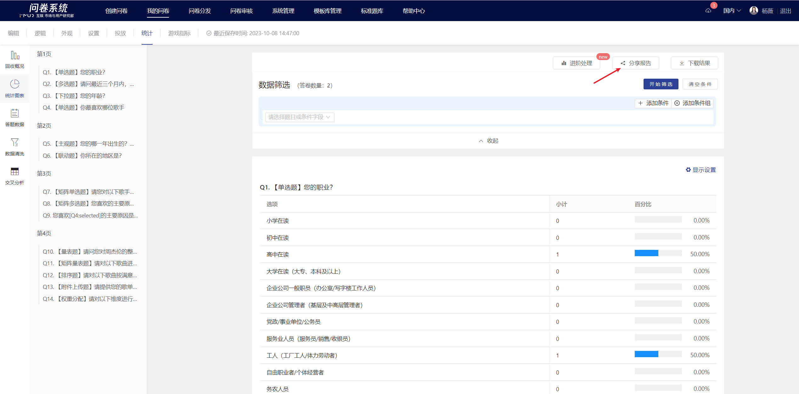
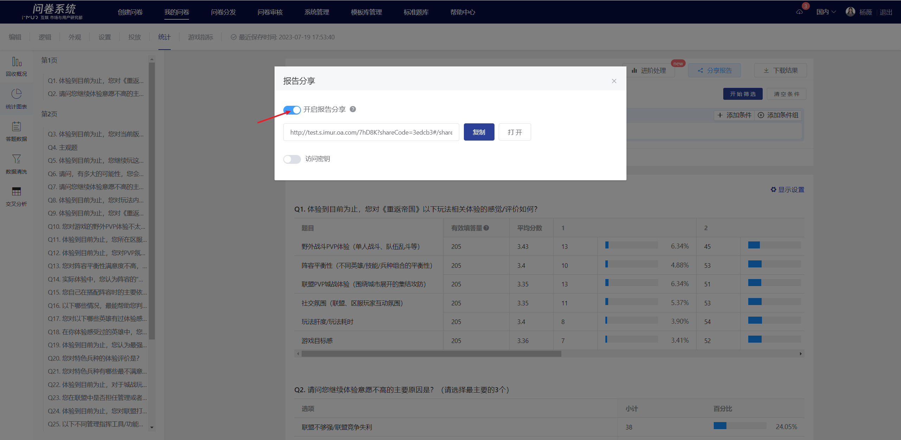
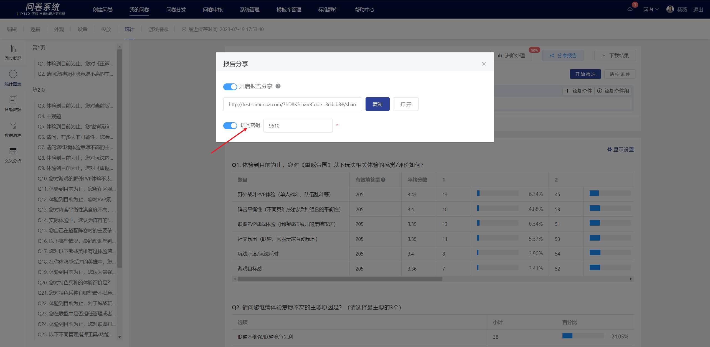
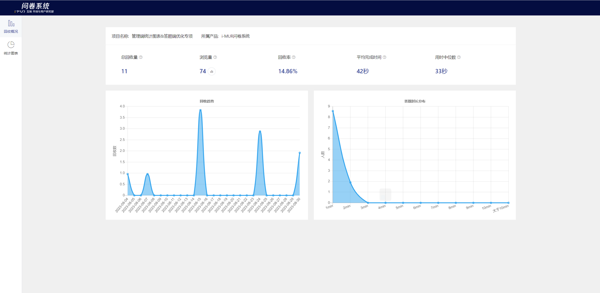

# 报告分享

系统提供报告分享功能，用户可在指定问卷的统计页中获取报告分享页链接，配置该分享页是否加密，分享到其他平台；获取到链接的用户不需登录问卷系统即可直接查看该问卷的实时回收情况及各题型统计数据。

### STEP 1 功能入口

在统计页中点击右上角的“分享报告”按钮。

### STEP 2 启用分享

在分享报告弹窗中启用报告分享功能，获取分享页链接；功能关闭后，该分享页链接失效，分享页将无法访问。

### STEP 3 配置加密

在弹窗中可配置给分享页是否加密，访问密钥支持自由修改；开启访问密钥后，获取分享页链接的用户需要输入正确的密钥才可访问该分享页。

### 报告分享页

报告分享页与原问卷的统计页数据一致，可实时查看该问卷的回收情况。

