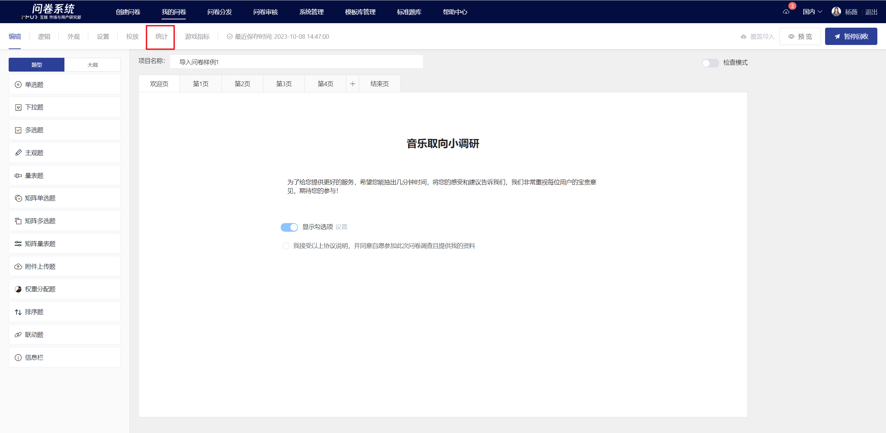
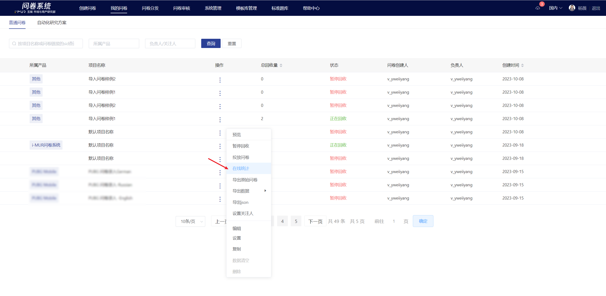

# Statistical Analysis

After the survey starts collecting responses, users can view the data collection status by clicking "Statistics" in the upper right corner of the survey editing page or by clicking "My Surveys — Actions — Online Statistics" to enter the statistics analysis page.

