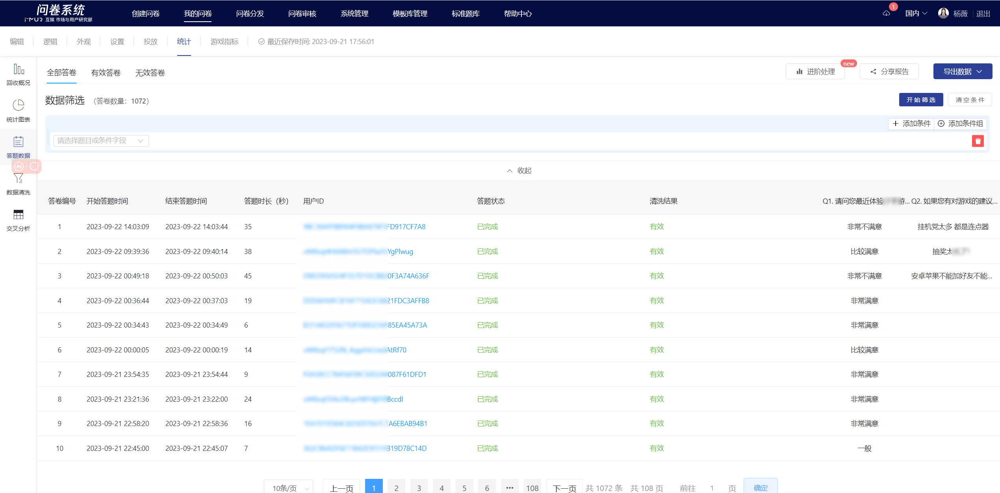
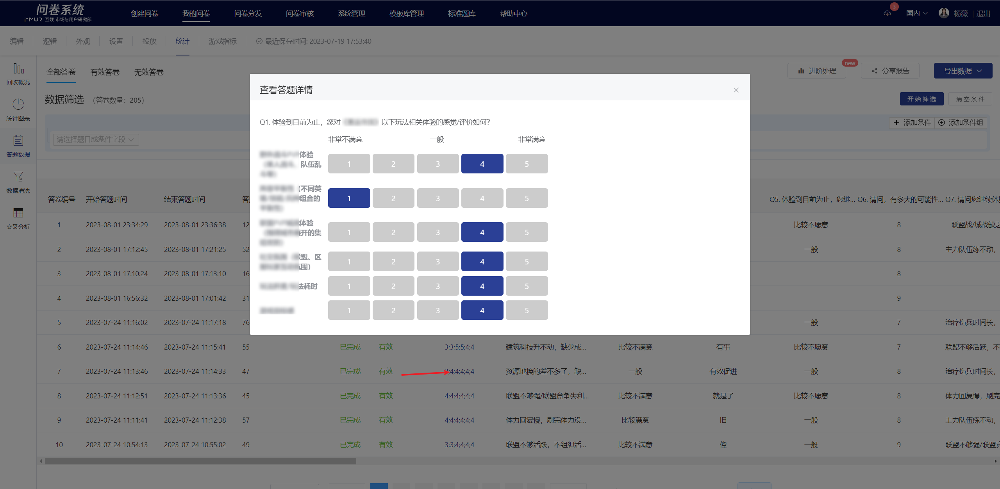
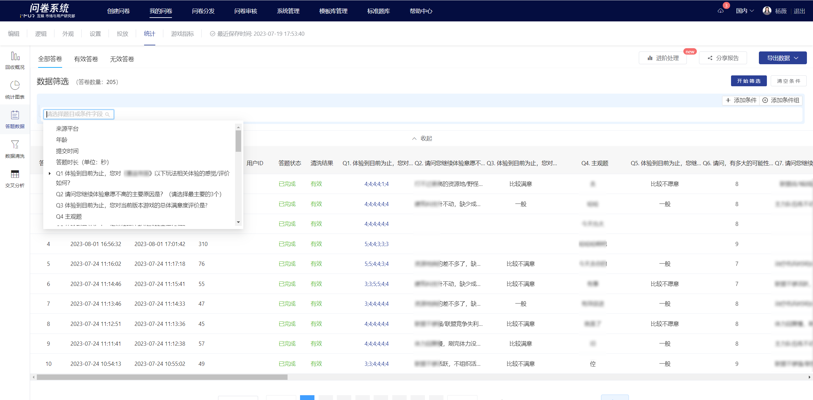

# View survey data online

The survey details can be viewed online on the statistics page, providing a quick overview of the data and response status for each question in the survey.


The answer fields for questions not answered by the user will be displayed as empty.


For matrix single-choice questions, matrix multiple-choice questions, and matrix scale questions, you can click on the pop-up window to view the details of each question's answers.

Support data filtering based on specified conditions, allowing viewing of partial surveys according to the specified criteria.

