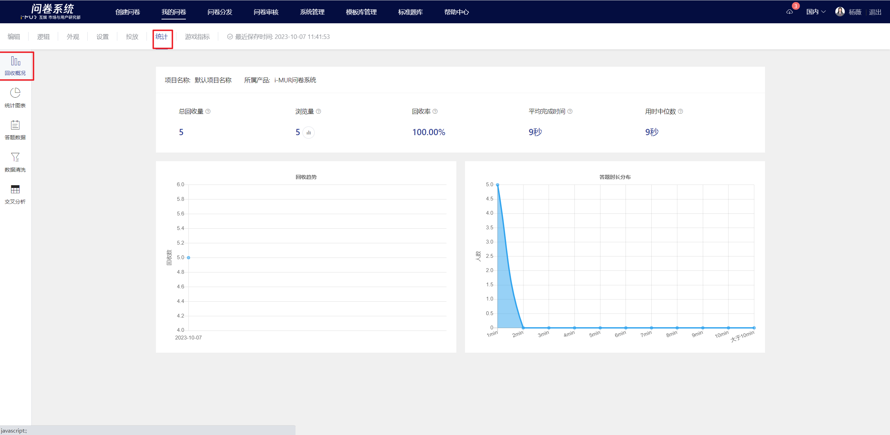

# Recycling Overview

### Overall Summary

The recycling overview shows the overall situation of survey collection.

| Metric                  | Explanation                                                                                                                                                        |
| ----------------------- | ------------------------------------------------------------------------------------------------------------------------------------------------------------------ |
| Recycling volume        | Number of valid surveys collected in real-time                                                                                                                     |
| Page views              | The number of real-time clicks on the survey link                                                                                                                  |
| Recycling rate          | The proportion of the number of valid responses to the survey in the total views, recovery rate = number of responses / total views \* 100%                        |
| Average Completion Time | Calculate the average response time of all respondents in the collected surveys using the formula = total time spent by all users / number of responses collected. |
| Median Time Taken       | Collect all survey respondents                                                                                                                                     |

### Page PV

Click on the view count icon to display the view details. The system will track and record the PV (page views) of each core page.

.png>)

| Metric                      | Explanation                                                                                                                                    |
| --------------------------- | ---------------------------------------------------------------------------------------------------------------------------------------------- |
| Number of Successful Logins | Number of successful logins via QQ login page/WeChat authorization login/in-game login                                                         |
| Welcome Page PV             | PV of the welcome message. The overseas verification process can skip the welcome page, in which case the welcome page PV will not be counted. |
| Survey page PV              | The PV of visiting the survey page will only be counted once, even if there are multiple question pages.                                       |
| Recycling volume            | Number of valid surveys collected                                                                                                              |

### Export daily statistics of page PV

Click the export button in the view count details popup to export the metric data statistics by day.

.png>)

