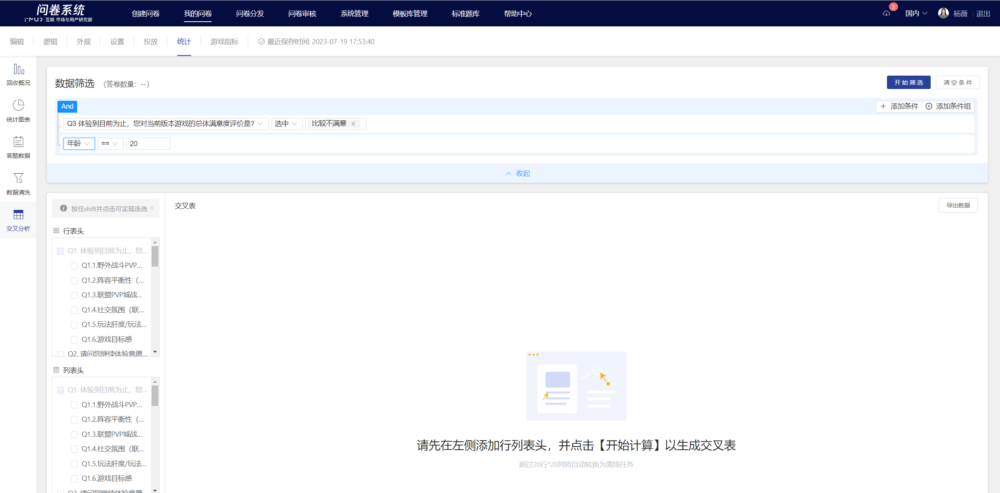
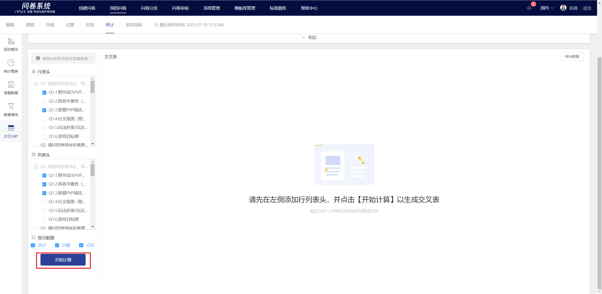
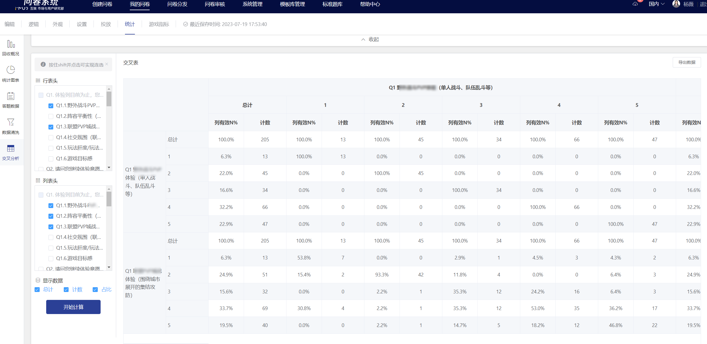

# 交叉分析

在统计页中支持定义行、列进行交叉分析，实时快速生成交叉表用于分析多道题之间的关系。

以问卷中的题目为变量，设置自变量和因变量后进行交叉分析。

* 定义行表头：一般为样本属性，如性别、年龄等；最多可设置20个自变量
* 定义列表头：一般为需要分析的题目，如偏好品类、游戏频率、付费情况等；最多可设置20个因变量

## 【STEP 1】数据筛选

提供数据筛选功能，开启后可设定指定条件先对当前已回收的答卷数据进行筛选，在筛选结果中生成交叉表。

## 【STEP 2】设置行、列表头

在左侧设置栏中分别勾选作为行表头、列表头的题目，点击下方“开始计算”按钮即实时计算生成交叉表。

## 【STEP 3】生成交叉表

