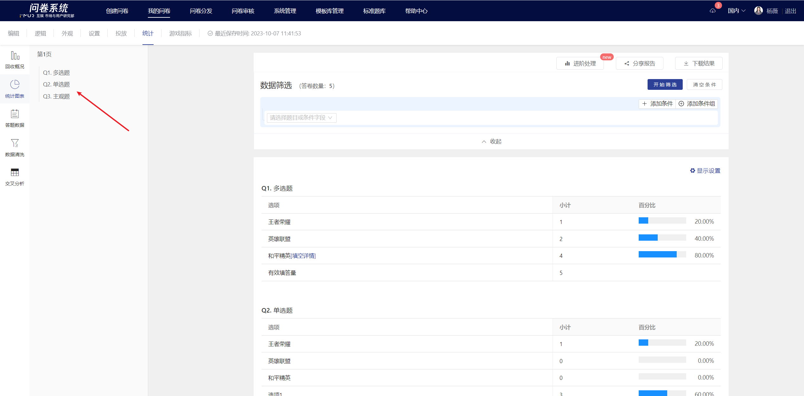
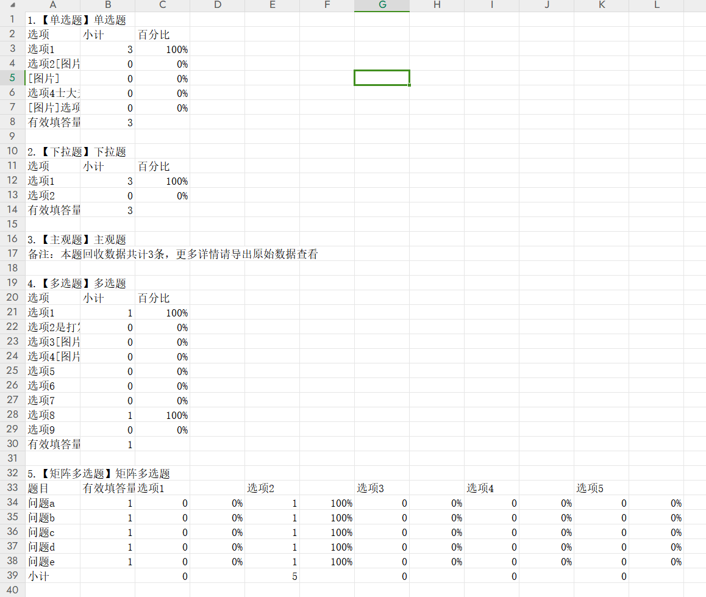
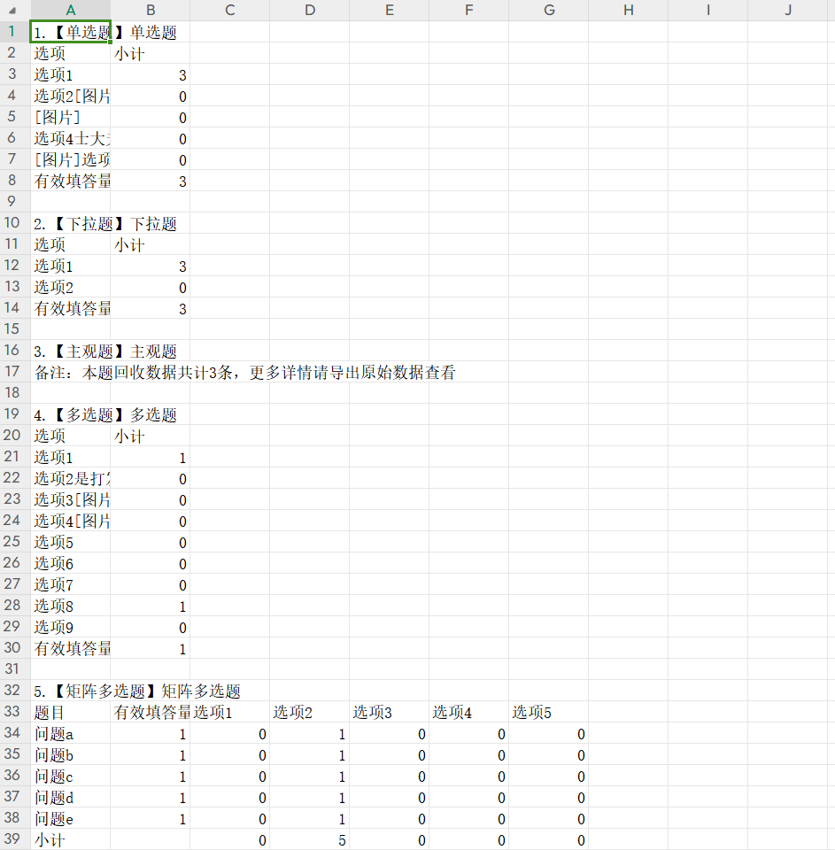
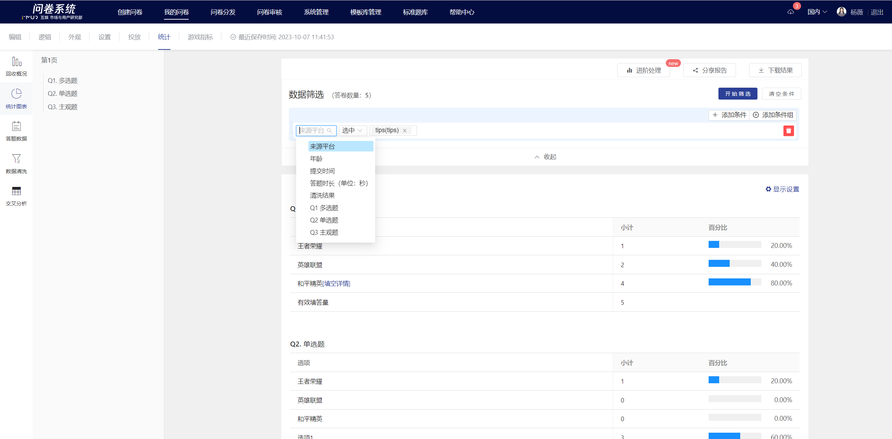
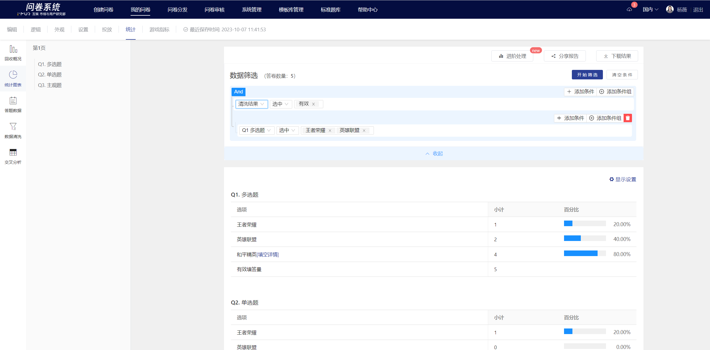
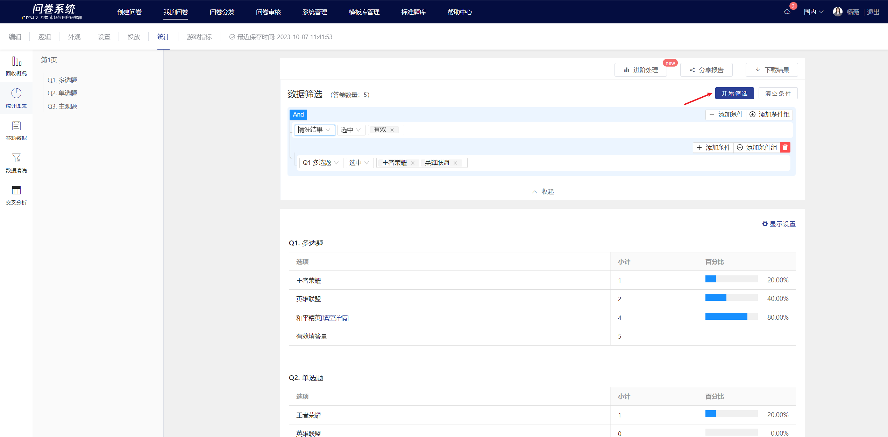

# 统计图表

在统计图表页支持在线查看各题答案的统计结果、统计结果导出（含小计和百分比）。


左侧导航大纲支持点击定位到指定题目。


下载结果格式为CSV格式，可在excel中直接打开，包含：总表（总计+小计+百分比）+频率表（含百分比）+频数表（含小计），满足不同看数场景

<figure><figcaption>
频率表
</figcaption></figure>

<figure><figcaption>
频数表
</figcaption></figure>

## 数据筛选

统计图表提供数据筛选功能，开启后可设定指定条件对当前已回收的答卷数据进行筛选，筛选结果以统计图表形式展现。


1. 关闭或刷新页面，将清空筛选条件并展示全部答题数据&#x20;
2. 筛选条件仅当次有效，不保存记录


添加条件

点击添加条件可设置多个条件进行筛选，支持一次勾选多个选项设定。筛选条件默认包含（来源平台、年龄、提交时间、答题时长、清洗结果）

添加条件组

点击“添加条件组“可自定义满足"And”或”or”条件下的数据筛选，支持一次勾选多个选项设定。筛选条件默认包含（来源平台、年龄、提交时间、答题时长、清洗结果）

添加条件后点击开始筛选，统计图表将会根据筛选条件刷新&#x20;

<figure><figcaption></figcaption></figure>

