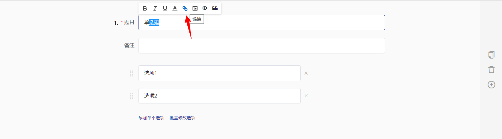
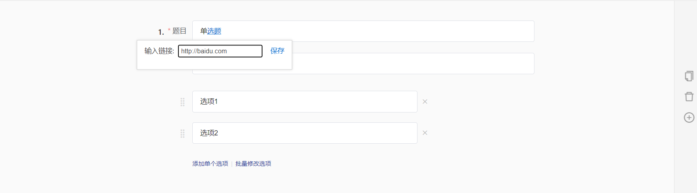
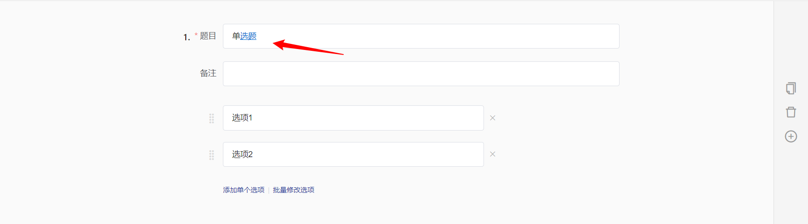
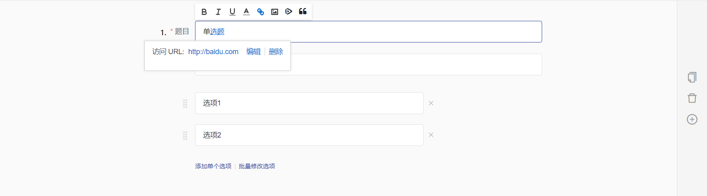
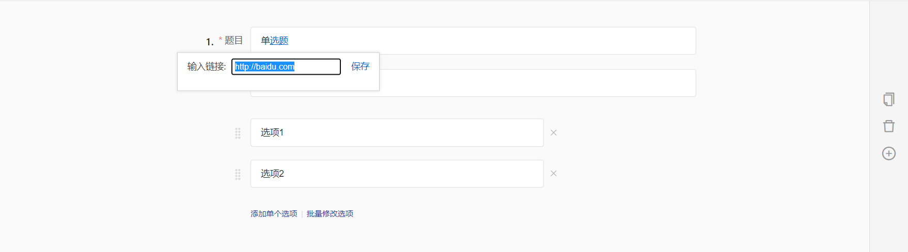
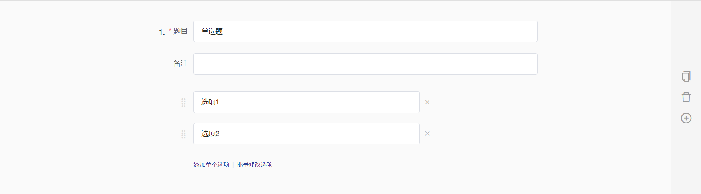

# Insert hyperlink

### Enter the hyperlink address in the edit boxEnter the hyperlink address in the edit boxEnter the hyperlink address in the edit boxEnter the hyperlink address in the edit boxwInsert hyperlink

When editing the survey title, welcome message, end message, questions, remarks, or options, it is possible to insert hyperlinks into the specified text.

### \[STEP 1] Select the text

After selecting the target text by dragging, click the "Hyperlink" icon in the rich text toolbar above the editing bar to display the hyperlink editing box.

### 【STEP 2】Enter the link

Enter the hyperlink address in the hyperlink edit box.


The hyperlink address must include prefixes such as https:// or http://.


### 【STEP 3】Save

After saving, the selected text will be displayed as a hyperlink.

### Edit hyperlink

在指定文字中插入超链接后，支持多次修改超链接地址。

### \[STEP 1] Select Text

In the survey editing mode, after clicking on the hyperlink text that needs to be modified, the corresponding hyperlink address for that text will be displayed below.

### 【STEP 2】Edit

Click the "Edit" button in the hyperlink toolbar to switch to hyperlink editing mode, and enter the new hyperlink address in the displayed address bar.

### 【STEP 3】Save

After saving, the selected text will be displayed in hyperlink style, and the hyperlink address corresponding to the text will be updated to the new hyperlink address.

.png>)

### Remove hyperlink

Text with inserted hyperlinks supports the functionality to remove hyperlinks while retaining the text.

### 【STEP 1】Select the text

In the survey editing mode, after clicking the hyperlink display text that needs to be modified, the corresponding hyperlink address for that text will be displayed below.

.png>)

### 【STEP 2】Remove

After clicking the "Delete" button in the hyperlink toolbar, the inserted hyperlink will be automatically removed, and the selected text will revert to normal text style.

### Survey Interface Display

.png>)
