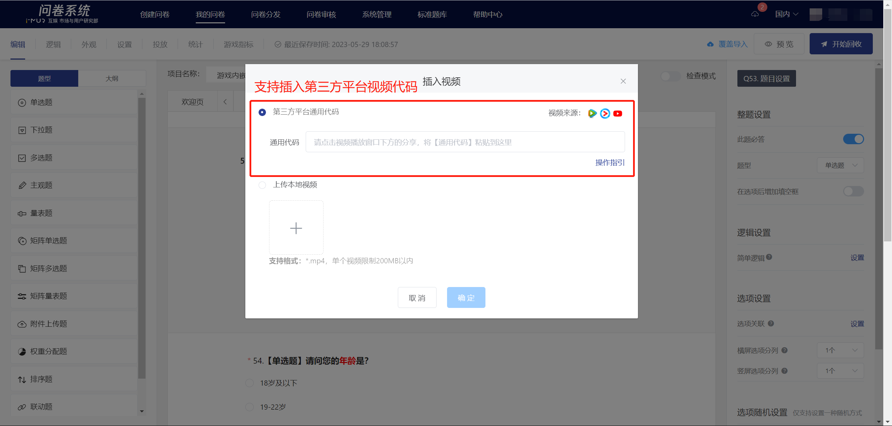

# Insert video

Supports two methods: uploading local videos and inserting third-party platform codes

### Insert video in edit mode

### 【STEP 1】Specify the video insertion position

In the survey editing state, after clicking on the survey question, remarks, or option text edit box, a rich text editing tool will expand in the upper left corner. Click on the "Video" icon in the rich text editing tool.

<figure><figcaption></figcaption></figure>

### Method 1: Local Video Upload

Support local video uploads, with videos directly uploaded to the survey system backend, more effectively preventing material leaks in sensitive survey projects.

<figure><figcaption></figcaption></figure>

### Method 2: Third-party platform video code

<figure><figcaption></figcaption></figure>


Note: When uploading videos, you should first upload the video to a third-party video website platform. It is recommended to use: Tencent Video.


On a third-party video website (it is recommended to use Tencent Video), find the "Universal Code" under the "Share" button on the playback page of the embedded video and copy it.


Supported Platforms

* Tencent Video&#x20;
* Youku Video
* bilibili
* YouTube


Platform 1: Tencent Video

.png>)

Platform Two: Youku Video

.png>)

#### Platform Three：YouTube

.png>)

.png>)

### Adjust video player size

To adjust the video size on the PC questionnaire interface, you can add width and height tags in the general code to set the width and height of the video player, such as: width="700" height="480".


Only supports adjusting the video player size in the PC survey interface


.png>)

### 【STEP 3】Confirm video insertion

Click OK to successfully insert the video, and a thumbnail of the inserted video will be displayed in the text editing bar.

.png>)

The survey interface displays a video.

.png>)
