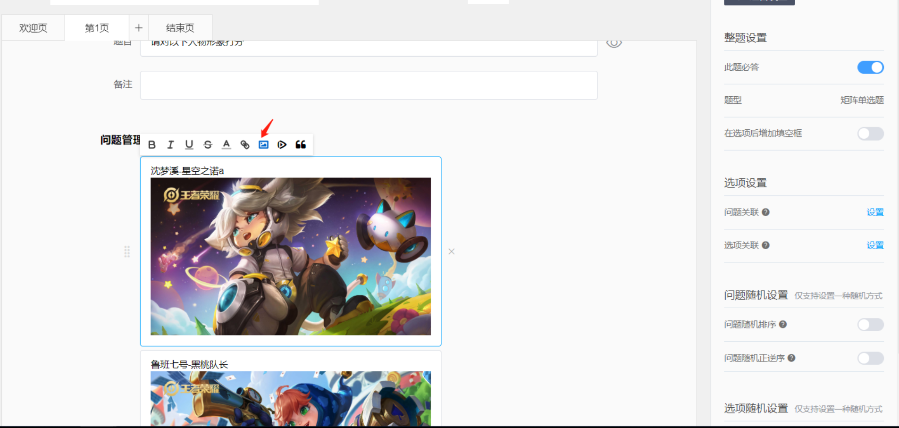
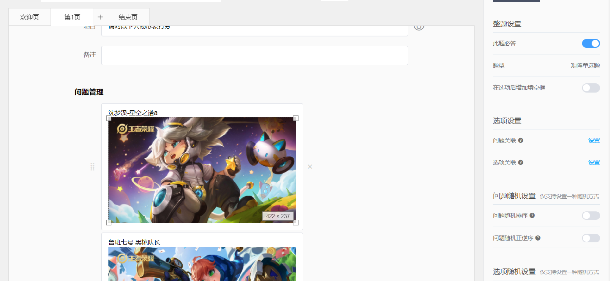

# 插入图片

在编辑问卷欢迎语、结束语、题目、备注或选项时，均支持使用插入图片功能。


1. 上传的图片限制最大为5MB
2. 支持支持GIF、JPG、PNG和BMP格式
3. 尺寸不限


## 编辑状态下插入图片

点击目标文字的编辑栏位置后上方出现富文本工具栏，点击“图片”图标后，可操作上传本地图片；插入后的图片可直接调整尺寸大小。

## 答题端显示图片

.png>)

.png>)

.png>)

