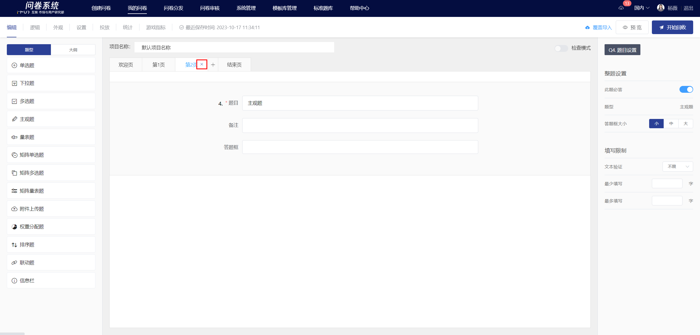
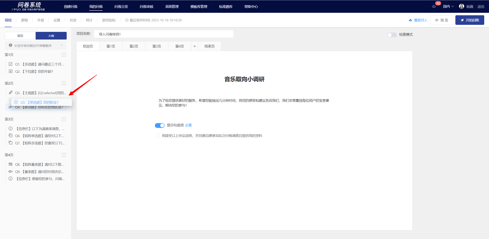
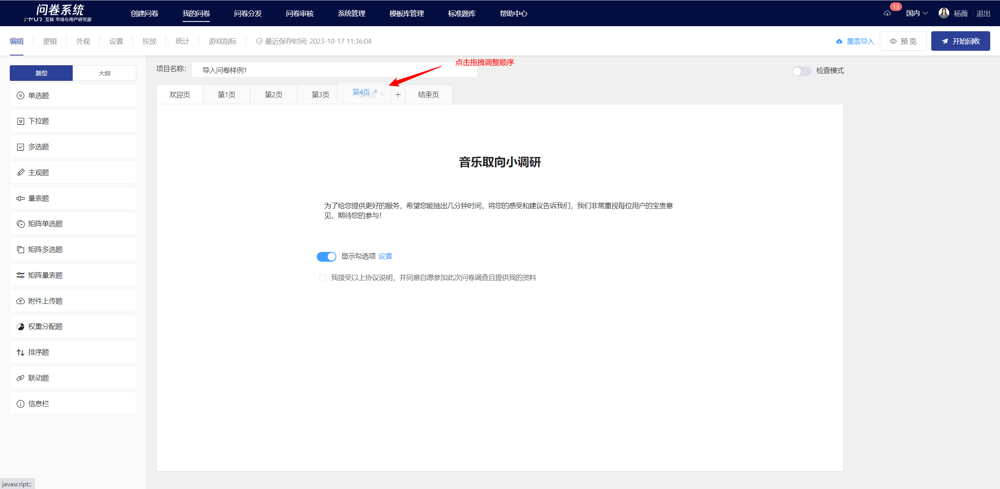
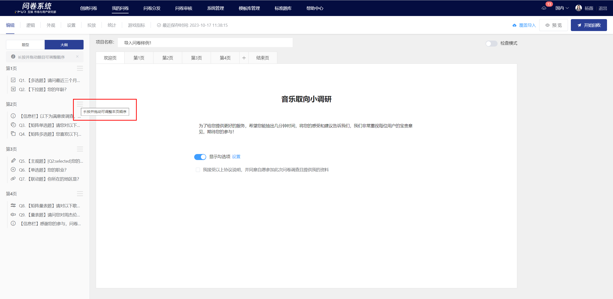

# Pagination and adding/removing survey pages

### Add survey page

On the survey editing page, click the "+" tab in the pagination bar to add a new survey page at the end of the main survey page.

### Delete survey page

To delete a specific survey page, click the "x" delete button on the page tab. All questions and associated elements, such as logic, references, and settings on that page, will be deleted simultaneously.

### Survey Pagination

In the "Outline" control on the left side of the page, users can adjust the pagination of questions by clicking and dragging the specified questions with the mouse. The system will automatically save the changes (the survey being collected will be synchronized to the answering end in a timely manner).


Users can locate specific questions by clicking on the titles in the "Outline".


### Adjust survey page order

In the page tab, users can adjust the order of survey pages by clicking and dragging the specified survey page titles with the mouse. The system will automatically save the changes (the ongoing surveys will be synchronized to the answer end in real-time).

In the "Outline" control on the left side of the page, you can drag icons to adjust the survey page order. The system will automatically save the changes (the survey being collected will be promptly synchronized to the answering end).

