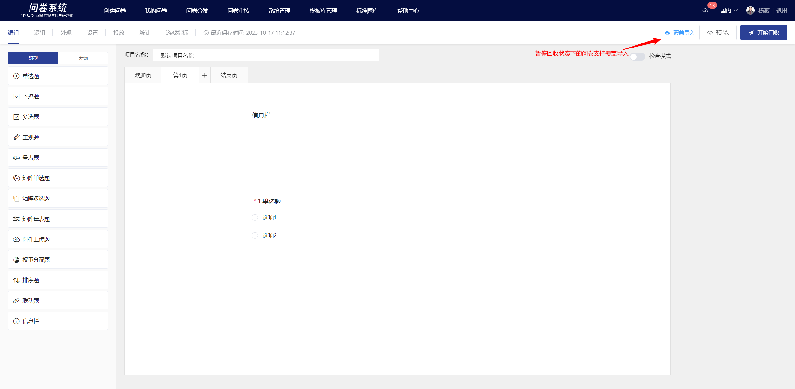
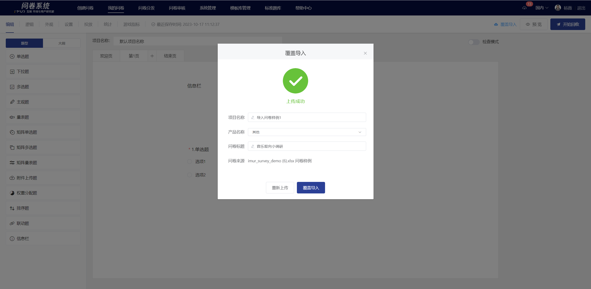
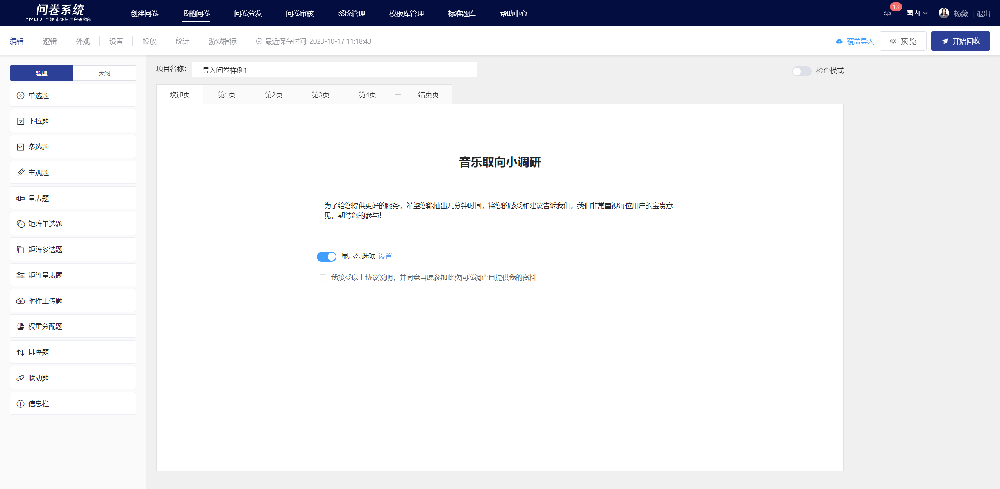

# Overlay Import

If you already have a designed EXCEL survey, you can use the "Overwrite Import" feature to import the survey into an already created survey. After importing, the original survey's distribution link remains unchanged, but the original survey content, logic settings, and collected response data will be cleared.

## 【STEP 1】Edit the survey content in excel

The survey can be edited in advance in EXCEL, including: basic survey information (project name, product name, survey title, welcome message, closing message), question and option content (including font styles), question settings, pagination settings, etc.

.png>)


1. If the Excel file contains multiple surveys, only the first survey will be recognized during import.
2. For detailed format specifications on editing surveys in Excel, please refer to the "Format Specifications".


## 【STEP 2】Overlay Import

On the survey editing page where a coverage import is required, click the "Coverage Import" button in the upper right corner and select the Excel file to be imported.


1. Only surveys with the "Pause Collection" status support overlay import. Surveys that are currently being collected or under review must be paused or the review must be revoked before overlay import.
2. After importing, the content, logic settings, and collected responses of the original survey will be cleared. Please proceed with caution.


## 【STEP 3】Confirm basic information

After uploading the EXCEL file, the system will automatically recognize the survey content. The uploaded survey supports re-uploading and adjusting project names, product names, and survey titles.

## 【STEP 4】Generate survey&#x20;

After confirming the survey information, click "Overwrite Import" to import the survey content from the excel file into the current survey, which will be displayed on the editing page.

