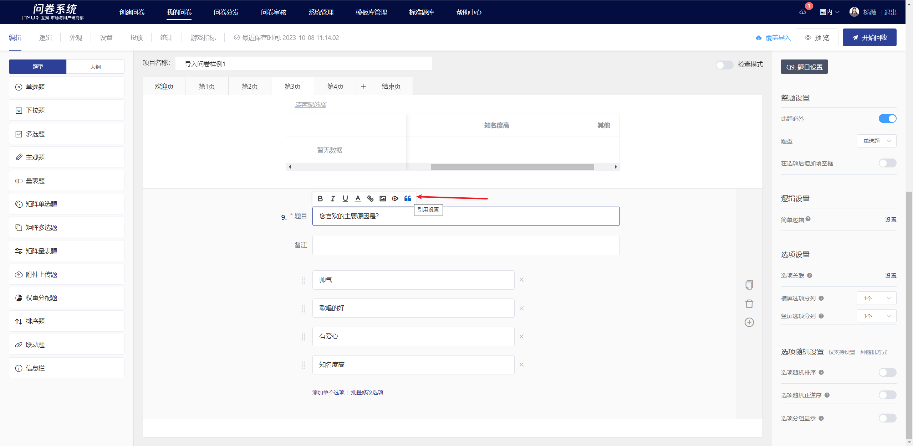
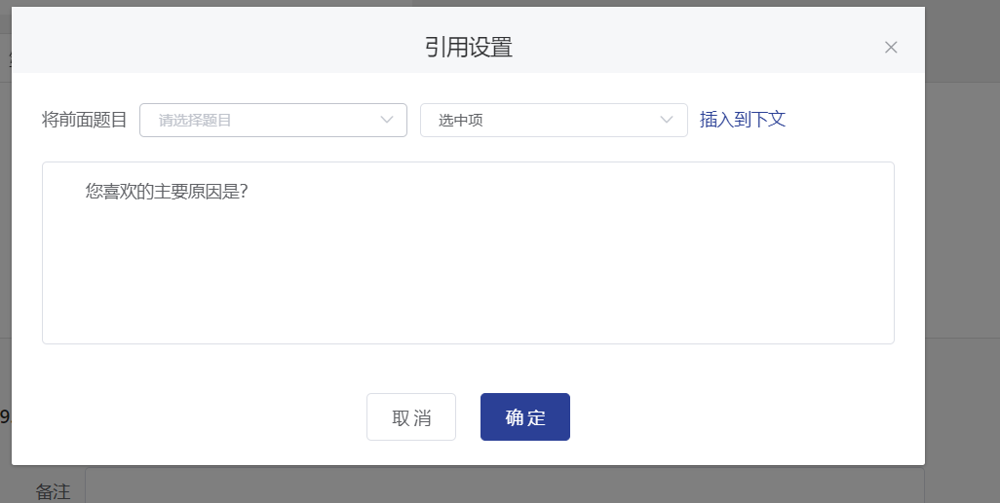
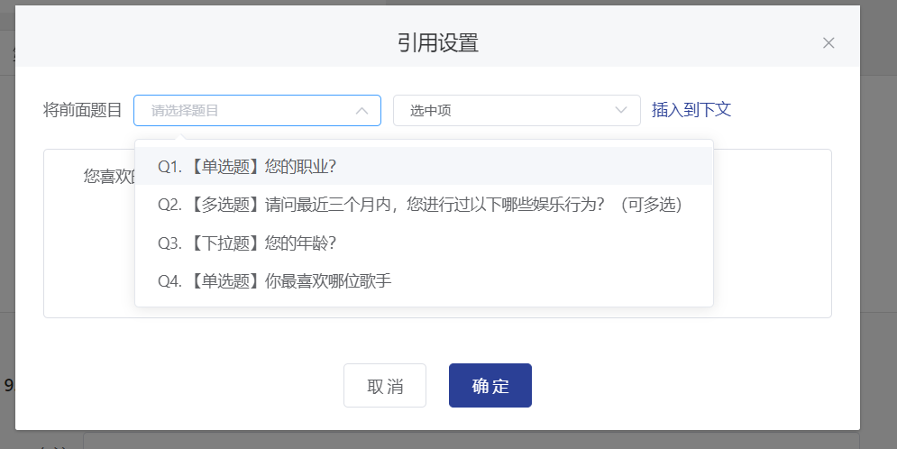
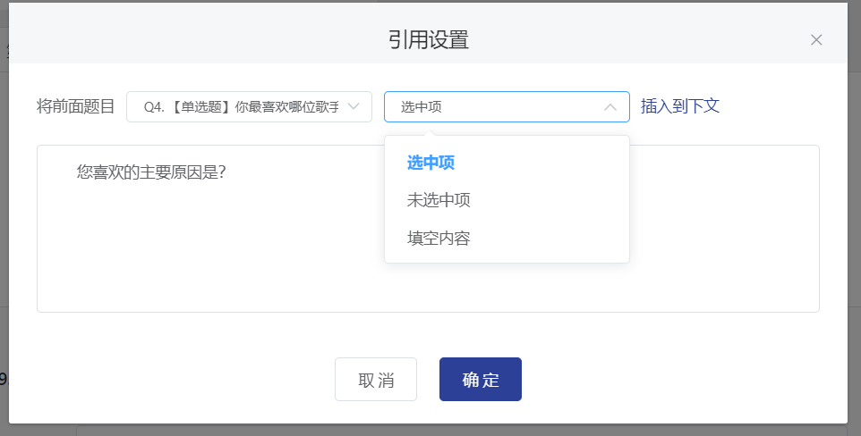
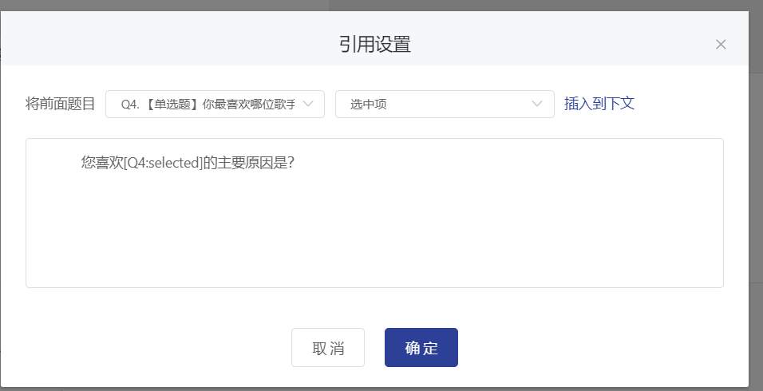
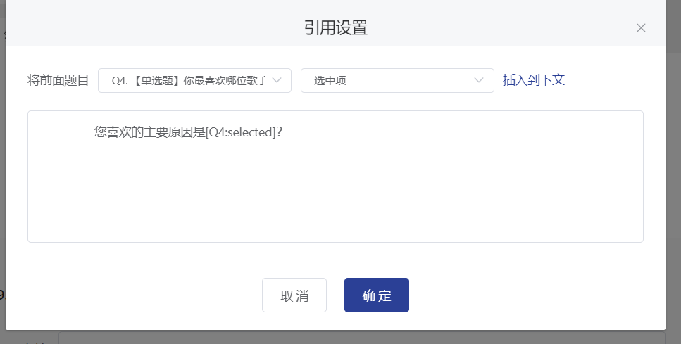
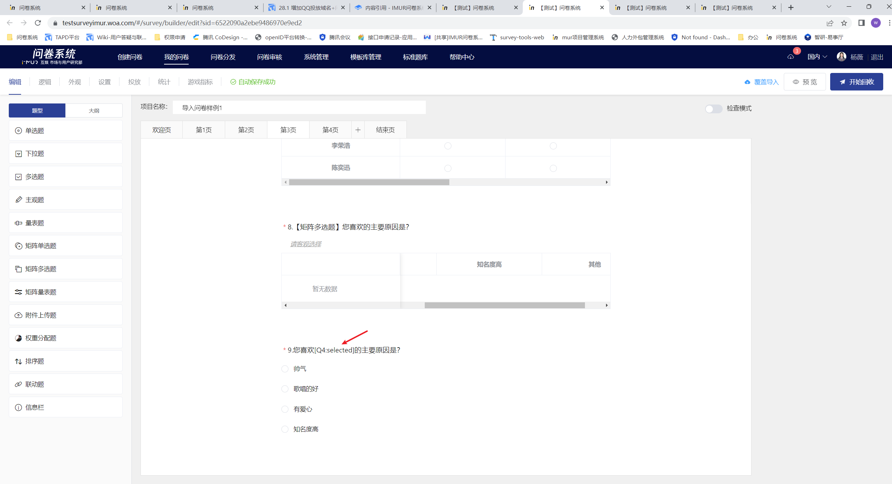
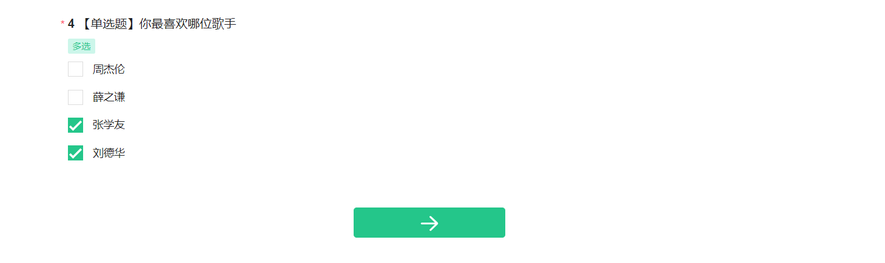
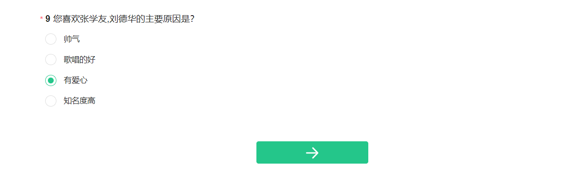

# Content citation

When editing survey questions, notes, or options, it supports referencing the selected items, unselected items, and fill-in-the-blank content of previous questions.

<figure><figcaption>
Content Citation Effect
</figcaption></figure>

### Set blockquote

### 【STEP 1】Specify the position to insert the content reference

In the survey editing mode, after clicking on the survey question, note, or option text editing box, a rich text editor tool will expand in the upper left corner. Click on the "Quote Settings" icon in the rich text editor tool.

### 【STEP 2】Display Citation Settings Popup

After clicking the "Citation Settings" icon, the Citation Settings window will pop up, as shown in the figure below.

### 【STEP 3】Specify the reference content

Specify the previous question to be referenced in the dropdown menu, then choose to reference the selected option, unselected option, or fill-in-the-blank item of that question. After making your selection, click "Insert into text below" on the right to automatically generate the identifier.


1. Only previous single-choice questions/multiple-choice questions/drop-down questions are supported for referencing, other question types are not supported as referenced questions.

&#x20;   2\. To avoid display errors, please try to avoid editing the automatically generated label content.



Quotation Mark Syntax Explanation

Format：\[Q:option identifier]

Such as：\[Q4:blank-content]

Option Identifier

**选中项** selected

&#x20;**未选中项**   unselected

**填空内容**  blank-content


### 【STEP 4】Adjust Display Position

The citation markers can be freely adjusted to the desired position in the text. Click "OK" to save, and the text editor will display the inserted citation markers.

### Survey interface display

The titles, notes, or options with inserted references will automatically synchronize the text on the answering end according to the changes in the referenced previous question options/blank fields. When there are multiple references, they will be automatically separated by commas.

<figure><figcaption></figcaption></figure>

