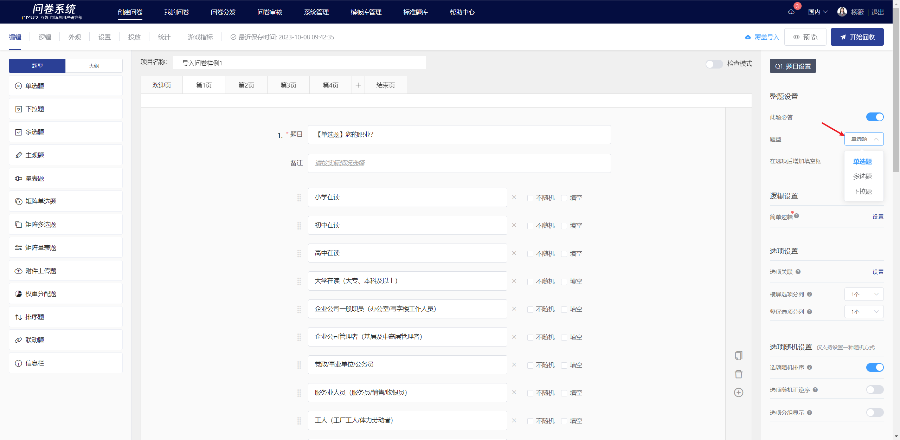

# Survey Setup

In the question editing mode, you can configure question settings in the 'Question Settings' panel on the right-hand side.

### Required setting

Disable the "This question is mandatory" feature in the right panel to allow this question to be optional when answering.


All questions have the "mandatory" feature enabled by default.


### Question Type Switching

Single-choice questions, multiple-choice questions, and dropdown questions can be switched between question types. After switching, the settings for fill-in-the-blank, random order, and mandatory answer will remain unchanged.

