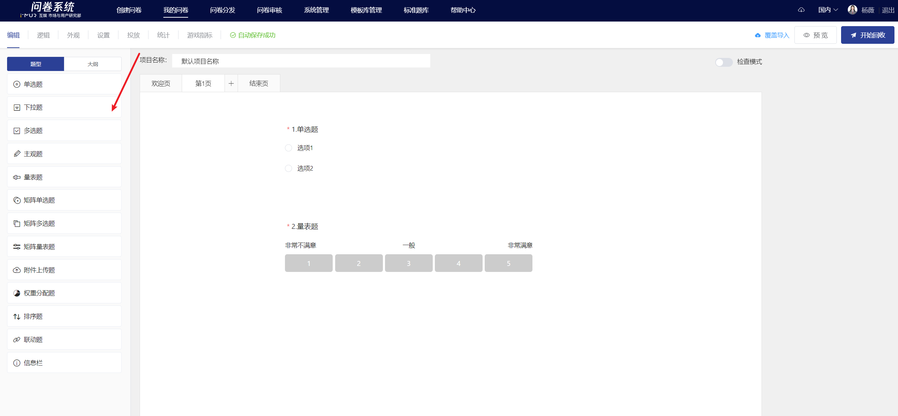
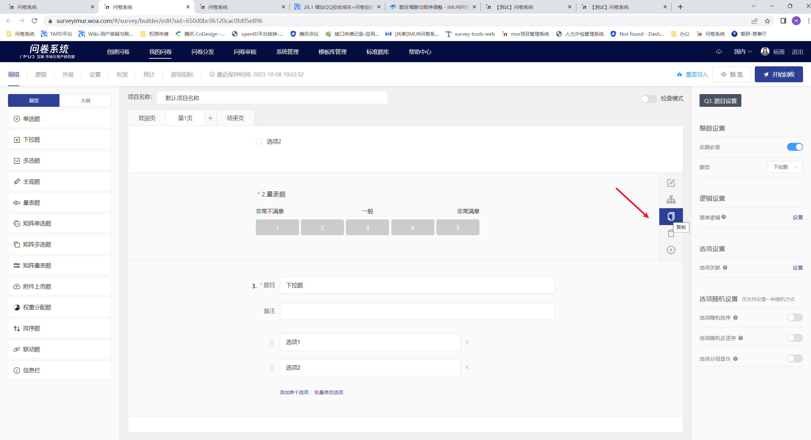
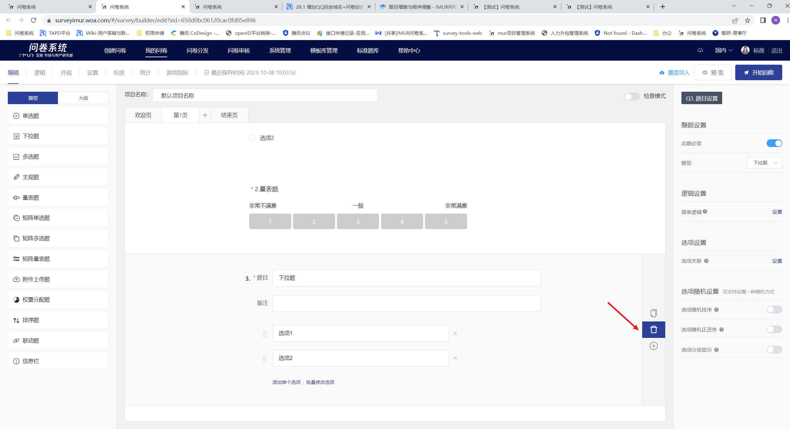
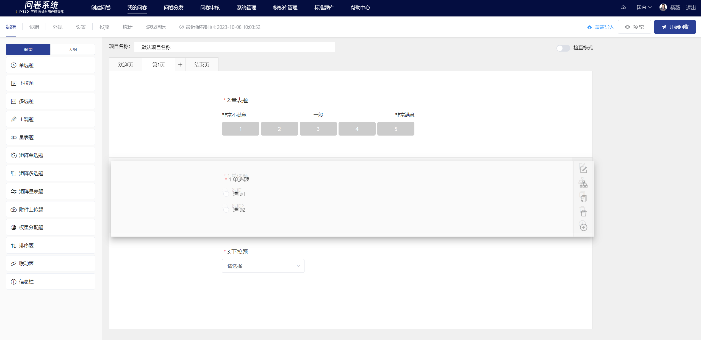
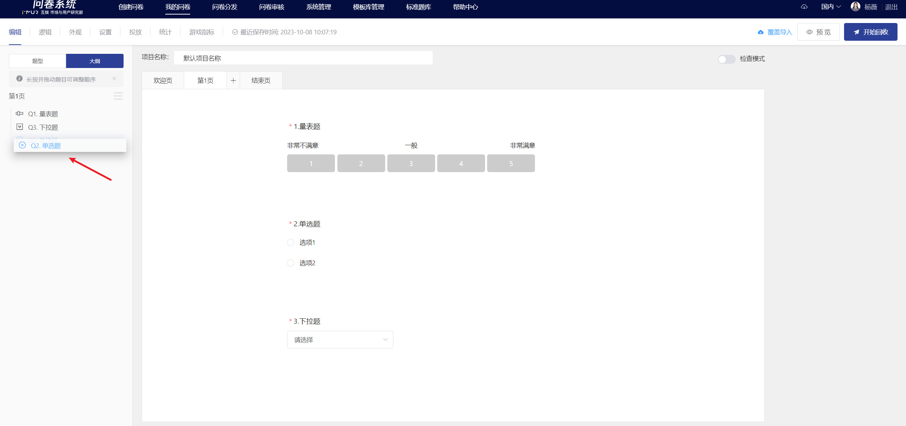

# Addition, Deletion, and Reordering of Questions

## Add question

### Add questions at the bottom of the current page

Click the "Question Type" control on the left side of the page to add a corresponding question below the current page.

### Add the question under the specified title

While viewing the question, focus on the specified question with the mouse, click the "+" button on the right shortcut toolbar, and select the desired question type to add a corresponding question below

### Copy the question

In the view mode of the problem, when you focus the mouse on a specific problem and click the copy button on the right toolbar, the problem will be duplicated below. The title, options, and other content and settings will be exactly the same as the original problem.


Copying the question does not include copying the original question's logical settings.


### Delete the question

In the problem viewing state, when you focus the mouse on the specified problem, click the delete button in the shortcut toolbar on the right to delete the problem.

### Adjustment of question order

The ways to adjust the order of questions include: adjusting in the editing area and adjusting in the outline.

### Adjust the order of questions in the editing area

When the question is focused, you can adjust the order of the questions by clicking and dragging with the mouse. The system will automatically save the changes (the survey being collected will be synchronized to the answering end in real-time).

### Adjust the order of questions in the outline

In the "Outline" control on the left side of the page, users can adjust the order of questions by clicking and dragging with the mouse. The system will automatically save the changes (the surveys being collected will be synchronized to the answering end in real time).


Users can locate specific questions by clicking on the titles in the "Outline".



1. 被设置为组合逻辑结果的题目不可调整到逻辑显示条件的题目前
2. 设置关联选项的题目不可调整到被关联的题目前


## 常见问题

### 有题目插入点选择和题目复制功能吗 ？

有，插入点前一题的右侧快捷工具栏中点击“+”选中需要插入的题型，即可在此题下方的插入已选择的新题目。可复制题目，复制后的新题在当前题的下方。


1. 复制题目不包括复制原题的逻辑设置、选项关联设置。
2. 复制后可能导致后序题目的题号更改，其他题目的引用设置中题号需要生动修改。


.png>)

.png>)
